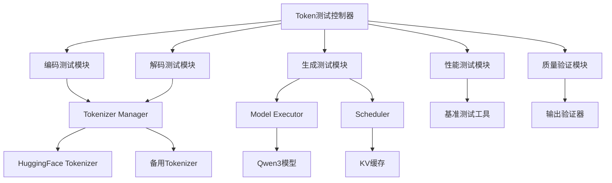

# Token输出测试功能设计文档

## 概述

本设计文档描述了一个全面的token输出测试系统，用于验证xLLM工程中的tokenization、生成和解码过程。该系统将提供多层次的测试功能，包括单元测试、集成测试、性能基准测试和质量验证。

## 架构

### 系统架构图



### 核心组件

#### 1. TokenTestController (Token测试控制器)
- 协调所有测试模块的执行
- 管理测试配置和参数
- 生成测试报告和统计信息
- 提供CLI和API接口

#### 2. EncodingTestModule (编码测试模块)
- 测试文本到token ID的转换
- 验证不同语言和字符集的编码
- 检查特殊字符和边界条件
- 测试编码一致性和可重复性

#### 3. DecodingTestModule (解码测试模块)
- 测试token ID到文本的转换
- 验证解码结果的正确性
- 处理无效token ID的错误情况
- 测试编码-解码往返一致性

#### 4. GenerationTestModule (生成测试模块)
- 测试模型的token生成过程
- 验证不同采样策略的效果
- 检查生成质量和连贯性
- 测试停止条件和长度限制

#### 5. PerformanceTestModule (性能测试模块)
- 测量token处理的吞吐量
- 监控内存使用和缓存效率
- 进行并发性能测试
- 生成性能基准报告

#### 6. QualityValidationModule (质量验证模块)
- 评估生成文本的质量
- 检查语法和语义正确性
- 验证内容安全性
- 提供质量评分机制

## 组件和接口

### 1. TokenTestController

```python
class TokenTestController:
    def __init__(self, config: TestConfig)
    def run_all_tests(self) -> TestReport
    def run_specific_test(self, test_type: str) -> TestResult
    def generate_report(self, results: List[TestResult]) -> TestReport
    def export_results(self, format: str) -> str
```

### 2. 测试配置类

```python
class TestConfig:
    # 基本配置
    server_url: str = "http://localhost:8000"
    model_path: str = "./model/Qwen/Qwen3-0.6B"
    
    # 测试参数
    test_samples: List[str]
    max_tokens: int = 100
    temperature: float = 0.7
    
    # 性能测试配置
    concurrent_requests: int = 10
    performance_iterations: int = 100
    
    # 质量验证配置
    quality_threshold: float = 0.8
    safety_check: bool = True
```

### 3. 测试结果类

```python
class TestResult:
    test_name: str
    success: bool
    execution_time: float
    details: Dict[str, Any]
    metrics: Dict[str, float]
    errors: List[str]
```

## 数据模型

### 1. 测试样本数据结构

```python
class TestSample:
    id: str
    input_text: str
    expected_tokens: Optional[List[int]]
    expected_output: Optional[str]
    language: str
    category: str  # "basic", "edge_case", "performance", "quality"
    metadata: Dict[str, Any]
```

### 2. 性能指标数据结构

```python
class PerformanceMetrics:
    tokens_per_second: float
    average_latency: float
    memory_usage: float
    cache_hit_rate: float
    concurrent_throughput: float
    error_rate: float
```

### 3. 质量评估数据结构

```python
class QualityMetrics:
    coherence_score: float
    relevance_score: float
    fluency_score: float
    safety_score: float
    grammar_score: float
    overall_score: float
```

## 错误处理

### 1. 错误分类

- **连接错误**: 服务器不可达或响应超时
- **编码错误**: 无法正确编码输入文本
- **解码错误**: 无法正确解码token序列
- **生成错误**: 模型生成过程中的异常
- **验证错误**: 输出质量不符合预期

### 2. 错误处理策略

```python
class ErrorHandler:
    def handle_connection_error(self, error: Exception) -> TestResult
    def handle_encoding_error(self, text: str, error: Exception) -> TestResult
    def handle_generation_error(self, prompt: str, error: Exception) -> TestResult
    def retry_with_backoff(self, operation: Callable, max_retries: int = 3) -> Any
```

### 3. 容错机制

- 自动重试机制，支持指数退避
- 降级测试模式，跳过失败的测试用例
- 部分结果保存，避免完全测试失败
- 详细错误日志记录

## 测试策略

### 1. 编码测试策略

#### 基础编码测试
- 英文文本编码
- 中文文本编码
- 混合语言文本编码
- 特殊字符和标点符号编码

#### 边界条件测试
- 空字符串编码
- 超长文本编码
- Unicode特殊字符编码
- 控制字符处理

#### 一致性测试
- 相同输入的重复编码
- 不同会话间的编码一致性
- 大小写敏感性测试

### 2. 解码测试策略

#### 基础解码测试
- 有效token ID序列解码
- 特殊token处理（BOS, EOS, PAD）
- 长序列解码测试

#### 错误处理测试
- 无效token ID处理
- 超出词汇表范围的token
- 损坏的token序列处理

#### 往返一致性测试
- 编码-解码往返测试
- 文本保真度验证
- 格式保持测试

### 3. 生成测试策略

#### 基础生成测试
- 简单提示生成
- 复杂提示生成
- 多轮对话生成

#### 采样策略测试
- 贪婪采样测试
- 温度采样测试
- Top-k采样测试
- Top-p采样测试
- 束搜索测试

#### 质量验证测试
- 语义连贯性检查
- 语法正确性验证
- 内容相关性评估
- 安全性检查

### 4. 性能测试策略

#### 吞吐量测试
- 单线程性能测试
- 多线程并发测试
- 批处理性能测试

#### 延迟测试
- 首token延迟测试
- 平均生成延迟测试
- 端到端延迟测试

#### 资源使用测试
- CPU使用率监控
- 内存使用监控
- KV缓存效率测试

## 实现细节

### 1. 测试数据准备

#### 测试样本集合
```python
TEST_SAMPLES = {
    "basic_chinese": [
        "你好，世界！",
        "人工智能是计算机科学的一个分支。",
        "今天天气很好。"
    ],
    "basic_english": [
        "Hello, world!",
        "Artificial intelligence is a branch of computer science.",
        "The weather is nice today."
    ],
    "mixed_language": [
        "Hello 你好 world 世界！",
        "AI人工智能 is very powerful很强大。"
    ],
    "edge_cases": [
        "",  # 空字符串
        "a" * 10000,  # 超长字符串
        "🚀🌟💫🎯🔥",  # emoji
        "\n\t\r",  # 控制字符
    ],
    "special_chars": [
        "特殊符号：@#$%^&*()_+-=[]{}|;':\",./<>?",
        "数学符号：∑∏∫∂∇∆∞±≤≥≠≈∈∉∪∩",
        "货币符号：$€£¥₹₽₩₪₫"
    ]
}
```

#### 性能基准数据
```python
PERFORMANCE_BENCHMARKS = {
    "target_throughput": 50.0,  # tokens/second
    "max_latency": 2.0,  # seconds
    "min_cache_hit_rate": 0.7,  # 70%
    "max_memory_usage": 4.0,  # GB
    "max_error_rate": 0.01  # 1%
}
```

### 2. 测试执行流程

#### 测试初始化
1. 验证服务器连接
2. 加载测试配置
3. 准备测试数据
4. 初始化测试模块

#### 测试执行
1. 按优先级执行测试
2. 收集测试结果
3. 实时监控进度
4. 处理异常情况

#### 结果处理
1. 汇总测试结果
2. 计算统计指标
3. 生成测试报告
4. 导出结果数据

### 3. 报告生成

#### HTML报告格式
- 测试概览和摘要
- 详细测试结果
- 性能图表和趋势
- 错误分析和建议

#### JSON报告格式
- 结构化测试数据
- 便于自动化处理
- 支持CI/CD集成

#### 实时监控界面
- Web界面显示测试进度
- 实时性能指标更新
- 交互式结果查看

## 集成方案

### 1. 与现有系统集成

#### xLLM服务器集成
- 使用现有的REST API接口
- 复用tokenizer和模型组件
- 利用现有的性能监控

#### 测试框架集成
- 兼容pytest测试框架
- 支持unittest测试用例
- 集成到CI/CD流水线

### 2. 扩展性设计

#### 插件架构
- 支持自定义测试模块
- 可扩展的评估指标
- 灵活的报告格式

#### 配置管理
- 支持多环境配置
- 动态参数调整
- 配置版本管理

### 3. 部署方案

#### 本地部署
- 单机测试环境
- 开发调试模式
- 快速验证功能

#### 分布式部署
- 多节点性能测试
- 大规模并发测试
- 云环境适配

## 监控和日志

### 1. 测试监控

#### 实时指标
- 测试执行进度
- 成功/失败率
- 性能指标趋势
- 资源使用情况

#### 告警机制
- 测试失败告警
- 性能异常告警
- 资源超限告警

### 2. 日志管理

#### 日志级别
- DEBUG: 详细调试信息
- INFO: 一般信息记录
- WARNING: 警告信息
- ERROR: 错误信息
- CRITICAL: 严重错误

#### 日志格式
```
[时间戳] [级别] [模块] [测试ID] 消息内容
```

#### 日志存储
- 本地文件存储
- 远程日志服务
- 结构化日志格式

## 安全考虑

### 1. 数据安全

#### 测试数据保护
- 敏感数据脱敏
- 测试数据加密
- 访问权限控制

#### 结果数据安全
- 测试结果加密存储
- 安全传输协议
- 数据备份策略

### 2. 系统安全

#### 访问控制
- 用户身份验证
- 权限分级管理
- API访问限制

#### 安全审计
- 操作日志记录
- 安全事件监控
- 定期安全评估