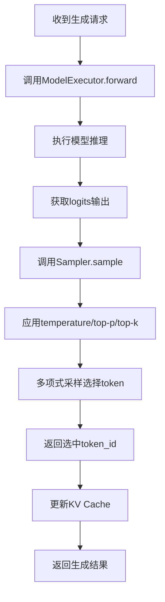

# Sampler 原理和作用详解

## 概述

Sampler（采样器）是大语言模型推理过程中的关键组件，负责从模型输出的概率分布中选择下一个 token。在语言模型中，每一步都会输出一个词汇表大小的 logits 向量，表示每个可能 token 的相对概率。Sampler 的任务就是根据这些 logits 和用户指定的参数来选择下一个 token。

## 核心原理

### 基本工作流程

1. **输入处理**：接收模型输出的 logits 张量
2. **维度调整**：确保 logits 是一维的（针对词汇表）
3. **温度应用**：根据温度参数调整 logits 分布
4. **过滤操作**：
   - Top-K 过滤：保留前 K 个最高概率的 token
   - Top-P 过滤：保留累积概率不超过阈值的 token
5. **概率归一化**：使用 softmax 将 logits 转换为概率分布
6. **采样选择**：根据概率分布选择下一个 token

## 核心方法详解

### 1. `sample` 方法 - 核心采样函数

这是最主要的采样方法，支持多种采样策略：

#### Temperature 控制
- 当 temperature=0 时，使用贪婪采样（选择概率最高的 token）
- 当 temperature>0 时，对 logits 进行缩放，控制输出的随机性
- 较高的温度值会产生更多样化的输出，较低的温度值会产生更确定性的输出

#### Top-K 采样
- 只保留概率最高的 K 个 token，将其他 token 的概率设为负无穷
- 防止模型选择极低概率的 token

#### Top-P (Nucleus) 采样
- 累积概率排序后，只保留累积概率不超过阈值 p 的 token
- 动态调整采样空间，适应不同位置的概率分布

#### 多项式采样
- 根据最终的概率分布进行随机采样

### 2. `sample_batch` 方法 - 批量采样

支持对一批序列同时进行采样，每个序列可以有不同的温度参数。

### 3. `sample_beam_search` 方法 - 束搜索

保留多个候选序列，选择整体概率最高的序列路径。

### 4. `sample_contrastive_search` 方法 - 对比搜索

一种新颖的解码策略，通过对比惩罚来减少重复生成。

## 在 xLLM 中的作用

在 xLLM 项目中，Sampler 被集成在以下位置：

1. **Scheduler 中**：在 `_process_batch_outputs` 方法中使用，处理模型输出并采样下一个 token
2. **ModelExecutor 中**：作为模型执行器的一部分，用于实际的 token 采样

## 工作流程图



## 优势和特点

1. **灵活性**：支持多种采样策略，可以根据需要选择合适的方法
2. **可控性**：通过温度、top-k、top-p 等参数精确控制生成质量
3. **高效性**：针对 CPU 优化实现，适合在资源受限环境中运行
4. **鲁棒性**：包含完善的错误处理和边界检查

## 使用示例

```python
from xllm.sampler import Sampler

# 创建采样器实例
sampler = Sampler()

# 示例 logits（假设词汇表大小为1000）
import torch
logits = torch.randn(1000)  # 随机生成的logits

# 使用不同的采样策略
# 1. 贪婪采样
greedy_token = sampler.sample(logits, temperature=0.0)

# 2. 带温度的采样
temp_token = sampler.sample(logits, temperature=0.7)

# 3. Top-K采样
topk_token = sampler.sample(logits, temperature=0.7, top_k=50)

# 4. Top-P采样
topp_token = sampler.sample(logits, temperature=0.7, top_p=0.9)

# 5. 结合Top-K和Top-P
combined_token = sampler.sample(logits, temperature=0.7, top_k=50, top_p=0.9)
```

## 性能优化建议

1. **合理设置参数**：
   - 创意性文本：较高温度值（0.8-1.0），适中 top-k（40-50）
   - 事实性文本：较低温度值（0.2-0.5），较小 top-k（10-20）

2. **避免极端参数**：
   - 温度过高会导致输出混乱
   - top-k 过小会限制创造性
   - top-p 过大会失去 nucleus sampling 的效果

Sampler 是连接模型输出和最终文本生成的关键桥梁，直接影响生成文本的质量和多样性。