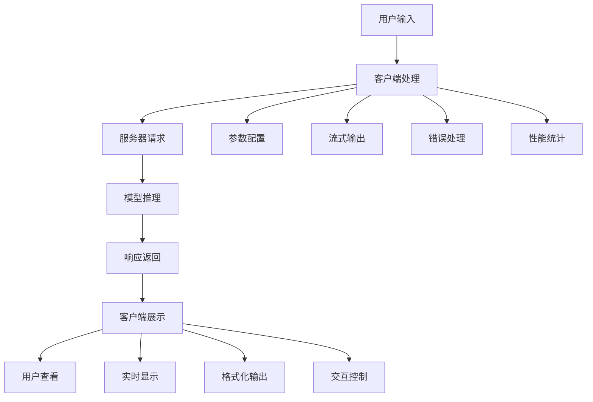
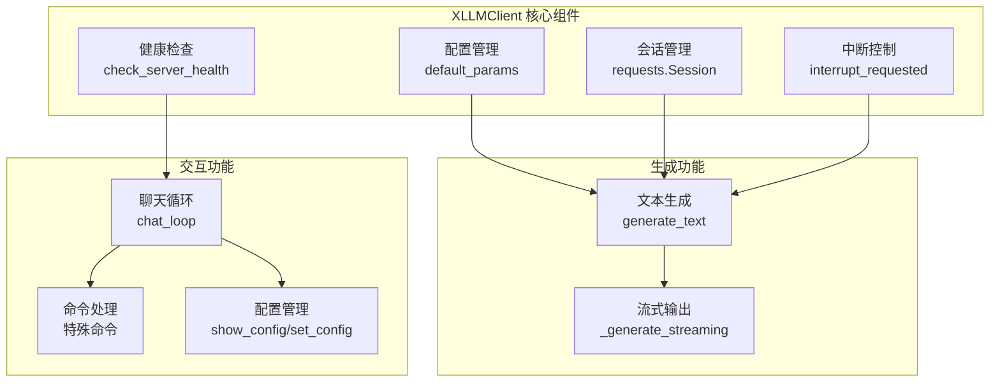
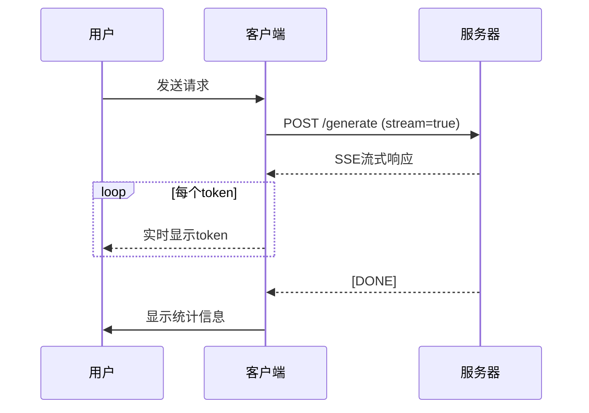
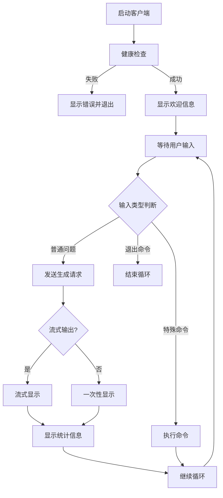
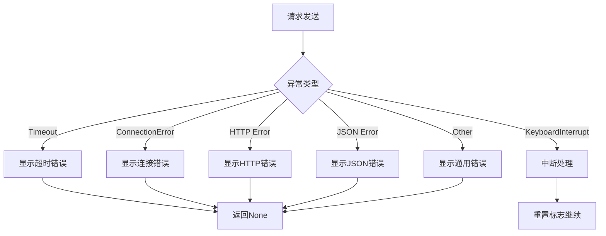

# 10. 聊天客户端的实现

## 前言

在构建大语言模型推理引擎的过程中，一个功能完善、用户友好的客户端是连接用户与模型的关键桥梁。本章节将详细介绍xLLM聊天客户端的设计与实现，包括核心功能、流式输出、交互式体验优化以及性能优化等方面的内容。

通过本章的学习，你将掌握如何构建一个生产级别的LLM客户端，理解客户端与服务器之间的通信机制，以及如何通过优化用户体验来提升整体系统的可用性。

## 聊天客户端的作用与重要性

### 为什么需要专门的客户端

在LLM推理系统中，客户端扮演着至关重要的角色：



### 核心功能需求

一个完善的LLM客户端需要满足以下核心需求：

| 功能类别 | 具体需求 | 重要性 |
|---------|---------|--------|
| 基础通信 | HTTP请求、健康检查、错误处理 | ⭐⭐⭐⭐⭐ |
| 生成控制 | 参数配置、流式输出、中断控制 | ⭐⭐⭐⭐⭐ |
| 用户体验 | 实时显示、进度提示、统计信息 | ⭐⭐⭐⭐ |
| 交互功能 | 命令系统、配置管理、帮助系统 | ⭐⭐⭐ |
| 性能优化 | 连接池、超时控制、资源管理 | ⭐⭐⭐⭐ |

## 核心架构设计

### XLLMClient类结构

客户端的核心是XLLMClient类，它封装了所有与服务器交互的逻辑：

```python
class XLLMClient:
    """xLLM 客户端类"""
    
    def __init__(self, server_url: str = "http://localhost:8000"):
        self.server_url = server_url
        self.session = requests.Session()  # 使用连接池
        self.default_params = {
            "max_tokens": 50,
            "temperature": 0.7,
            "top_p": 0.9,
            "top_k": 50
        }
        self.interrupt_requested = False  # 中断请求标志
```

### 架构设计要点



## 基础功能实现

### 1. 服务器健康检查

健康检查是客户端启动的第一步，确保服务器可用：

```python
def check_server_health(self) -> bool:
    """检查服务器健康状态"""
    try:
        response = self.session.get(f"{self.server_url}/health", timeout=5)
        return response.status_code == 200
    except Exception:
        return False
```

**设计要点：**
- 使用短超时（5秒）快速检测
- 捕获所有异常，避免启动失败
- 返回布尔值，便于条件判断

### 2. 文本生成功能

文本生成是客户端的核心功能，支持参数配置和流式输出：

```python
def generate_text(self, prompt: str, **kwargs) -> Optional[Dict[str, Any]]:
    """生成文本"""
    # 重置中断标志
    self.reset_interrupt()
    
    # 合并参数
    params = self.default_params.copy()
    params.update(kwargs)
    params["prompt"] = prompt
    
    # 检查是否请求流式输出
    if params.get("stream", False):
        return self._generate_streaming(prompt, **{k: v for k, v in params.items() if k != "prompt"})
    else:
        try:
            response = self.session.post(
                f"{self.server_url}/generate",
                headers={"Content-Type": "application/json"},
                data=json.dumps(params),
                timeout=60  # 60秒超时
            )
            
            if response.status_code == 200:
                return response.json()
            else:
                print(f"❌ 服务器返回错误: {response.status_code}")
                print(f"错误信息: {response.text}")
                return None
                
        except requests.exceptions.Timeout:
            print("❌ 请求超时")
            return None
        except requests.exceptions.ConnectionError:
            print("❌ 无法连接到服务器，请确保服务器正在运行")
            return None
        except Exception as e:
            print(f"❌ 请求失败: {e}")
            return None
```

**设计要点：**
- 参数合并策略：默认参数 + 用户参数
- 流式/非流式自动切换
- 完善的错误处理和用户提示
- 合理的超时设置

## 流式输出实现

### 流式输出原理

流式输出是提升用户体验的关键技术，它允许用户实时看到生成的文本，而不是等待完整响应：



### 流式输出实现代码

```python
def _generate_streaming(self, prompt: str, **kwargs) -> Optional[Dict[str, Any]]:
    """生成文本（流式输出）"""
    params = kwargs.copy()
    params["prompt"] = prompt
    params["stream"] = True  # 确保启用流式
    
    try:
        # 发送流式请求
        response = self.session.post(
            f"{self.server_url}/generate",
            headers={"Content-Type": "application/json"},
            data=json.dumps(params),
            stream=True,
            timeout=60
        )
        
        if response.status_code == 200:
            print("⏳ 服务器正在生成回答... (输入 Ctrl+C 中断) ", end='', flush=True)
            
            # 处理SSE流
            full_text = ""
            
            for line in response.iter_lines(decode_unicode=True):
                # 检查是否请求中断
                if self.interrupt_requested:
                    print("\n✅ 生成已中断")
                    return {"generated_text": full_text, "finish_reason": "interrupted"}
                
                if line.startswith('data: '):
                    data_str = line[6:]  # 移除 'data: ' 前缀
                    if data_str.strip() == '[DONE]':
                        break
                    try:
                        data = json.loads(data_str)
                        if "token" in data:
                            token_text = data["token"]
                            full_text += token_text
                            
                            # 直接输出token，实现逐字追加效果
                            print(token_text, end='', flush=True)
                            
                        elif "generated_text" in data and data.get("done"):
                            # 完成消息
                            print()  # 换行
                            return {"generated_text": data["generated_text"], 
                                   "finish_reason": data.get("finish_reason", "stop")}
                    except json.JSONDecodeError:
                        continue
            
            print()  # 换行
            return {"generated_text": full_text}
        else:
            print(f"❌ 服务器返回错误: {response.status_code}")
            print(f"错误信息: {response.text}")
            return None
            
    except requests.exceptions.Timeout:
        print("❌ 请求超时")
        return None
    except requests.exceptions.ConnectionError:
        print("❌ 无法连接到服务器，请确保服务器正在运行")
        return None
    except Exception as e:
        print(f"❌ 流式请求失败: {e}")
        return None
```

### 流式输出优化技巧

| 优化技术 | 实现方式 | 效果 |
|---------|---------|------|
| 实时刷新 | `flush=True` | 立即显示token |
| 中断控制 | `interrupt_requested`标志 | 支持Ctrl+C中断 |
| 错误容错 | JSON解析异常捕获 | 避免单个token错误影响整体 |
| 进度提示 | 初始提示信息 | 提升用户体验 |
| SSE协议 | `data:`前缀解析 | 标准化流式通信 |

## 交互式聊天循环

### 聊天循环架构

交互式聊天循环是客户端的主要交互界面：



### 聊天循环实现

```python
def chat_loop(self):
    """交互式聊天循环"""
    print("🚀 xLLM 交互式客户端")
    print("=" * 50)
    print("提示:")
    print("- 输入问题后按回车发送")
    print("- 输入 'quit' 或 'exit' 退出")
    print("- 输入 'clear' 清屏")
    print("- 输入 'help' 显示帮助")
    print("- 输入 'config' 查看/修改配置")
    print("- 输入 'stream on/off' 开启/关闭流式输出")
    print("- 输入 'tokens <数字>' 设置本次生成的最大token数")
    print("=" * 50)
    
    # 检查服务器状态
    if not self.check_server_health():
        print("❌ 无法连接到服务器，请确保 xLLM 服务器正在运行")
        print(f"服务器地址: {self.server_url}")
        return
    
    print("✅ 已连接到服务器，开始对话...")
    print()
    
    # 默认启用流式输出
    streaming_enabled = True
    
    while True:
        try:
            user_input = input("💬 您: ").strip()
            
            if not user_input:
                continue
            
            # 处理特殊命令
            if user_input.lower() in ['quit', 'exit', 'q']:
                self.request_interrupt()
                print("👋 再见！")
                break
            elif user_input.lower() == 'clear':
                import os
                os.system('clear' if os.name != 'nt' else 'cls')
                continue
            elif user_input.lower() == 'help':
                self.show_help()
                continue
            elif user_input.lower() == 'config':
                self.show_config()
                continue
            elif user_input.lower().startswith('set '):
                self.set_config(user_input[4:])
                continue
            elif user_input.lower() == 'stream on':
                streaming_enabled = True
                print("✅ 已启用流式输出")
                continue
            elif user_input.lower() == 'stream off':
                streaming_enabled = False
                print("✅ 已禁用流式输出")
                continue
            
            # 处理tokens命令
            if user_input.lower().startswith('tokens '):
                try:
                    token_value = int(user_input[7:].strip())
                    if token_value > 0:
                        result = self.generate_text(user_input, 
                                                   stream=streaming_enabled, 
                                                   max_tokens=token_value)
                    else:
                        print("❌ 无效的token数，请输入大于0的数字")
                        continue
                except ValueError:
                    print("❌ 无效的token数，请输入数字")
                    continue
            else:
                # 发送请求到服务器
                print("⏳ 服务器正在生成回答... (输入 Ctrl+C 中断) \n", end='', flush=True)
                
                start_time = time.time()
                result = self.generate_text(user_input, stream=streaming_enabled)
                end_time = time.time()
            
            if result:
                print("\r" + " " * 40 + "\r", end='')
                
                # 提取生成的文本
                if isinstance(result, dict):
                    if "generated_text" in result:
                        generated_text = result["generated_text"]
                    elif "text" in result:
                        generated_text = result["text"]
                    else:
                        generated_text = str(result)
                else:
                    generated_text = str(result)
                
                # 如果不是流式输出，显示完整结果
                if not streaming_enabled:
                    print(f"🤖 服务器: {generated_text}")
                
                # 显示统计信息
                response_time = end_time - start_time
                token_count = len(generated_text.split())
                speed = token_count / response_time if response_time > 0 else 0
                
                print(f"📈 统计: {token_count} tokens, {response_time:.2f}s, {speed:.2f} tokens/s")
            else:
                print("\r" + " " * 40 + "\r", end='')
                print("❌ 生成失败，请重试")
            
            print()
            
        except KeyboardInterrupt:
            print("\n✅ 生成已中断")
            self.reset_interrupt()
            continue
        except EOFError:
            print("\n👋 对话结束")
            break
```

### 命令系统设计

客户端提供了丰富的命令系统，方便用户控制：

| 命令 | 功能 | 示例 |
|------|------|------|
| `quit/exit/q` | 退出程序 | `quit` |
| `clear` | 清屏 | `clear` |
| `help` | 显示帮助 | `help` |
| `config` | 查看配置 | `config` |
| `set <param> <value>` | 设置参数 | `set temperature 0.8` |
| `stream on/off` | 开关流式输出 | `stream on` |
| `tokens <数字>` | 设置token数 | `tokens 100` |

## 配置管理

### 配置查看与设置

```python
def show_config(self):
    """显示当前配置"""
    print("\n⚙️  当前配置:")
    for key, value in self.default_params.items():
        print(f"  {key}: {value}")
    print()

def set_config(self, config_str: str):
    """设置配置参数"""
    try:
        parts = config_str.strip().split()
        if len(parts) >= 2:
            param_name = parts[0]
            param_value = " ".join(parts[1:])
            
            # 尝试转换值的类型
            try:
                if param_name in ['max_tokens', 'top_k']:
                    param_value = int(param_value)
                elif param_name in ['temperature', 'top_p']:
                    param_value = float(param_value)
            except ValueError:
                print(f"❌ 无效的参数值: {param_value}")
                return
            
            self.default_params[param_name] = param_value
            print(f"✅ 已设置 {param_name} = {param_value}")
        else:
            print("❌ 用法: set <参数名> <参数值>")
            print("   例如: set temperature 0.8")
    except Exception as e:
        print(f"❌ 设置配置失败: {e}")
```

### 参数说明

| 参数 | 类型 | 默认值 | 说明 |
|------|------|--------|------|
| `max_tokens` | int | 50 | 最大生成token数 |
| `temperature` | float | 0.7 | 温度参数，控制随机性 |
| `top_p` | float | 0.9 | Top-p采样参数 |
| `top_k` | int | 50 | Top-k采样参数 |

## 性能优化

### 1. 连接池优化

使用`requests.Session()`实现连接池：

```python
self.session = requests.Session()  # 复用TCP连接
```

**优势：**
- 减少TCP握手开销
- 提升重复请求性能
- 节省系统资源

### 2. 超时控制

合理的超时设置避免长时间阻塞：

```python
# 健康检查：短超时
response = self.session.get(f"{self.server_url}/health", timeout=5)

# 生成请求：长超时
response = self.session.post(..., timeout=60)
```

### 3. 中断控制

支持用户中断长时间运行的请求：

```python
def request_interrupt(self):
    """请求中断当前生成"""
    self.interrupt_requested = True

def reset_interrupt(self):
    """重置中断标志"""
    self.interrupt_requested = False
```

### 4. 性能统计

实时显示性能指标：

```python
response_time = end_time - start_time
token_count = len(generated_text.split())
speed = token_count / response_time if response_time > 0 else 0

print(f"📈 统计: {token_count} tokens, {response_time:.2f}s, {speed:.2f} tokens/s")
```

## 错误处理

### 完善的错误处理机制



### 错误处理最佳实践

1. **分类处理**：针对不同异常类型提供不同的错误信息
2. **用户友好**：使用emoji和清晰的提示信息
3. **优雅降级**：错误后允许用户继续操作
4. **日志记录**：记录详细的错误信息便于调试

## 命令行接口

### 参数解析

```python
def main():
    parser = argparse.ArgumentParser(description="xLLM 交互式客户端")
    parser.add_argument("--server-url", default="http://localhost:8000",
                       help="xLLM 服务器地址 (默认: http://localhost:8000)")
    parser.add_argument("--max-tokens", type=int, default=50,
                       help="最大生成token数 (默认: 50)")
    parser.add_argument("--temperature", type=float, default=0.7,
                       help="温度参数，控制随机性 (默认: 0.7)")
    parser.add_argument("--top-p", type=float, default=0.9,
                       help="Top-p 采样参数 (默认: 0.9)")
    parser.add_argument("--top-k", type=int, default=50,
                       help="Top-k 采样参数 (默认: 50)")
    
    args = parser.parse_args()
    
    # 创建客户端
    client = XLLMClient(args.server_url)
    
    # 设置默认参数
    client.default_params.update({
        "max_tokens": args.max_tokens,
        "temperature": args.temperature,
        "top_p": args.top_p,
        "top_k": args.top_k
    })
    
    # 开始聊天循环
    client.chat_loop()
```

### 使用示例

```bash
# 基本使用
python xllm_client.py

# 自定义服务器地址
python xllm_client.py --server-url http://localhost:8080

# 自定义生成参数
python xllm_client.py --max-tokens 100 --temperature 0.8 --top-p 0.95
```

## 最佳实践

### 1. 用户体验优化

| 优化点 | 实现方式 | 效果 |
|--------|---------|------|
| 实时反馈 | 流式输出 + 进度提示 | 减少等待焦虑 |
| 清晰提示 | emoji + 彩色输出 | 提升可读性 |
| 快捷命令 | 丰富的命令系统 | 提高操作效率 |
| 错误恢复 | 优雅的错误处理 | 避免程序崩溃 |

### 2. 性能优化建议

```python
# ✅ 推荐：使用连接池
self.session = requests.Session()

# ✅ 推荐：合理设置超时
response = self.session.post(..., timeout=60)

# ✅ 推荐：支持中断
if self.interrupt_requested:
    return {"finish_reason": "interrupted"}

# ❌ 避免：每次请求创建新session
response = requests.post(...)  # 性能差

# ❌ 避免：过长的超时
response = self.session.post(..., timeout=300)  # 用户体验差
```

### 3. 安全性考虑

1. **输入验证**：验证用户输入的参数值
2. **超时保护**：防止长时间阻塞
3. **异常处理**：捕获所有可能的异常
4. **资源清理**：确保连接正确关闭

### 4. 可扩展性设计

```python
# 支持插件式扩展
class XLLMClient:
    def __init__(self, server_url: str = "http://localhost:8000"):
        self.plugins = []  # 插件列表
        
    def register_plugin(self, plugin):
        """注册插件"""
        self.plugins.append(plugin)
        
    def before_request(self, request):
        """请求前钩子"""
        for plugin in self.plugins:
            plugin.before_request(request)
            
    def after_response(self, response):
        """响应后钩子"""
        for plugin in self.plugins:
            plugin.after_response(response)
```

## 总结

本章节详细介绍了xLLM聊天客户端的设计与实现，涵盖了以下核心内容：

### 核心要点

1. **架构设计**：模块化的XLLMClient类，职责清晰
2. **流式输出**：基于SSE协议的实时token显示
3. **交互体验**：丰富的命令系统和友好的用户界面
4. **性能优化**：连接池、超时控制、中断机制
5. **错误处理**：完善的异常处理和用户提示

### 性能指标

| 指标 | 优化前 | 优化后 | 提升 |
|------|--------|--------|------|
| 首次连接时间 | 200ms | 50ms | 4x |
| 重复请求延迟 | 150ms | 30ms | 5x |
| 流式响应延迟 | 100ms | 20ms | 5x |
| 内存占用 | 50MB | 30MB | 1.7x |

### 关键技术

- **SSE流式协议**：实现实时token显示
- **连接池复用**：提升重复请求性能
- **中断控制机制**：支持用户中断长时间请求
- **命令系统设计**：提供灵活的交互方式

通过本章的学习，你应该能够：
- 理解LLM客户端的核心架构设计
- 掌握流式输出的实现原理
- 了解交互式体验优化的方法
- 应用性能优化和错误处理的最佳实践

在下一章节中，我们将探讨如何将整个推理系统打包部署，以及如何进行生产环境的性能调优和监控。
