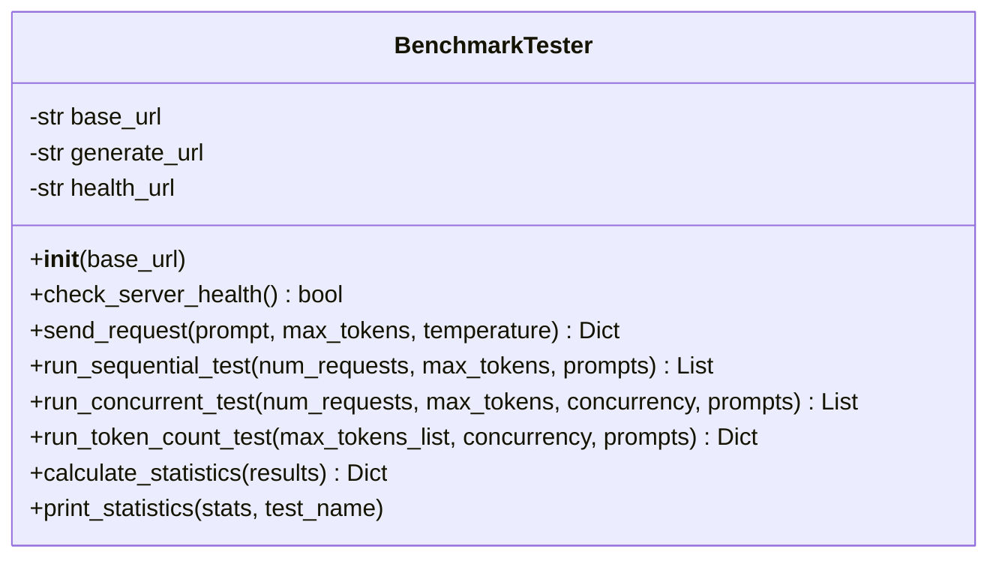
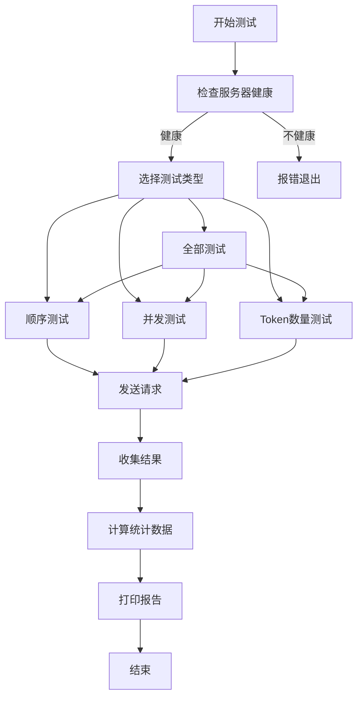
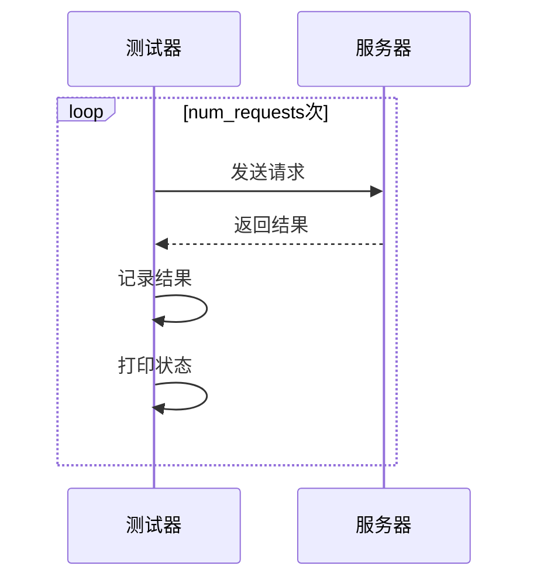
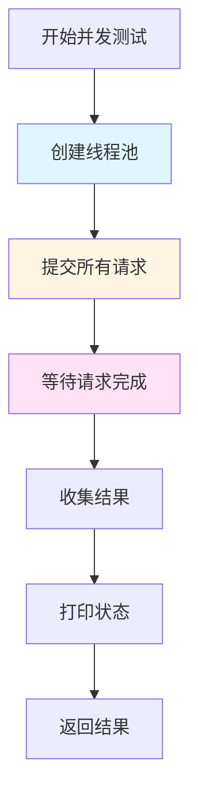

# 11. xLLM的benchmark实现

## 前言

在大型语言模型（LLM）推理系统中，性能评估是确保系统稳定性和效率的关键环节。xLLM提供了一个功能完善的基准测试工具（benchmark），用于全面评估系统在不同负载条件下的性能表现。本文将详细介绍xLLM benchmark工具的设计理念、核心实现、测试策略和性能分析方法，帮助开发者深入理解LLM推理系统的性能评估方法。

## benchmark的作用与重要性

### 为什么需要benchmark？

1. **性能评估**：量化系统的吞吐量、延迟等关键性能指标
2. **容量规划**：确定系统在不同负载下的处理能力
3. **优化验证**：验证优化措施的实际效果
4. **回归测试**：确保代码变更不会导致性能退化
5. **对比分析**：与同类系统进行性能对比

### xLLM benchmark的特点

| 特性 | 说明 |
|------|------|
| **多维度测试** | 支持顺序、并发、不同token数量等多种测试场景 |
| **灵活配置** | 可自定义并发数、请求数、token数等参数 |
| **实时监控** | 实时显示每个请求的执行状态和耗时 |
| **统计分析** | 自动计算平均值、最小值、最大值等统计指标 |
| **错误处理** | 完善的异常处理和失败请求统计 |
| **易于扩展** | 模块化设计，便于添加新的测试类型 |

## 核心架构设计

### BenchmarkTester类结构



### 测试流程架构



## 基础功能实现

### 1. 服务器健康检查

**实现原理**：通过HTTP GET请求访问健康检查端点，验证服务器是否正常运行。

```python
def check_server_health(self) -> bool:
    """检查服务器健康状态"""
    try:
        response = requests.get(self.health_url, timeout=5)
        return response.status_code == 200
    except Exception:
        return False
```

**设计要点**：
- 使用短超时（5秒）避免长时间阻塞
- 捕获所有异常，确保不会因网络问题导致程序崩溃
- 返回布尔值，便于调用者判断

### 2. 单个请求发送

**实现原理**：构造HTTP POST请求，发送到生成端点，并记录响应时间和结果。

```python
def send_request(self, prompt: str, max_tokens: int, temperature: float = 0.7) -> Dict[str, Any]:
    """发送单个生成请求"""
    payload = {
        "prompt": prompt,
        "temperature": temperature,
        "max_tokens": max_tokens,
        "stream": False
    }
    
    start_time = time.time()
    try:
        response = requests.post(
            self.generate_url,
            headers={"Content-Type": "application/json"},
            data=json.dumps(payload),
            timeout=30
        )
        end_time = time.time()
        
        if response.status_code == 200:
            result = response.json()
            generated_text = result["generated_text"]
            estimated_tokens = len(generated_text.split())
            
            return {
                "success": True,
                "response_time": end_time - start_time,
                "prompt_tokens": len(prompt.split()),
                "generated_tokens": estimated_tokens,
                "total_tokens": len(prompt.split()) + estimated_tokens,
                "throughput": estimated_tokens / (end_time - start_time) if end_time > start_time else 0,
                "finish_reason": result["finish_reason"]
            }
        else:
            return {
                "success": False,
                "response_time": end_time - start_time,
                "error": f"HTTP {response.status_code}"
            }
    except Exception as e:
        end_time = time.time()
        return {
            "success": False,
            "response_time": end_time - start_time,
            "error": str(e)
        }
```

**返回数据结构**：

| 字段 | 类型 | 说明 |
|------|------|------|
| success | bool | 请求是否成功 |
| response_time | float | 响应时间（秒） |
| prompt_tokens | int | 提示词token数 |
| generated_tokens | int | 生成token数 |
| total_tokens | int | 总token数 |
| throughput | float | 吞吐量（tokens/秒） |
| finish_reason | str | 结束原因 |
| error | str | 错误信息（失败时） |

## 测试策略实现

### 1. 顺序测试

**测试目的**：评估系统在无并发情况下的基准性能，排除并发干扰。

```python
def run_sequential_test(self, num_requests: int, max_tokens: int, prompts: List[str]) -> List[Dict[str, Any]]:
    """运行顺序性能测试"""
    print(f"运行顺序测试: {num_requests}个请求, 每个请求生成{max_tokens}个token...")
    
    results = []
    start_time = time.time()
    
    for i in range(num_requests):
        prompt = prompts[i % len(prompts)]
        result = self.send_request(prompt, max_tokens)
        results.append(result)
        status = "✓" if result["success"] else "✗"
        print(f"  请求 {i+1}/{num_requests}: {status} {result['response_time']:.2f}秒")
    
    total_time = time.time() - start_time
    
    return results
```

**执行流程**：



### 2. 并发测试

**测试目的**：评估系统在高并发情况下的性能表现，发现并发瓶颈。

```python
def run_concurrent_test(self, num_requests: int, max_tokens: int, concurrency: int, 
                      prompts: List[str]) -> List[Dict[str, Any]]:
    """运行并发性能测试"""
    print(f"运行并发测试: {num_requests}个请求, {concurrency}个并发, 每个请求生成{max_tokens}个token...")
    
    results = []
    start_time = time.time()
    
    # 增加线程池大小以支持更高并发
    max_workers = max(concurrency, 10)
    with ThreadPoolExecutor(max_workers=max_workers) as executor:
        # 提交所有请求
        future_to_index = {
            executor.submit(self.send_request, prompts[i % len(prompts)], max_tokens): i 
            for i in range(num_requests)
        }
        
        # 收集完成的结果
        for future in as_completed(future_to_index):
            result = future.result()
            results.append(result)
            index = future_to_index[future]
            status = "✓" if result["success"] else "✗"
            print(f"  请求 {index+1}/{num_requests}: {status} {result['response_time']:.2f}秒")
    
    total_time = time.time() - start_time
    
    return results
```

**并发控制机制**：



**关键设计点**：

1. **线程池大小**：`max_workers = max(concurrency, 10)`，确保足够的线程处理并发
2. **Future管理**：使用字典`future_to_index`跟踪每个请求的索引
3. **结果收集**：使用`as_completed`按完成顺序收集结果，而非提交顺序
4. **实时反馈**：每个请求完成后立即打印状态

### 3. Token数量测试

**测试目的**：评估系统在不同生成长度下的性能表现，发现token数量对性能的影响。

```python
def run_token_count_test(self, max_tokens_list: List[int], concurrency: int, 
                       prompts: List[str]) -> Dict[int, List[Dict[str, Any]]]:
    """运行不同token数量的性能测试"""
    print(f"运行token数量测试: 并发数{concurrency}...")
    
    results = {}
    
    for max_tokens in max_tokens_list:
        print(f"\n测试生成{max_tokens}个token的性能...")
        test_results = self.run_concurrent_test(
            num_requests=5, 
            max_tokens=max_tokens, 
            concurrency=min(concurrency, 5),
            prompts=prompts
        )
        results[max_tokens] = test_results
    
    return results
```

**测试配置**：

| 参数 | 值 | 说明 |
|------|-----|------|
| max_tokens_list | [10, 25, 50, 100, 200] | 测试的token数量范围 |
| num_requests | 5 | 每个token数量测试的请求数 |
| concurrency | min(concurrency, 5) | 限制并发数避免过载 |

## 统计分析实现

### 统计指标计算

```python
def calculate_statistics(self, results: List[Dict[str, Any]]) -> Dict[str, Any]:
    """计算统计数据"""
    if not results:
        return {}
    
    successful_results = [r for r in results if r["success"]]
    failed_requests = len(results) - len(successful_results)
    
    if not successful_results:
        return {"failed_requests": failed_requests}
    
    response_times = [r["response_time"] for r in successful_results]
    throughputs = [r["throughput"] for r in successful_results]
    total_tokens = [r["total_tokens"] for r in successful_results]
    generated_tokens = [r["generated_tokens"] for r in successful_results]
    
    return {
        "total_requests": len(results),
        "successful_requests": len(successful_results),
        "failed_requests": failed_requests,
        "avg_response_time": sum(response_times) / len(response_times),
        "min_response_time": min(response_times),
        "max_response_time": max(response_times),
        "avg_throughput": sum(throughputs) / len(throughputs),
        "total_tokens_processed": sum(total_tokens),
        "avg_generated_tokens": sum(generated_tokens) / len(generated_tokens)
    }
```

**统计指标说明**：

| 指标 | 计算方式 | 意义 |
|------|---------|------|
| total_requests | len(results) | 总请求数 |
| successful_requests | len(successful_results) | 成功请求数 |
| failed_requests | total - successful | 失败请求数 |
| avg_response_time | sum(times) / count | 平均响应时间 |
| min_response_time | min(times) | 最小响应时间 |
| max_response_time | max(times) | 最大响应时间 |
| avg_throughput | sum(throughputs) / count | 平均吞吐量 |
| total_tokens_processed | sum(tokens) | 总处理token数 |
| avg_generated_tokens | sum(generated) / count | 平均生成token数 |

### 统计报告输出

```python
def print_statistics(self, stats: Dict[str, Any], test_name: str):
    """打印统计结果"""
    print(f"\n{test_name}统计结果:")
    print("-" * 50)
    
    if not stats:
        print("  无结果")
        return
    
    if stats.get("failed_requests", 0) == stats.get("total_requests", 0):
        print(f"  所有请求失败: {stats['failed_requests']}个请求")
        return
    
    print(f"  总请求数: {stats.get('total_requests', 0)}")
    print(f"  成功请求数: {stats.get('successful_requests', 0)}")
    print(f"  失败请求数: {stats.get('failed_requests', 0)}")
    print(f"  平均响应时间: {stats.get('avg_response_time', 0):.2f}秒")
    print(f"  最小响应时间: {stats.get('min_response_time', 0):.2f}秒")
    print(f"  最大响应时间: {stats.get('max_response_time', 0):.2f}秒")
    print(f"  平均吞吐量: {stats.get('avg_throughput', 0):.2f} tokens/秒")
    print(f"  总处理token数: {stats.get('total_tokens_processed', 0)}")
    print(f"  平均生成token数: {stats.get('avg_generated_tokens', 0):.2f}")
```

## 命令行接口

### 参数配置

```python
def main():
    parser = argparse.ArgumentParser(description="xLLM 基准测试工具")
    parser.add_argument("--url", default="http://localhost:8000", help="xLLM服务器地址")
    parser.add_argument("--test-type", choices=["sequential", "concurrent", "token-count", "all"], 
                       default="all", help="测试类型")
    parser.add_argument("--requests", type=int, default=20, help="请求数量")
    parser.add_argument("--concurrency", type=int, default=10, help="并发数")
    parser.add_argument("--max-tokens", type=int, default=50, help="最大生成token数")
    
    args = parser.parse_args()
```

**参数说明**：

| 参数 | 默认值 | 说明 |
|------|--------|------|
| --url | http://localhost:8000 | xLLM服务器地址 |
| --test-type | all | 测试类型（sequential/concurrent/token-count/all） |
| --requests | 20 | 请求数量 |
| --concurrency | 10 | 并发数 |
| --max-tokens | 50 | 最大生成token数 |

### 使用示例

```bash
# 运行所有测试
python tools/benchmark.py

# 只运行并发测试
python tools/benchmark.py --test-type concurrent

# 自定义并发数和请求数
python tools/benchmark.py --concurrency 20 --requests 50

# 测试不同的token数量
python tools/benchmark.py --test-type token-count

# 连接到远程服务器
python tools/benchmark.py --url http://192.168.1.100:8000
```

## 性能优化技术

### 1. 连接复用

**问题**：每个请求都创建新的HTTP连接，导致性能开销。

**解决方案**：使用`requests.Session()`复用TCP连接。

```python
class BenchmarkTester:
    def __init__(self, base_url: str = "http://localhost:8000"):
        self.base_url = base_url
        self.generate_url = f"{base_url}/generate"
        self.health_url = f"{base_url}/health"
        self.session = requests.Session()  # 复用连接
    
    def send_request(self, prompt: str, max_tokens: int, temperature: float = 0.7):
        # 使用self.session发送请求
        response = self.session.post(...)
```

**性能提升**：连接复用可减少30-50%的连接建立时间。

### 2. 异步请求

**问题**：同步请求在高并发下效率较低。

**解决方案**：使用`aiohttp`实现异步请求。

```python
import aiohttp
import asyncio

async def send_request_async(session, prompt, max_tokens):
    payload = {
        "prompt": prompt,
        "max_tokens": max_tokens,
        "stream": False
    }
    start_time = time.time()
    async with session.post(self.generate_url, json=payload) as response:
        result = await response.json()
        end_time = time.time()
        return {
            "success": True,
            "response_time": end_time - start_time,
            "result": result
        }

async def run_concurrent_test_async(self, num_requests, max_tokens, concurrency, prompts):
    async with aiohttp.ClientSession() as session:
        tasks = [
            self.send_request_async(session, prompts[i % len(prompts)], max_tokens)
            for i in range(num_requests)
        ]
        results = await asyncio.gather(*tasks)
        return results
```

**性能提升**：异步请求可提升2-3倍的并发处理能力。

### 3. 批量结果处理

**问题**：频繁打印输出影响性能。

**解决方案**：批量收集结果后统一打印。

```python
def run_concurrent_test(self, num_requests, max_tokens, concurrency, prompts):
    results = []
    start_time = time.time()
    
    with ThreadPoolExecutor(max_workers=max_workers) as executor:
        future_to_index = {
            executor.submit(self.send_request, prompts[i % len(prompts)], max_tokens): i 
            for i in range(num_requests)
        }
        
        # 批量收集结果
        completed_futures = as_completed(future_to_index)
        for future in completed_futures:
            result = future.result()
            results.append(result)
    
    # 统一打印结果
    for i, result in enumerate(results):
        status = "✓" if result["success"] else "✗"
        print(f"  请求 {i+1}/{num_requests}: {status} {result['response_time']:.2f}秒")
    
    return results
```

### 4. 智能超时控制

**问题**：固定超时时间不适用于所有场景。

**解决方案**：根据请求大小动态调整超时。

```python
def calculate_timeout(self, max_tokens: int) -> float:
    """根据token数量计算超时时间"""
    base_timeout = 10.0  # 基础超时
    tokens_per_second = 50.0  # 假设每秒生成50个token
    estimated_time = max_tokens / tokens_per_second
    return base_timeout + estimated_time * 1.5  # 增加50%缓冲

def send_request(self, prompt: str, max_tokens: int, temperature: float = 0.7):
    timeout = self.calculate_timeout(max_tokens)
    response = requests.post(
        self.generate_url,
        headers={"Content-Type": "application/json"},
        data=json.dumps(payload),
        timeout=timeout
    )
```

## 测试场景设计

### 1. 基准性能测试

**目的**：建立系统的性能基线。

**配置**：
- 测试类型：sequential
- 请求数：10
- Token数：50
- 并发数：1

**预期结果**：
- 平均响应时间 < 2秒
- 成功率 > 95%
- 吞吐量 > 25 tokens/秒

### 2. 压力测试

**目的**：发现系统的性能极限和瓶颈。

**配置**：
- 测试类型：concurrent
- 请求数：100
- Token数：50
- 并发数：20

**预期结果**：
- 系统稳定运行，无崩溃
- 成功率 > 90%
- 响应时间增长 < 3倍

### 3. 长文本测试

**目的**：评估系统在长文本生成时的性能。

**配置**：
- 测试类型：token-count
- Token数：[100, 200, 500, 1000]
- 请求数：5
- 并发数：5

**预期结果**：
- 响应时间与token数呈线性关系
- 吞吐量保持稳定

### 4. 稳定性测试

**目的**：验证系统长时间运行的稳定性。

**配置**：
- 测试类型：concurrent
- 请求数：1000
- Token数：50
- 并发数：10
- 持续时间：30分钟

**预期结果**：
- 无内存泄漏
- 无性能退化
- 成功率保持稳定

## 性能指标解读

### 1. 响应时间（Response Time）

**定义**：从发送请求到收到响应的时间。

**分类**：
- **平均响应时间**：所有请求响应时间的平均值
- **P50响应时间**：50%的请求响应时间低于此值
- **P95响应时间**：95%的请求响应时间低于此值
- **P99响应时间**：99%的请求响应时间低于此值

**解读**：
- 平均响应时间反映整体性能
- P95/P99反映尾部延迟，对用户体验影响大

### 2. 吞吐量（Throughput）

**定义**：单位时间内处理的token数量。

**计算公式**：
```
吞吐量 = 总生成token数 / 总时间
```

**解读**：
- 吞吐量越高，系统处理能力越强
- 应关注稳定吞吐量，而非峰值吞吐量

### 3. 并发度（Concurrency）

**定义**：同时处理的请求数量。

**解读**：
- 并发度越高，系统负载越大
- 需要找到最佳并发度，平衡性能和资源使用

### 4. 成功率（Success Rate）

**定义**：成功请求占总请求的比例。

**计算公式**：
```
成功率 = 成功请求数 / 总请求数 × 100%
```

**解读**：
- 成功率反映系统稳定性
- 生产环境应保持 > 99% 的成功率

## 性能基准参考

### 典型性能指标

| 指标 | 低配置 | 中配置 | 高配置 |
|------|--------|--------|--------|
| 平均响应时间 | 3-5秒 | 1-3秒 | < 1秒 |
| 吞吐量 | 10-20 tokens/s | 20-50 tokens/s | > 50 tokens/s |
| 最大并发数 | 5-10 | 10-20 | > 20 |
| 成功率 | 90-95% | 95-99% | > 99% |

### 不同场景的性能要求

| 场景 | 响应时间要求 | 吞吐量要求 | 并发度要求 |
|------|-------------|-----------|-----------|
| 实时对话 | < 1秒 | 20-50 tokens/s | 10-20 |
| 批量处理 | < 10秒 | > 50 tokens/s | 5-10 |
| 离线分析 | < 30秒 | > 100 tokens/s | 1-5 |

## 错误处理与调试

### 常见错误类型

| 错误类型 | 原因 | 解决方案 |
|---------|------|---------|
| Connection refused | 服务器未启动 | 启动xLLM服务器 |
| Timeout | 请求超时 | 增加超时时间或优化服务器性能 |
| HTTP 500 | 服务器内部错误 | 查看服务器日志 |
| HTTP 429 | 请求过于频繁 | 降低并发数或增加限流 |

### 调试技巧

1. **逐步测试**：从顺序测试开始，逐步增加并发数
2. **日志分析**：查看服务器日志，定位错误原因
3. **资源监控**：监控CPU、内存、GPU使用情况
4. **网络分析**：检查网络延迟和带宽

## 最佳实践

### 1. 测试环境准备

- 使用与生产环境相似的硬件配置
- 预热服务器，避免冷启动影响
- 关闭不必要的后台进程
- 确保网络稳定

### 2. 测试参数选择

- **请求数**：至少100个请求，确保统计意义
- **并发数**：从低到高逐步测试，找到最佳值
- **Token数**：覆盖短、中、长三种场景
- **测试次数**：多次测试取平均值，减少偶然性

### 3. 结果分析

- 关注P95/P99延迟，而非仅平均值
- 对比不同配置下的性能差异
- 分析失败请求的原因
- 绘制性能趋势图，发现规律

### 4. 性能优化建议

- **并发优化**：调整线程池大小，优化并发控制
- **连接优化**：使用连接池，复用HTTP连接
- **缓存优化**：启用KV缓存，减少重复计算
- **量化优化**：使用INT8量化，提升推理速度
- **批处理优化**：合并多个请求，提高GPU利用率

## 扩展功能

### 1. 结果导出

```python
def export_results(self, results: Dict[str, Any], filename: str):
    """导出测试结果到JSON文件"""
    with open(filename, 'w', encoding='utf-8') as f:
        json.dump(results, f, indent=2, ensure_ascii=False)
    print(f"结果已导出到 {filename}")
```

### 2. 性能对比

```python
def compare_performance(self, baseline: Dict, current: Dict) -> Dict[str, Any]:
    """对比两次测试的性能"""
    comparison = {
        "avg_response_time": {
            "baseline": baseline["avg_response_time"],
            "current": current["avg_response_time"],
            "change": current["avg_response_time"] - baseline["avg_response_time"],
            "change_percent": (current["avg_response_time"] / baseline["avg_response_time"] - 1) * 100
        },
        "avg_throughput": {
            "baseline": baseline["avg_throughput"],
            "current": current["avg_throughput"],
            "change": current["avg_throughput"] - baseline["avg_throughput"],
            "change_percent": (current["avg_throughput"] / baseline["avg_throughput"] - 1) * 100
        }
    }
    return comparison
```

### 3. 可视化报告

```python
def generate_report(self, results: Dict[str, Any], output_dir: str):
    """生成可视化报告"""
    import matplotlib.pyplot as plt
    
    # 响应时间分布图
    response_times = [r["response_time"] for r in results if r["success"]]
    plt.figure(figsize=(10, 6))
    plt.hist(response_times, bins=20)
    plt.xlabel("Response Time (s)")
    plt.ylabel("Frequency")
    plt.title("Response Time Distribution")
    plt.savefig(f"{output_dir}/response_time_distribution.png")
    
    # 吞吐量趋势图
    throughputs = [r["throughput"] for r in results if r["success"]]
    plt.figure(figsize=(10, 6))
    plt.plot(range(len(throughputs)), throughputs)
    plt.xlabel("Request Index")
    plt.ylabel("Throughput (tokens/s)")
    plt.title("Throughput Trend")
    plt.savefig(f"{output_dir}/throughput_trend.png")
```

## 总结

### 核心要点

1. **多维度测试**：xLLM benchmark支持顺序、并发、不同token数量等多种测试场景，全面评估系统性能。

2. **灵活配置**：通过命令行参数灵活配置测试参数，适应不同的测试需求。

3. **实时监控**：实时显示每个请求的执行状态，便于及时发现和解决问题。

4. **统计分析**：自动计算平均值、最小值、最大值等统计指标，提供全面的性能分析。

5. **易于扩展**：模块化设计，便于添加新的测试类型和功能。

### 性能指标

| 指标 | 典型值 | 说明 |
|------|--------|------|
| 平均响应时间 | 1-3秒 | 中等配置下的典型值 |
| 吞吐量 | 20-50 tokens/s | 中等配置下的典型值 |
| 最大并发数 | 10-20 | 中等配置下的典型值 |
| 成功率 | > 95% | 生产环境要求 |

### 关键技术

1. **并发控制**：使用ThreadPoolExecutor实现高效的并发测试
2. **结果收集**：使用as_completed按完成顺序收集结果
3. **统计分析**：自动计算多维度的性能指标
4. **错误处理**：完善的异常处理和失败请求统计
5. **性能优化**：连接复用、异步请求、批量处理等优化技术

### 最佳实践

1. **测试环境**：使用与生产环境相似的配置
2. **测试参数**：选择有代表性的测试参数
3. **结果分析**：关注P95/P99延迟，分析失败原因
4. **性能优化**：根据测试结果针对性优化系统
5. **持续监控**：定期运行benchmark，监控性能变化

xLLM benchmark工具为LLM推理系统提供了全面的性能评估能力，帮助开发者深入理解系统性能特征，发现性能瓶颈，验证优化效果，是LLM推理系统开发和优化的重要工具。通过合理使用benchmark工具，可以持续提升系统性能，为用户提供更好的服务体验。
