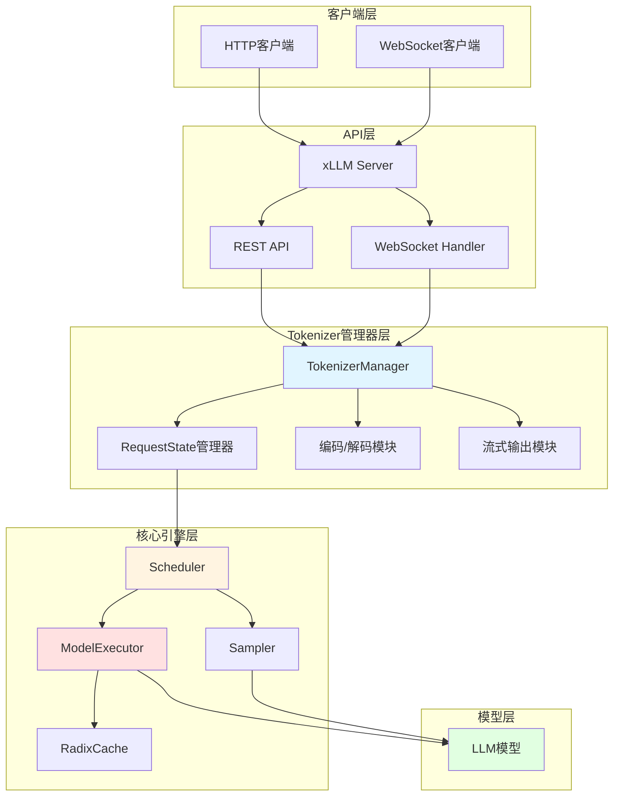
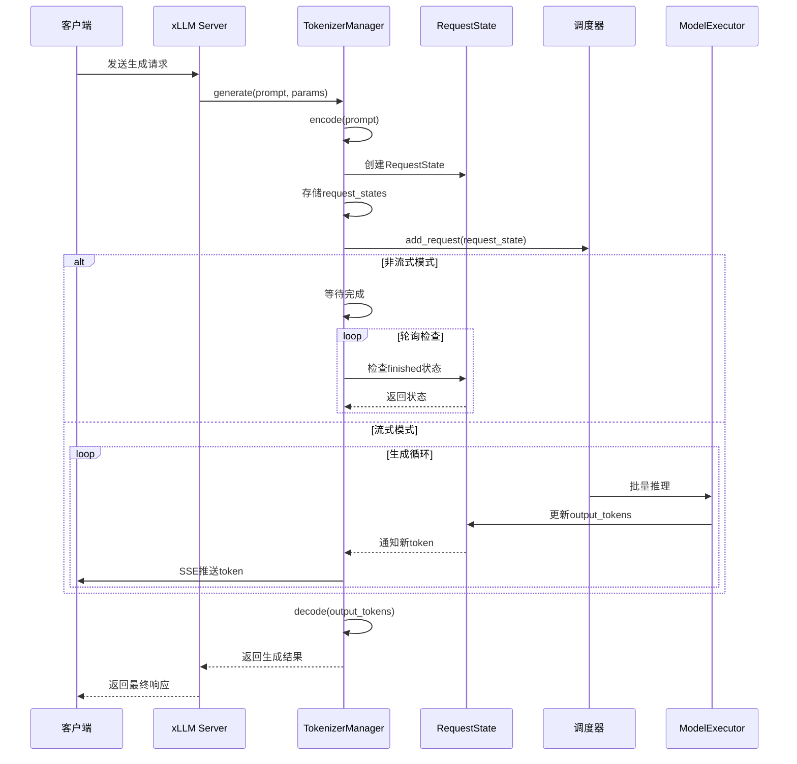

# 自己动手从头开始编写LLM推理引擎

## 第二篇：自研推理引擎的设计
## 前言

在上一篇博客中，我们实现了一个基础的LLM推理引擎，展示了从零开始构建推理系统的核心流程。然而，从Demo到生产级系统，需要解决性能、可扩展性、并发处理等诸多挑战。

本文将深入介绍我们自研的xLLM推理引擎的设计思路和实现细节。xLLM是一个基于纯CPU实现的高性能推理引擎，灵感来源于SGLang的设计理念，专门针对Qwen3、DeepSeek-R1等大语言模型进行优化。

## 一、从Demo到生产级：架构演进

### 1.1 Demo推理引擎的局限性

在Demo版本中，我们实现了基础的推理功能：

```python
# 传统模式的交互实现
def chat_traditional():
    """传统模式的对话实现"""
    print("=== 传统模式对话 ===")
    prompt_engineer = PromptEngineer()
    decoder = Decoder(model)
    
    conversation_history = []
    
    while True:
        user_input = input("\n用户: ")
        if user_input.lower() in ['exit', 'quit']:
            break
        
        conversation_history.append({"role": "user", "content": user_input})
        
        # 格式化提示
        formatted_prompt = prompt_engineer.format_prompt(conversation_history)
        
        # 生成响应
        response = decoder.generate(formatted_prompt, max_tokens=200, temperature=0.7)
        
        conversation_history.append({"role": "assistant", "content": response})
        print(f"助手: {response}")
```

虽然这个Demo能够完成基本的对话功能，但它存在明显的局限性：

- **单请求处理**：无法同时处理多个推理请求
- **无缓存机制**：每次推理都需要重新计算
- **性能瓶颈**：CPU利用率低，缺乏优化
- **扩展性差**：难以支持不同模型和场景


## 二、推理引擎架构设计（xLLM）

### 2.1 整体架构

采用与SGLang类似的分层架构设计，命名为xLLM。这种分层架构设计借鉴了现代软件工程的最佳实践，将复杂的推理引擎系统拆分为多个职责明确的层次，每一层专注于特定的功能，通过清晰的接口进行交互。

#### 2.1.0 架构设计理念

xLLM推理引擎的架构设计遵循以下核心原则：

**1. 分层解耦**
- 每一层只关注特定的职责，降低系统复杂度
- 层与层之间通过明确定义的接口进行通信
- 便于独立开发、测试和维护各个组件

**2. 高内聚低耦合**
- 相关功能集中在同一层内，提高内聚性
- 层与层之间的依赖关系清晰，降低耦合度
- 支持组件的独立演进和替换

**3. 可扩展性**
- 新功能可以通过扩展现有层或添加新层来实现
- 支持多种模型、多种协议的灵活接入
- 便于集成第三方服务和工具

**4. 高性能**
- 通过批处理和缓存优化提高吞吐量
- 异步处理机制支持高并发请求
- 资源利用率最大化

**5. 可观测性**
- 每一层都提供完善的日志和监控
- 便于问题诊断和性能分析
- 支持实时监控和告警

#### 2.1.1 系统架构图



**架构说明：**

xLLM推理引擎采用五层架构设计，从上到下依次为客户端层、API层、Tokenizer管理器层、核心引擎层和模型层。每一层都有明确的职责和边界，通过清晰的接口进行交互。

##### **客户端层**

客户端层是用户与xLLM推理引擎交互的入口点，提供多种访问方式以满足不同场景的需求：

- **HTTP客户端**：支持标准的HTTP/HTTPS协议，适用于Web应用、移动应用等场景。客户端通过RESTful API发送请求，接收JSON格式的响应。这种方式简单易用，兼容性好，适合大多数应用场景。

- **WebSocket客户端**：支持实时双向通信，适用于需要低延迟、实时交互的场景。WebSocket连接建立后，服务器可以主动向客户端推送数据，特别适合流式生成、实时对话等应用。

**设计优势：**
- 灵活性：用户可以根据应用需求选择最适合的协议
- 兼容性：支持主流的客户端框架和语言
- 可扩展性：易于添加新的协议支持（如gRPC、MQTT等）

##### **API层**

API层是xLLM推理引擎的服务入口，负责处理来自客户端的请求，提供统一的接口和服务：

- **xLLM Server**：基于FastAPI框架构建的高性能HTTP服务器，负责请求路由、参数验证、错误处理等核心功能。FastAPI提供了自动API文档生成、类型检查、异步支持等特性，大大简化了API开发。

- **REST API**：提供标准的RESTful接口，包括文本生成、文本编码、健康检查、模型信息查询等端点。REST API遵循REST架构风格，使用HTTP方法（GET、POST、PUT、DELETE）来表示操作类型，使用URL路径表示资源。

- **WebSocket Handler**：处理WebSocket连接和消息，支持流式输出和实时交互。WebSocket Handler管理连接的生命周期，处理连接建立、消息接收、连接关闭等事件。

**设计优势：**
- 统一性：提供一致的接口规范，降低客户端集成复杂度
- 可靠性：完善的错误处理和参数验证，确保系统稳定性
- 可观测性：内置日志记录和监控，便于问题诊断
- 文档化：自动生成API文档，提高开发效率

##### **Tokenizer管理器层**

Tokenizer管理器层是xLLM推理引擎的核心管理层，负责文本转换和请求协调，是连接API层和核心引擎层的桥梁：

- **TokenizerManager**：核心管理组件，负责协调各个子模块的工作。它维护所有活跃请求的状态，管理文本编码/解码，处理流式输出，与调度器进行交互。TokenizerManager是推理引擎的"大脑"，确保请求能够高效、可靠地处理。

- **RequestState管理器**：管理每个推理请求的完整生命周期。每个请求都有对应的RequestState对象，存储请求的所有状态信息（如prompt、tokenized_prompt、output_tokens、finished状态等）。RequestState管理器提供统一的接口来创建、查询、更新和删除请求状态。

- **编码/解码模块**：负责文本与token ID之间的双向转换。编码模块将用户输入的文本转换为模型可以理解的token ID列表，解码模块将模型输出的token ID列表转换回可读的文本。该模块包含完善的错误处理和备用实现，确保系统的可靠性。

- **流式输出模块**：实现Server-Sent Events (SSE)协议，支持实时推送生成的token。流式输出模块管理SSE连接，处理消息格式化，支持增量更新和完成通知，提供更好的用户体验。

**设计优势：**
- 集中管理：统一管理所有请求的状态，避免状态分散
- 高可靠性：完善的错误处理和备用方案，确保系统稳定运行
- 灵活性：支持多种生成模式和参数配置
- 可扩展性：易于添加新的编码/解码算法和流式协议

##### **核心引擎层**

核心引擎层是xLLM推理引擎的执行引擎，负责请求调度、模型推理、token采样和缓存管理，是系统性能的关键：

- **Scheduler（调度器）**：负责请求调度和批处理策略。调度器根据请求的优先级、长度、等待时间等因素对请求进行排序，将多个请求组合成批次，批量提交给模型执行器。调度器还管理KV缓存的分配和回收，实现高效的缓存复用。

- **ModelExecutor（模型执行器）**：负责加载和管理模型权重，执行模型前向计算。模型执行器针对CPU进行了深度优化，使用OpenMP进行多线程并行计算，利用Intel MKL库优化矩阵运算，实现高效的注意力机制计算。支持模型量化（INT8、FP16）以减少内存占用和提高推理速度。

- **Sampler（采样器）**：负责token采样策略。采样器实现了多种采样算法，包括温度采样、Top-K采样、Top-P（nucleus）采样等，控制生成的随机性和多样性。采样器还支持自定义采样策略，满足不同应用场景的需求。

- **RadixCache**：基于Radix树的数据结构管理KV缓存。RadixCache支持前缀匹配和缓存共享，多个请求如果具有相同的前缀，可以复用KV缓存，避免重复计算。RadixCache还实现了自动缓存淘汰机制，根据访问频率和时间淘汰不常用的缓存条目。

**设计优势：**
- 高性能：通过批处理和缓存复用显著提高吞吐量
- 智能调度：优先级调度算法优化延迟和吞吐量的平衡
- 内存高效：RadixCache大幅减少内存占用
- 灵活采样：支持多种采样策略，满足不同场景需求

##### **模型层**

模型层是实际的LLM模型推理层，负责执行大语言模型的前向计算：

- **LLM模型**：支持多种大语言模型，包括Qwen3系列模型（0.6B测试版本）、DeepSeek-R1系列模型等。模型层采用插件化加载机制，易于添加对新模型的支持。模型权重在启动时加载到内存中，推理时直接从内存读取，避免频繁的磁盘I/O。

**设计优势：**
- 多模型支持：灵活支持多种大语言模型
- 插件化架构：易于扩展新模型
- 内存优化：高效的权重加载和管理
- 推理优化：针对不同模型进行特定的优化

##### **层间交互**

各层之间通过清晰的接口进行交互，数据流向如下：

1. **请求下行**：客户端层 → API层 → Tokenizer管理器层 → 核心引擎层 → 模型层
2. **响应上行**：模型层 → 核心引擎层 → Tokenizer管理器层 → API层 → 客户端层

每一层只与相邻的层进行交互，避免了跨层依赖，降低了系统的复杂度。层与层之间的接口设计遵循最小知识原则，只暴露必要的功能，隐藏实现细节。

#### 2.1.2 组件交互流程



**流程说明：**

1. **请求接收**：客户端通过HTTP或WebSocket发送生成请求
2. **文本编码**：TokenizerManager将用户输入的prompt转换为token ID列表
3. **状态创建**：创建RequestState对象，存储请求的所有状态信息
4. **调度处理**：将请求提交给调度器，由调度器负责批处理和执行
5. **模型推理**：ModelExecutor执行实际的模型推理
6. **结果返回**：根据非流式或流式模式返回生成结果

### 2.2 核心组件详解

#### 2.2.1 HTTP服务接口

HTTP服务接口是xLLM的入口，负责接收推理请求并返回结果。我们使用FastAPI框架实现RESTful API：

主要端点包括：
- `POST /generate` - 文本生成接口
- `POST /encode` - 文本编码接口
- `GET /health` - 健康检查接口
- `GET /models` - 模型信息查询接口
- `GET /cache-stats` - KV缓存统计信息

#### 2.2.2 Tokenizer管理器

Tokenizer管理器负责文本的tokenization和detokenization，同时管理请求的生命周期。它是连接HTTP服务接口和调度器的关键组件。

##### 2.2.2.1 RequestState类：请求状态管理

`RequestState`类是Tokenizer管理器的核心数据结构，用于跟踪每个推理请求的完整生命周期。

**RequestState的核心属性：**

- **request_id**：唯一标识符，使用UUID生成，用于跟踪和管理请求
- **prompt**：原始用户输入的文本提示
- **tokenized_prompt**：经过tokenizer编码后的token ID列表
- **temperature**：控制生成随机性的参数（0.0-1.0）
- **max_tokens**：最大生成的token数量限制
- **stream**：是否启用流式输出
- **stop**：停止字符串，当生成内容包含这些字符串时停止生成
- **output_tokens**：已生成的token列表
- **finished**：请求是否完成
- **generated_tokens**：已生成的token数量
- **error**：错误信息（如果发生错误）

##### 2.2.2.2 TokenizerManager类：核心功能实现

**初始化与配置**

TokenizerManager在初始化时会：
1. 加载指定模型的tokenizer（使用HuggingFace的AutoTokenizer）
2. 初始化调度器（Scheduler）用于请求调度
3. 初始化采样器（Sampler）用于token采样
4. 创建请求状态字典，用于管理所有活跃请求

**文本编码（encode方法）**

encode方法将用户输入的文本转换为模型可以理解的token ID列表。如果tokenizer加载失败，会使用备用的简单实现。

**文本解码（decode方法）**

decode方法将模型输出的token ID列表转换回可读的文本。它包含了完善的错误处理机制，确保即使遇到异常情况也能返回有意义的结果。

##### 2.2.2.3 请求生成流程

**非流式生成（generate方法）**

非流式生成的完整流程：
1. **请求ID生成**：使用UUID生成唯一的请求标识符
2. **文本编码**：将用户输入的prompt转换为token ID列表
3. **状态创建**：创建RequestState对象，初始化所有必要的状态信息
4. **状态存储**：将请求状态存储在字典中，便于后续访问和管理
5. **调度器提交**：将请求提交给调度器，由调度器负责批处理和执行
6. **调度器启动**：确保调度器循环正在运行
7. **等待完成**：异步等待请求完成，定期检查状态
8. **结果返回**：解码生成的token并返回完整的生成结果

**流式生成（generate_stream方法）**

流式生成与非流式生成的主要区别在于：
- 流式生成使用异步生成器（async generator）逐步输出结果
- 每生成一个token就立即发送给客户端
- 提供更好的用户体验，特别是在生成长文本时

##### 2.2.2.4 流式响应处理机制

流式响应使用Server-Sent Events (SSE)协议实现，允许服务器向客户端推送实时更新。

**流式响应的关键特性：**

1. **实时推送**：每生成一个token就立即发送给客户端
2. **增量更新**：客户端可以逐步看到生成的内容
3. **完成通知**：请求完成时发送最终的完成消息
4. **错误处理**：如果请求不存在，立即返回错误信息


##### 2.2.2.5 与调度器的交互

Tokenizer管理器通过调度器实现请求的高效批处理。

调度器会：
1. 根据优先级对请求进行排序
2. 将多个请求组合成批次
3. 批量执行模型推理
4. 将结果更新到对应的RequestState中
5. 通知Tokenizer管理器请求已完成

这种设计实现了：
- **高效批处理**：多个请求可以一起处理，提高吞吐量
- **优先级调度**：短请求和等待时间长的请求优先处理
- **状态同步**：Tokenizer管理器和调度器共享RequestState，实现状态同步

##### 2.2.2.6 核心功能总结

Tokenizer管理器的核心功能包括：

- **文本编码/解码**：支持多种tokenizer，提供完善的备用实现
- **请求生命周期管理**：从请求创建到完成的完整状态跟踪
- **异步处理**：使用asyncio实现高效的异步请求处理
- **流式输出**：支持SSE协议的实时流式响应
- **错误处理**：完善的错误处理和日志记录
- **与调度器集成**：无缝集成调度器，实现高效批处理
- **请求状态管理**：集中管理所有活跃请求的状态

Tokenizer管理器是xLLM推理引擎的"大脑"，负责协调各个组件，确保请求能够高效、可靠地处理。

#### 2.2.3 调度器

调度器是xLLM的核心组件，负责请求调度和批处理策略：

**批处理策略**
- 连续批处理：动态组合多个请求形成批次
- 优先级调度：根据请求长度和等待时间分配优先级
- KV缓存复用：利用RadixCache提高缓存命中率

**RadixCache设计**
- 基于Radix树的数据结构管理KV缓存
- 支持前缀匹配和缓存共享
- 自动缓存淘汰机制

```python
# RadixCache的核心思想
# 1. 将请求的prompt前缀作为Radix树的键
# 2. 共享相同前缀的请求可以复用KV缓存
# 3. 自动淘汰不常用的缓存条目
```

#### 2.2.4 模型执行器

模型执行器负责加载和管理模型权重，执行模型前向计算：

**CPU优化技术**
- 使用OpenMP进行多线程并行计算
- 利用Intel MKL库优化矩阵运算
- 实现高效的注意力机制计算
- 模型量化支持（INT8、FP16）
- 设置合适的CPU线程数以充分利用多核资源

**模型支持**
- Qwen3系列模型（0.6B测试版本）
- DeepSeek-R1系列模型
- 模型插件化加载机制

## 三、性能优化策略

### 3.1 计算优化

**多线程并行处理**
```python
# 使用OpenMP进行多线程优化
import os
os.environ["OMP_NUM_THREADS"] = "8"  # 设置CPU线程数
```

**SIMD指令集优化**
- 利用AVX2/AVX-512指令集加速矩阵运算
- 向量化处理减少循环开销

**内存访问模式优化**
- 优化数据布局，提高缓存命中率
- 减少内存拷贝和分配

**计算图优化**
- 算子融合减少内存访问
- 消除冗余计算

### 3.2 内存优化

**KV缓存管理优化**
- 动态调整KV缓存大小
- 智能缓存淘汰策略

**动态内存分配策略**
- 预分配内存池减少分配开销
- 对象复用减少GC压力

### 3.3 批处理优化

**动态调整批处理大小**
- 根据当前负载动态调整批次大小
- 平衡延迟和吞吐量

**优化请求打包策略**
- 相似长度的请求打包在一起
- 减少批处理间的空闲时间

### 3.4 缓存优化策略

#### 3.4.1 KV缓存优化

**LRU淘汰算法改进**
- 基于访问时间和访问频率的混合淘汰策略
- 考虑请求的优先级和紧急程度

**缓存预热**
- 对热门前缀进行预加载
- 基于历史数据预测缓存需求

**分层缓存**
- 实现多级缓存结构，提高命中率
- 热数据在快速缓存中，冷数据在慢速缓存中

**缓存压缩**
- 对KV缓存进行量化压缩以节省内存
- 使用FP16或INT8存储KV缓存

#### 3.4.2 缓存命中率监控
实时监控指标包括：
- 缓存命中率
- 缓存条目访问统计
- 缓存效率分析
- 动态调整缓存策略

#### 3.4.3 缓存优化效果

- 通过缓存复用减少重复计算
- 提高推理吞吐量
- 降低平均响应时间

## 四、与SGLang的对比和借鉴

### 4.1 SGLang的设计理念

SGLang是一个高效的大语言模型推理系统，其核心设计理念包括：

- **RadixCache**：基于Radix树的KV缓存管理
- **连续批处理**：动态组合多个请求形成批次
- **结构化生成**：支持格式化输出
- **多模型并发**：同时支持多个模型推理

### 4.2 xLLM的借鉴和创新

**借鉴部分**
- RadixCache的KV缓存管理机制
- 连续批处理的调度策略
- 分层架构设计

**创新部分**
- 纯CPU实现，降低部署门槛
- 针对Qwen3、DeepSeek-R1等模型的专门优化
- 简化的API接口，易于集成


## 五、未来工作

### 5.1 功能增强

- **多模型支持**：扩展支持更多主流大语言模型
- **分布式推理**：支持多机多卡分布式推理
- **模型量化**：支持更高效的量化方案
- **结构化生成**：支持JSON、XML等格式化输出

### 5.2 性能优化

- **GPU支持**：添加GPU加速支持
- **模型蒸馏**：支持模型压缩和蒸馏
- **自适应批处理**：根据负载自动调整批处理策略
- **预测性缓存**：基于机器学习的缓存预测

### 5.3 扩展工作

- **多语言SDK**：提供Python、Java、Go等多语言SDK
- **监控告警**：集成Prometheus、Grafana等监控工具
- **自动化部署**：提供Docker、Kubernetes部署方案
- **社区生态**：建立开源社区，促进协作开发

## 总结

从Demo推理引擎到生产级的xLLM推理引擎，我们经历了架构设计、性能优化、功能完善等多个阶段。xLLM采用分层架构设计，包含HTTP服务接口、Tokenizer管理器、调度器和模型执行器等核心组件，通过连续批处理、RadixCache KV缓存、CPU优化等技术实现了高性能推理。

在后续的博客中，我们将深入探讨各个核心组件的实现细节，包括调度器的批处理策略、RadixCache的数据结构设计、模型执行器的CPU优化技术等。敬请期待！

---

**完整代码**：https://github.com/xdongp/xllm/
**作者**：Danny Pan (xdongp@gmail.com)


**相关资源**：
- [Qwen模型](https://huggingface.co/Qwen)
- [Transformers文档](https://huggingface.co/docs/transformers)
- [ModelScope](https://www.modelscope.cn)