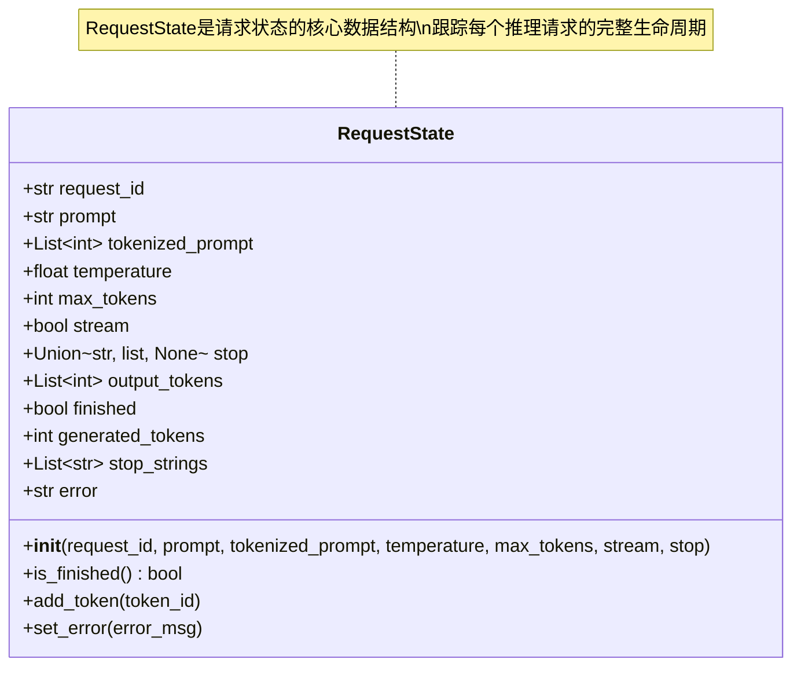
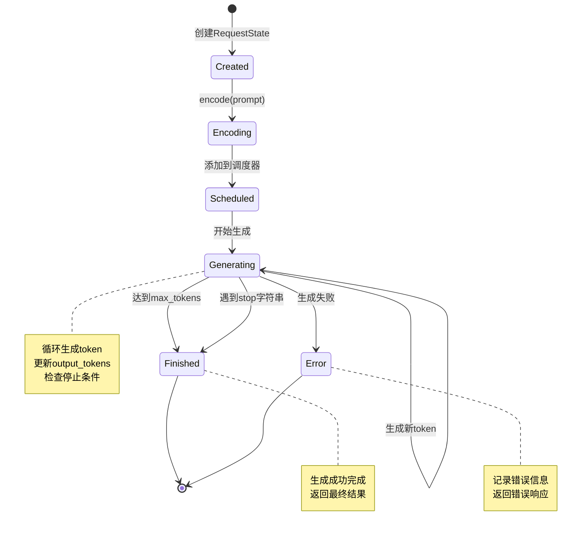
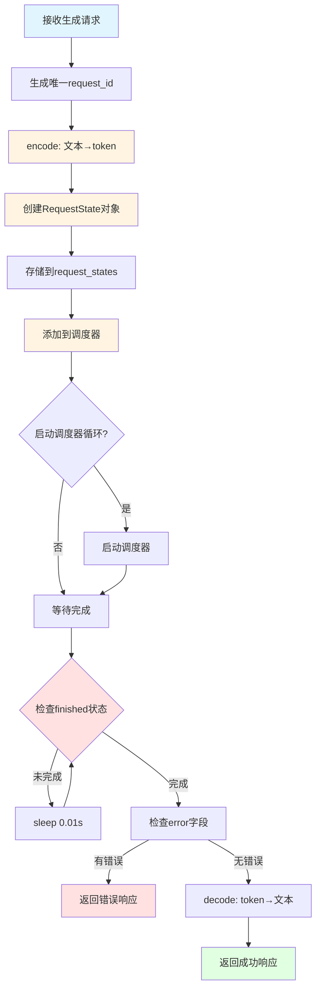
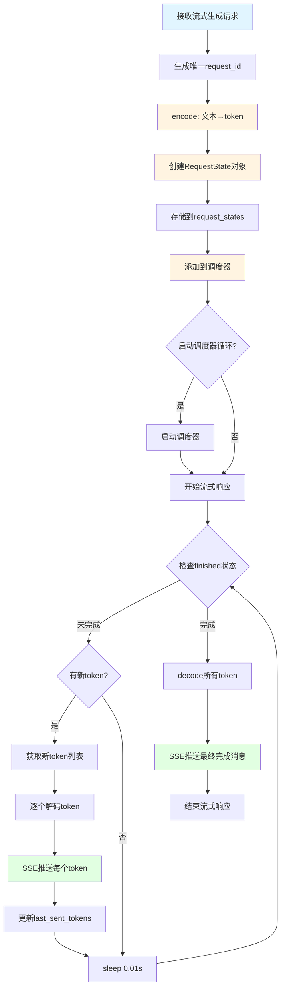
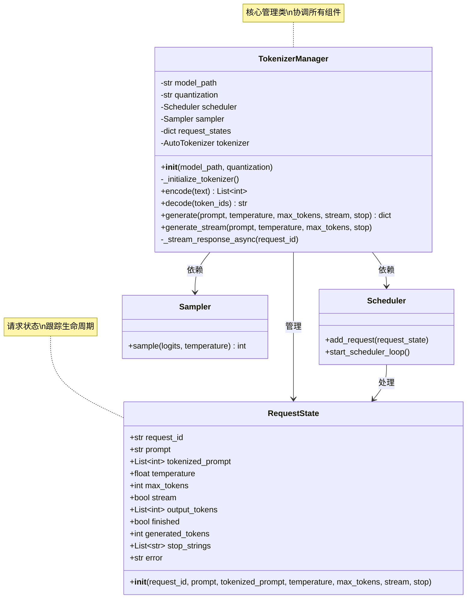
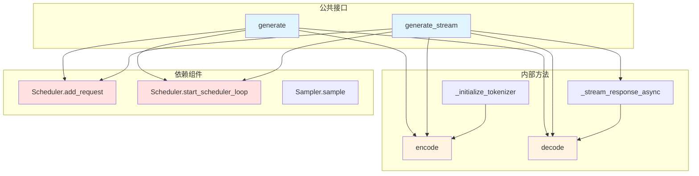

# 自己动手从头开始编写LLM推理引擎

## 第三篇：Tokenizer管理器的实现

### 前言

在前两篇文章中，我们分别搭建了一个Demo推理引擎，并设计了自研的xLLM推理引擎架构。在Demo阶段，我们使用了简单的PD（Prompt Engineering + Decoding）分离架构，将提示工程和解码过程分离。然而，当我们从Demo走向生产级系统时，需要一个更加完善的Tokenizer管理器来处理复杂的推理场景。本文将深入介绍Tokenizer管理器的设计与实现，解释为什么需要专门的Tokenizer管理器，实现的原则和要点，并结合实际代码展示最佳实践。

## 一、为什么需要Tokenizer管理器？

在生产级推理引擎中，Tokenizer管理器承担着以下核心职责：

1. **文本转换中枢**：负责文本到token ID的双向转换
2. **请求状态管理**：跟踪每个推理请求的完整生命周期
3. **流式输出支持**：实现Server-Sent Events (SSE)协议的实时推送
4. **容错机制**：完善的错误处理和备用方案

关于整体架构和组件交互的详细说明，请参考**[第二篇：自研推理引擎的设计](./2.自研推理引擎的设计.md)**中的架构设计部分。

## 二、Tokenizer管理器实现的原则和要点

### 2.1 设计原则

#### 2.1.1 单一职责原则 (Single Responsibility Principle)

Tokenizer管理器应该专注于分词和请求管理，不应该承担模型推理的责任。这种职责分离使得：

- 代码更易于理解和维护
- 各组件可以独立测试和优化
- 便于扩展新功能

在我们的实现中，Tokenizer管理器负责：
- ✅ 文本编码/解码
- ✅ 请求状态管理
- ✅ 与调度器的交互

而将以下职责交给其他组件：
- 模型推理 → ModelExecutor
- 请求调度 → Scheduler
- Token采样 → Sampler

#### 2.1.2 开闭原则 (Open-Closed Principle)

Tokenizer管理器应该对扩展开放，对修改关闭。这意味着：

- 可以轻松添加新的分词器支持
- 可以扩展新的生成参数
- 不需要修改核心代码

我们的实现通过以下方式支持开闭原则：

```python
# 支持多种分词器
def _initialize_tokenizer(self):
    """初始化分词器"""
    try:
        self.tokenizer = AutoTokenizer.from_pretrained(self.model_path)
        logger.info(f"Successfully loaded tokenizer for model: {self.model_path}")
    except Exception as e:
        logger.error(f"Failed to load tokenizer for model {self.model_path}: {e}")
        logger.info("Using fallback tokenizer")
        self.tokenizer = None  # 使用备用实现
```

#### 2.1.3 依赖倒置原则 (Dependency Inversion Principle)

Tokenizer管理器应该依赖于抽象（接口）而不是具体实现。在我们的实现中：

- Tokenizer管理器通过接口与Scheduler交互
- 不直接依赖具体的调度器实现
- 便于替换和测试

```python
# 通过接口与调度器交互
self.scheduler.add_request(request_state)
# 而不是直接操作调度器的内部状态
```

### 2.2 核心实现要点

#### 2.2.1 RequestState：请求状态管理

`RequestState`类是Tokenizer管理器的核心数据结构，用于跟踪每个推理请求的完整生命周期。

**设计要点：**

1. **唯一标识符**：使用UUID生成唯一的request_id
2. **完整的状态信息**：包含请求的所有必要信息
3. **生成状态跟踪**：实时跟踪生成进度
4. **错误处理**：记录错误信息

**实际实现：**

```python
class RequestState:
    """表示生成请求的状态"""
    
    def __init__(self, request_id: str, prompt: str, tokenized_prompt: List[int], 
                 temperature: float = 0.7, max_tokens: int = 100, 
                 stream: bool = False, stop: Union[str, list, None] = None):
        self.request_id = request_id
        self.prompt = prompt
        self.tokenized_prompt = tokenized_prompt
        self.temperature = temperature
        self.max_tokens = max_tokens
        self.stream = stream
        self.stop = stop
        
        # 生成状态
        self.output_tokens = []
        self.finished = False
        self.generated_tokens = 0
        self.stop_strings = []
        self.error = None
        
        # 处理停止字符串
        if isinstance(stop, str):
            self.stop_strings = [stop]
        elif isinstance(stop, list):
            self.stop_strings = stop
        elif stop is not None:
            self.stop_strings = [str(stop)]
```

**关键设计决策：**

- **stop_strings的灵活处理**：支持字符串、列表或None三种形式
- **output_tokens的增量更新**：支持流式输出
- **finished标志**：简化完成状态的判断
- **error字段**：集中管理错误信息

#### 2.2.1.1 RequestState数据结构图



#### 2.2.1.2 RequestState状态转换图



#### 2.2.2 文本编码/解码：容错机制

文本编码/解码是Tokenizer管理器的核心功能，需要实现完善的容错机制。

**编码实现要点：**

```python
def encode(self, text: str) -> List[int]:
    """将文本编码为token ID"""
    if self.tokenizer:
        return self.tokenizer.encode(text)
    else:
        # 备用实现
        return [ord(c) for c in text][:100]  # 简单的字符到整数编码演示
```

**解码实现要点：**

```python
def decode(self, token_ids: List[int]) -> str:
    """将token ID解码为文本"""
    if self.tokenizer:
        # 处理特殊标记
        return self.tokenizer.decode(token_ids, skip_special_tokens=True)
    else:
        # 备用实现 - 改进的解码方法
        try:
            # 尝试更广泛的字符范围，包括常见的Unicode字符
            decoded_chars = []
            for token_id in token_ids:
                try:
                    # 尝试直接转换为字符
                    char = chr(token_id)
                    # 只添加可打印的字符或空格
                    if char.isprintable() or char.isspace():
                        decoded_chars.append(char)
                    else:
                        # 对于不可打印字符，尝试替换为占位符
                        decoded_chars.append(f"[{token_id}]")
                except ValueError:
                    # 如果转换失败，添加占位符
                    decoded_chars.append(f"[{token_id}]")
            return ''.join(decoded_chars)
        except Exception as e:
            # 如果所有方法都失败，返回原始token ID列表作为字符串
            logger.warning(f"Failed to decode token IDs: {e}")
            return f"<DECODE_ERROR: {str(token_ids)[:100]}>"  # 限制长度以防过长
```

**容错机制的关键点：**

1. **多级备用方案**：主分词器 → 备用实现 → 错误占位符
2. **异常捕获**：捕获所有可能的异常
3. **日志记录**：记录失败信息便于调试
4. **安全限制**：限制输出长度防止内存溢出


#### 2.2.3 异步生成：非流式与流式

Tokenizer管理器支持两种生成模式：非流式（等待完整结果）和流式（实时推送）。

**非流式生成流程：**

```python
async def generate(self, prompt: str, temperature: float = 0.7, 
                   max_tokens: int = 100, stream: bool = False,
                   stop: Union[str, list, None] = None) -> dict:
    """根据提示生成文本"""
    # 1. 创建请求ID
    request_id = str(uuid.uuid4())
    
    # 2. 对提示进行分词
    tokenized_prompt = self.encode(prompt)
    
    # 3. 创建请求状态
    request_state = RequestState(
        request_id=request_id,
        prompt=prompt,
        tokenized_prompt=tokenized_prompt,
        temperature=temperature,
        max_tokens=max_tokens,
        stream=stream,
        stop=stop
    )
    
    # 4. 存储请求状态
    self.request_states[request_id] = request_state
    
    # 5. 将请求添加到调度器
    self.scheduler.add_request(request_state)
    
    # 6. 启动调度器循环（如果尚未启动）
    if hasattr(self.scheduler, 'start_scheduler_loop'):
        self.scheduler.start_scheduler_loop()
    
    # 7. 等待完成
    while not request_state.finished:
        await asyncio.sleep(0.01)
        if request_state.error:
            break
    
    # 8. 返回最终结果
    if request_state.error:
        return {
            "request_id": request_id,
            "prompt": prompt,
            "error": request_state.error,
            "generated_text": "",
            "finish_reason": "error"
        }
    
    decoded_text = self.decode(request_state.output_tokens)
    return {
        "request_id": request_id,
        "prompt": prompt,
        "generated_text": decoded_text,
        "finish_reason": "length" if request_state.generated_tokens >= max_tokens else "stop"
    }
```

**流式生成流程：**

```python
async def generate_stream(self, prompt: str, temperature: float = 0.7,
                          max_tokens: int = 100, stop: Union[str, list, None] = None):
    """根据提示生成文本并流式输出"""
    # 1-6. 与非流式生成相同的初始化步骤
    request_id = str(uuid.uuid4())
    tokenized_prompt = self.encode(prompt)
    request_state = RequestState(...)
    self.request_states[request_id] = request_state
    self.scheduler.add_request(request_state)
    if hasattr(self.scheduler, 'start_scheduler_loop'):
        self.scheduler.start_scheduler_loop()
    
    # 7. 流式响应
    async for chunk in self._stream_response_async(request_id):
        yield chunk

async def _stream_response_async(self, request_id: str):
    """异步生成流式响应"""
    request_state = self.request_states.get(request_id)
    if not request_state:
        yield f'data: {{"error": "Request not found", "request_id": "{request_id}"}}\n\n'
        return
    
    last_sent_tokens = 0
    while not request_state.finished:
        # 发送新生成的token
        if len(request_state.output_tokens) > last_sent_tokens:
            new_tokens = request_state.output_tokens[last_sent_tokens:]
            decoded_text = self.decode(new_tokens)
            
            # 为每个新token创建SSE事件
            for i, token_id in enumerate(new_tokens):
                token_text = self.decode([token_id])
                token_data = {
                    "id": f"{request_id}-{last_sent_tokens + i}",
                    "request_id": request_id,
                    "token": token_text,
                    "generated_text": self.decode(request_state.output_tokens[:last_sent_tokens + i + 1])
                }
                yield f'data: {json.dumps(token_data, ensure_ascii=False)}\n\n'
            
            last_sent_tokens = len(request_state.output_tokens)
        
        await asyncio.sleep(0.01)
    
    # 发送最终完成消息
    final_text = self.decode(request_state.output_tokens)
    completion_data = {
        "id": f"{request_id}-final",
        "request_id": request_id,
        "generated_text": final_text,
        "finish_reason": "length" if request_state.generated_tokens >= request_state.max_tokens else "stop",
        "done": True
    }
    yield f'data: {json.dumps(completion_data, ensure_ascii=False)}\n\n'
```

**流式输出的关键特性：**

1. **Server-Sent Events (SSE)协议**：使用标准化的流式输出协议
2. **增量更新**：每生成一个token就立即发送
3. **完成通知**：请求完成时发送最终消息
4. **错误处理**：请求不存在时立即返回错误

#### 2.2.3.1 非流式生成流程图



#### 2.2.3.2 流式生成流程图



#### 2.2.3.3 SSE消息格式示例

```mermaid
graph LR
    subgraph "Token 1"
        A1[data: {id: req-1-0, token: 你}]
    end

    subgraph "Token 2"
        A2[data: {id: req-1-1, token: 好}]
    end

    subgraph "Token 3"
        A3[data: {id: req-1-2, token: ！}]
    end

    subgraph "最终消息"
        A4[data: {done: true, finish_reason: stop}]
    end

    A1 --> A2 --> A3 --> A4

    style A1 fill:#e1f5ff
    style A2 fill:#fff4e1
    style A3 fill:#fff4e1
    style A4 fill:#e1ffe1
```

#### 2.2.4 与调度器的集成

Tokenizer管理器通过调度器实现请求的高效批处理。集成接口如下：

```python
# 初始化时创建调度器
from xllm.scheduler import Scheduler
self.scheduler = Scheduler(model_path, quantization=quantization)

# 添加请求到调度器
self.scheduler.add_request(request_state)

# 启动调度器循环
if hasattr(self.scheduler, 'start_scheduler_loop'):
    self.scheduler.start_scheduler_loop()
```

关于调度器的详细实现（批处理策略、KV缓存管理、请求调度算法），请参考后续文章关于调度器的实现。

## 三、最佳实践：完整的Tokenizer管理器实现

### 3.1 完整的类结构

```python
class TokenizerManager:
    """管理分词和请求处理"""
    
    def __init__(self, model_path: str, quantization: str = None):
        """初始化Tokenizer管理器"""
        self.model_path = model_path
        self.quantization = quantization
        
        # 初始化依赖组件
        from xllm.scheduler import Scheduler
        self.scheduler = Scheduler(model_path, quantization=quantization)
        from xllm.sampler import Sampler
        self.sampler = Sampler()
        self.request_states = {}
        
        # 初始化分词器
        self.tokenizer = None
        self._initialize_tokenizer()
    
    def _initialize_tokenizer(self):
        """初始化分词器"""
        try:
            self.tokenizer = AutoTokenizer.from_pretrained(self.model_path)
            logger.info(f"Successfully loaded tokenizer for model: {self.model_path}")
        except Exception as e:
            logger.error(f"Failed to load tokenizer for model {self.model_path}: {e}")
            logger.info("Using fallback tokenizer")
            self.tokenizer = None
    
    def encode(self, text: str) -> List[int]:
        """将文本编码为token ID"""
        if self.tokenizer:
            return self.tokenizer.encode(text)
        else:
            # 备用实现
            return [ord(c) for c in text][:100]
    
    def decode(self, token_ids: List[int]) -> str:
        """将token ID解码为文本"""
        if self.tokenizer:
            return self.tokenizer.decode(token_ids, skip_special_tokens=True)
        else:
            # 备用实现
            # ... (详细实现见上文)
    
    async def generate(self, prompt: str, temperature: float = 0.7, 
                       max_tokens: int = 100, stream: bool = False,
                       stop: Union[str, list, None] = None) -> dict:
        """非流式生成"""
        # ... (详细实现见上文)
    
    async def generate_stream(self, prompt: str, temperature: float = 0.7,
                              max_tokens: int = 100, stop: Union[str, list, None] = None):
        """流式生成"""
        # ... (详细实现见上文)
```

#### 3.1.1 TokenizerManager类结构图



#### 3.1.2 方法调用关系图




## 四、总结

### 4.1 Tokenizer管理器的核心价值

Tokenizer管理器是xLLM推理引擎的关键组件，它提供了：

1. **统一的文本转换接口**：封装了复杂的编码/解码逻辑
2. **完善的请求生命周期管理**：跟踪每个请求的状态
3. **灵活的生成模式**：支持非流式和流式两种模式
4. **高可靠性**：完善的错误处理和容错机制
5. **高性能**：与调度器无缝集成，支持批处理

### 4.2 设计原则总结

- ✅ **单一职责原则**：专注于分词和请求管理
- ✅ **开闭原则**：对扩展开放，对修改关闭
- ✅ **依赖倒置原则**：依赖于抽象而不是具体实现
- ✅ **容错优先**：完善的错误处理和备用方案
- ✅ **异步优先**：使用asyncio实现高效的异步处理

### 4.3 实现要点总结

- ✅ **RequestState**：完整的请求状态管理
- ✅ **容错机制**：多级备用方案
- ✅ **流式输出**：SSE协议的实时推送
- ✅ **调度器集成**：高效批处理
- ✅ **日志记录**：完善的监控和调试支持

### 4.4 下一步

在下一篇文章中，我们将深入介绍**调度器（Scheduler）**的实现，调度器是推理引擎的"心脏"，负责协调所有请求的高效处理。敬请期待！

**完整代码**：https://github.com/xdongp/xllm/
**作者**：Danny Pan (xdongp@gmail.com)