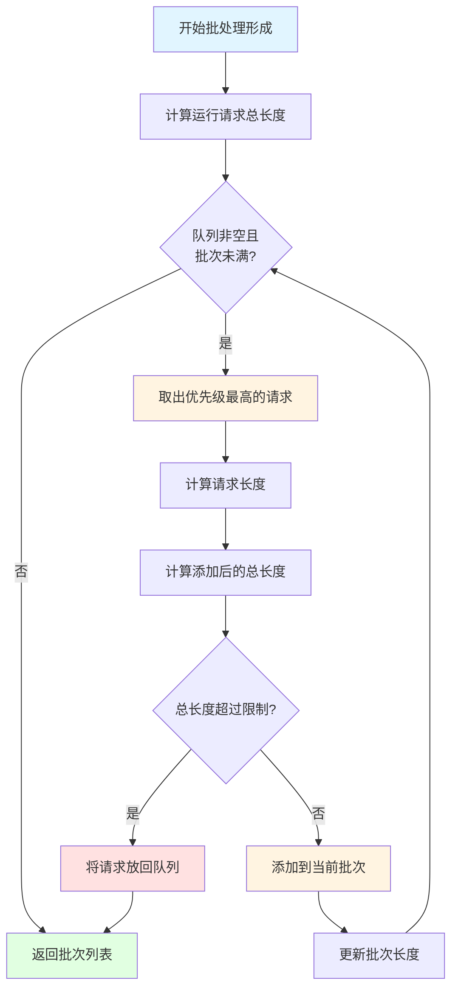
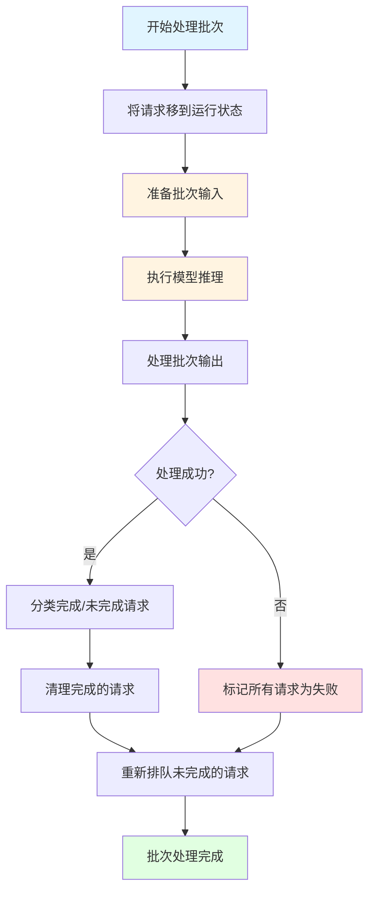
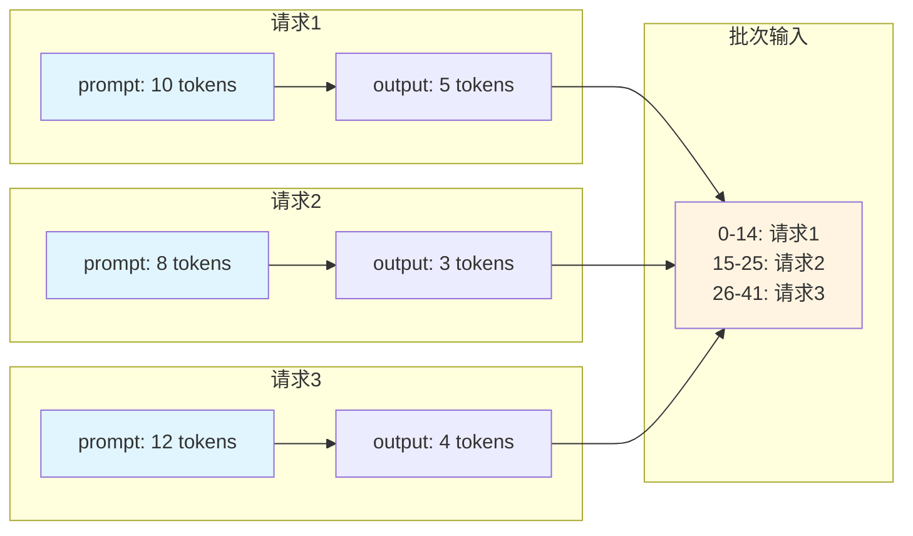
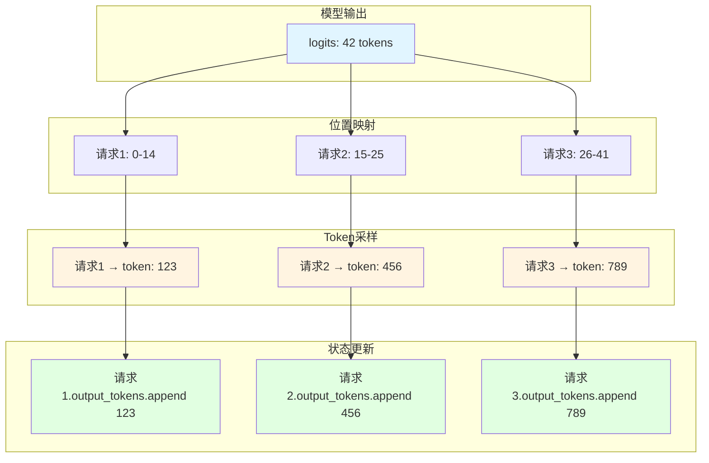
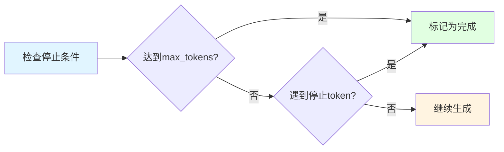
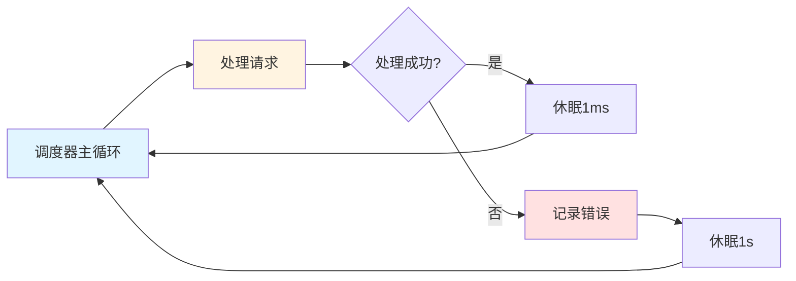
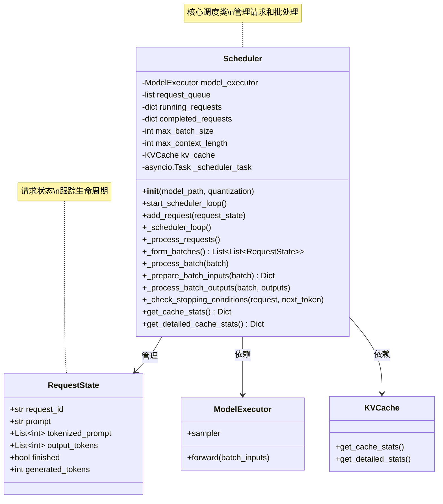
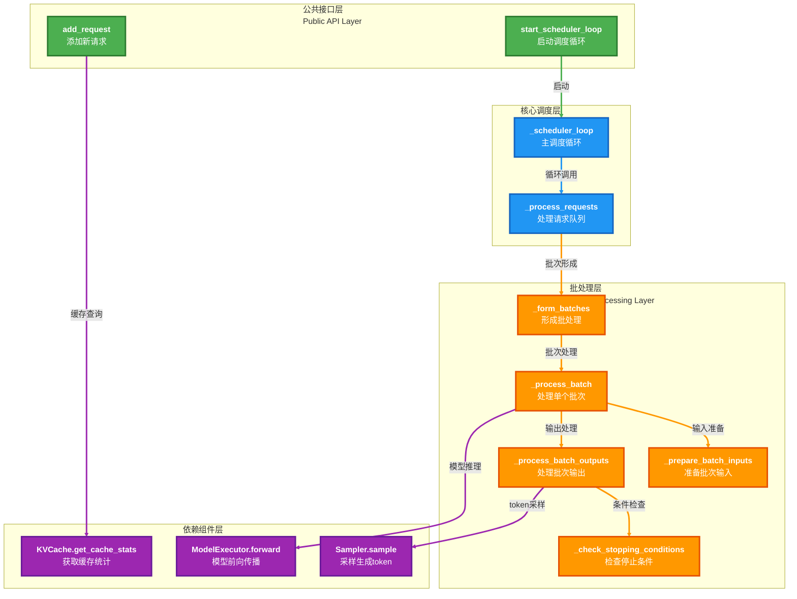
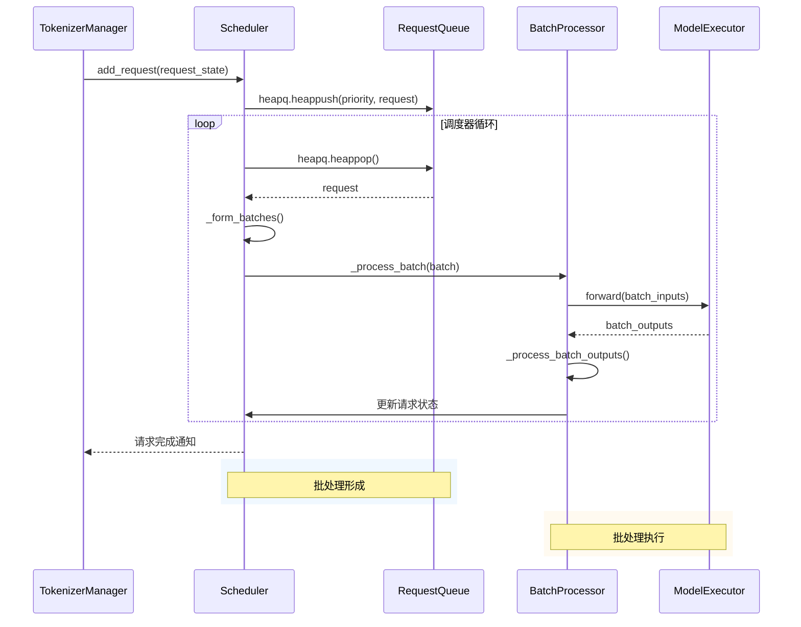
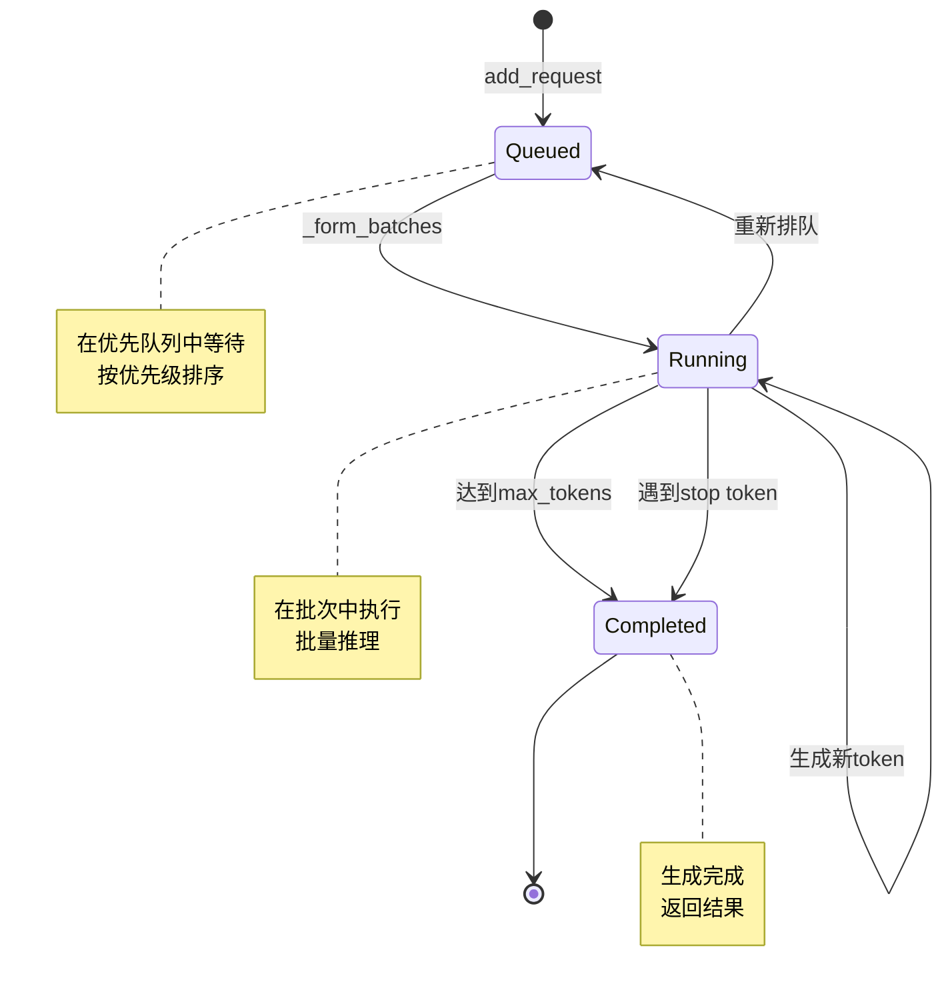

## 第四篇：调度器的实现

### 前言

在前三篇文章中，我们分别搭建了Demo推理引擎、设计了xLLM推理引擎的架构，并实现了Tokenizer管理器。Tokenizer管理器负责文本转换和请求状态管理，但它并不直接执行模型推理。那么，谁来负责将多个请求高效地组织起来，批量提交给模型执行呢？答案就是调度器（Scheduler）。

调度器是xLLM推理引擎的核心组件，负责请求调度、批处理策略和KV缓存管理。它决定了系统的吞吐量、延迟和资源利用率。本文将深入介绍调度器的设计与实现，解释为什么需要专门的调度器，实现的原则和要点，并结合实际代码展示最佳实践。

## 一、为什么需要调度器？

在Demo推理引擎中，我们采用简单的顺序处理方式：

```python
# Demo版本的顺序处理
for prompt in prompts:
    response = decoder.generate(prompt, max_tokens=200)
    print(response)
```

这种方式虽然简单，但在生产级系统中存在明显的局限性：

- **低吞吐量**：一次只能处理一个请求，无法利用批处理的优势
- **高延迟**：长请求会阻塞短请求，导致响应时间不稳定
- **资源浪费**：CPU和内存利用率低，无法充分发挥硬件性能
- **无缓存复用**：相同前缀的请求需要重复计算，浪费计算资源

调度器解决了这些问题，它承担着以下核心职责：

1. **请求调度**：根据优先级、长度、等待时间等因素对请求进行排序
2. **批处理管理**：将多个请求组合成批次，批量提交给模型执行
3. **KV缓存管理**：管理KV缓存的分配、复用和回收
4. **性能优化**：通过智能调度策略提高吞吐量和降低延迟

## 二、调度器实现的原则和要点

### 2.1 设计原则

#### 2.1.1 高效批处理原则

调度器的核心目标是最大化批处理的效率。这意味着：

- **动态批处理**：根据当前负载动态调整批次大小
- **智能组合**：将相似长度的请求打包在一起，减少padding开销
- **优先级调度**：短请求和等待时间长的请求优先处理，降低平均延迟

#### 2.1.2 缓存复用原则

KV缓存是大语言模型推理中最重要的优化手段之一。调度器需要：

- **前缀匹配**：识别具有相同前缀的请求，复用KV缓存
- **缓存分配**：智能分配KV缓存空间，避免内存浪费
- **缓存淘汰**：自动淘汰不常用的缓存条目，为新请求腾出空间

#### 2.1.3 异步处理原则

调度器需要支持高并发请求，因此必须采用异步处理机制：

- **非阻塞调度**：调度器循环不应阻塞新请求的加入
- **并发执行**：多个批次可以并发执行，提高吞吐量
- **事件驱动**：基于事件驱动的架构，提高响应速度

### 2.2 核心实现要点

#### 2.2.1 请求队列管理

调度器使用优先队列来管理待处理的请求：

```python
class Scheduler:
    def __init__(self, model_path: str, quantization: str = None):
        # 请求队列：使用优先队列
        self.request_queue = []  # 传入请求的优先队列
        self.running_requests = {}  # 当前正在处理的请求
        self.completed_requests = {}  # 已完成的请求
        
        # 调度器配置
        self.max_batch_size = 8  # 处理的最大批处理大小
        self.max_context_length = 2048  # 最大上下文长度
```

**优先级计算：**

```python
def add_request(self, request_state: RequestState):
    """将新请求按优先级添加到调度器队列"""
    # 根据等待时间和请求长度计算优先级
    # 较短的请求和等待时间较长的请求获得更高的优先级
    priority = time.time() + len(request_state.tokenized_prompt) * 0.01
    heapq.heappush(self.request_queue, (priority, request_state))
    logger.debug(f"Added request {request_state.request_id} to queue with priority {priority}")
```

**设计要点：**

1. **时间优先级**：等待时间越长的请求优先级越高
2. **长度优先级**：较短的请求获得更高的优先级
3. **动态调整**：优先级随着等待时间动态变化

#### 2.2.2 批处理策略

批处理是调度器的核心功能，它决定了系统的吞吐量。

**批处理形成算法：**

```python
def _form_batches(self) -> List[List[RequestState]]:
    """从请求队列中形成批处理"""
    batches = []
    current_batch = []
    current_batch_length = 0
    
    # 计算当前运行请求的长度
    running_requests_length = sum(
        len(req.tokenized_prompt) + req.generated_tokens 
        for req in self.running_requests.values()
    )
    
    # 处理队列中的请求直到达到批处理大小限制或上下文长度限制
    while (self.request_queue and 
           len(current_batch) < self.max_batch_size and
           current_batch_length < self.max_context_length):
        
        # 检查队列中的下一个请求
        if not self.request_queue:
            break
            
        _, request = heapq.heappop(self.request_queue)
        
        # 计算添加此请求后的总长度
        request_length = len(request.tokenized_prompt) + request.generated_tokens
        total_length = running_requests_length + current_batch_length + request_length
        
        # 检查是否超出上下文长度限制
        if total_length > self.max_context_length:
            # 将请求放回队列
            priority = time.time() + len(request.tokenized_prompt) * 0.01
            heapq.heappush(self.request_queue, (priority, request))
            break
        
        # 添加请求到当前批处理
        current_batch.append(request)
        current_batch_length += request_length
    
    # 如果形成了有效的批处理，添加到批次列表中
    if current_batch:
        batches.append(current_batch)
    
    return batches
```

**批处理策略的关键点：**

1. **动态批次大小**：根据当前负载动态调整批次大小
2. **上下文长度限制**：确保批次总长度不超过最大上下文长度
3. **请求回退**：超出限制的请求放回队列，等待下一轮处理

#### 2.2.2.1 批处理形成流程图

<div style="width: 100%; max-width: 250px; margin: 0 auto;">



</div>

#### 2.2.3 批处理执行

批处理形成后，调度器需要执行实际的推理：

```python
async def _process_batch(self, batch: List[RequestState]):
    """处理一批请求"""
    # 将请求移到运行状态
    for request in batch:
        self.running_requests[request.request_id] = request
    
    try:
        # 为模型准备输入
        batch_inputs = self._prepare_batch_inputs(batch)
        
        # 运行模型推理
        batch_outputs = await self.model_executor.forward(batch_inputs)
        
        # 处理输出
        self._process_batch_outputs(batch, batch_outputs)
        
    except Exception as e:
        # 将批次中的所有请求标记为失败
        for request in batch:
            request.finished = True
            request.error = str(e)
    
    # 清理已完成的请求并将未完成的请求重新排队
    completed_requests = [req for req in batch if req.finished]
    unfinished_requests = [req for req in batch if not req.finished]
    
    # 处理已完成的请求
    for request in completed_requests:
        if request.request_id in self.running_requests:
            del self.running_requests[request.request_id]
        self.completed_requests[request.request_id] = request
        
    # 将未完成的请求重新排队
    for request in unfinished_requests:
        if request.request_id in self.running_requests:
            del self.running_requests[request.request_id]
        priority = time.time()
        heapq.heappush(self.request_queue, (priority, request))
```

**批处理执行的关键点：**

1. **状态转换**：请求从队列状态转换到运行状态
2. **批量推理**：一次性处理多个请求，提高吞吐量
3. **错误处理**：单个请求失败不影响其他请求
4. **状态清理**：完成的请求移出运行状态，未完成的请求重新排队

#### 2.2.3.1 批处理执行流程图

<div style="width: 100%; max-width: 250px; margin: 0 auto;">



</div>

#### 2.2.4 批次输入准备

批次输入准备是将多个请求组合成模型可以处理的格式：

```python
def _prepare_batch_inputs(self, batch: List[RequestState]) -> Dict:
    """准备批处理的输入"""
    # 为批次中的所有请求组合提示和当前上下文
    all_input_ids = []
    request_positions = []
    sequence_ids = []
    
    current_pos = 0
    for request in batch:
        # 组合提示和生成的令牌
        input_ids = request.tokenized_prompt + request.output_tokens
        all_input_ids.extend(input_ids)
        request_positions.append((current_pos, current_pos + len(input_ids)))
        sequence_ids.append(request.request_id)
        current_pos += len(input_ids)
    
    return {
        "input_ids": all_input_ids,
        "request_positions": request_positions,
        "batch_size": len(batch),
        "sequence_ids": sequence_ids
    }
```

**批次输入准备的关键点：**

1. **Token拼接**：将所有请求的token ID拼接成一个长序列
2. **位置记录**：记录每个请求在批次中的起始和结束位置
3. **序列标识**：为每个请求分配唯一的序列ID

#### 2.2.4.1 批次输入准备示意图



#### 2.2.5 批次输出处理

批次输出处理是将模型输出分配给对应的请求：

```python
def _process_batch_outputs(self, batch: List[RequestState], outputs: Dict):
    """处理批次输出并更新请求状态"""
    logits = outputs["logits"]
    request_positions = outputs["request_positions"]
    
    # 处理批次中的每个请求
    for i, request in enumerate(batch):
        if request.finished:
            continue
            
        start_pos, end_pos = request_positions[i]
        # 确保不越界
        if start_pos < logits.shape[0] and end_pos <= logits.shape[0]:
            request_logits = logits[start_pos:end_pos]
            
            # 使用采样器采样下一个令牌
            next_token = self.model_executor.sampler.sample(
                request_logits, 
                request.temperature
            )
            
            # 将令牌添加到输出
            request.output_tokens.append(next_token)
            request.generated_tokens += 1
            
            # 检查停止条件
            self._check_stopping_conditions(request, next_token)
            
            # 额外检查：如果我们已经生成了足够的令牌，则标记为完成
            if request.generated_tokens >= request.max_tokens and not request.finished:
                request.finished = True
```

**批次输出处理的关键点：**

1. **位置映射**：根据request_positions找到每个请求的输出
2. **Token采样**：使用采样器生成下一个token
3. **状态更新**：更新请求的output_tokens和generated_tokens
4. **停止检查**：检查是否达到停止条件

#### 2.2.5.1 批次输出处理示意图



#### 2.2.6 停止条件检查

停止条件检查确保请求在适当的时候停止生成：

```python
def _check_stopping_conditions(self, request: RequestState, next_token: int):
    """检查请求是否应该停止"""
    # 检查最大令牌数
    if request.generated_tokens >= request.max_tokens:
        request.finished = True
        logger.info(f"Request {request.request_id} finished due to max tokens")
        return
    
    # 检查停止令牌（简化版）
    # 在实际实现中，这将检查实际的停止令牌
    if next_token == 0:  # Placeholder stop token
        request.finished = True
        logger.info(f"Request {request.request_id} finished due to stop token")
        return
```

**停止条件的关键点：**

1. **最大token数**：达到max_tokens时停止
2. **停止token**：遇到停止token时停止
3. **可扩展性**：易于添加其他停止条件（如停止字符串）

#### 2.2.6.1 停止条件检查流程图




#### 2.2.7 调度器主循环

调度器主循环是调度器的核心，负责持续处理请求：

```python
async def _scheduler_loop(self):
    """主调度器循环"""
    while True:
        try:
            # 处理请求
            await self._process_requests()
            
            # 短暂休眠以避免忙等待
            await asyncio.sleep(0.001)  # 1ms延迟
        except Exception as e:
            logger.error(f"Error in scheduler loop: {e}")
            import traceback
            logger.error(traceback.format_exc())
            await asyncio.sleep(1)  # 出错时等待更长时间
```

**调度器主循环的关键点：**

1. **持续运行**：调度器循环持续运行，不断处理请求
2. **异常处理**：捕获所有异常，确保调度器不会崩溃
3. **避免忙等待**：短暂休眠避免CPU占用过高

#### 2.2.7.1 调度器主循环流程图



#### 2.2.8 KV缓存管理

KV缓存是大语言模型推理中最重要的优化手段之一。调度器通过统一的KV缓存实现来管理缓存：

```python
def __init__(self, model_path: str, quantization: str = None):
    # 初始化KV缓存 - 使用统一的KV缓存实现
    from kv_cache import get_global_kv_cache
    self.kv_cache = get_global_kv_cache()

def get_cache_stats(self) -> Dict[str, Any]:
    """获取KV缓存统计信息"""
    return self.kv_cache.get_cache_stats()

def get_detailed_cache_stats(self) -> Dict[str, Any]:
    """获取详细的KV缓存统计信息"""
    return self.kv_cache.get_detailed_stats()
```

**KV缓存管理的关键点：**

1. **统一管理**：使用全局KV缓存实现，避免重复管理
2. **统计信息**：提供缓存统计信息，便于监控和优化
3. **可观测性**：支持详细的缓存统计，帮助诊断问题

## 三、最佳实践：完整的调度器实现

### 3.1 完整的类结构

```python
class Scheduler:
    """管理请求调度和批处理"""
    
    def __init__(self, model_path: str, quantization: str = None):
        from xllm.model_executor import ModelExecutor
        self.model_path = model_path
        self.quantization = quantization
        self.model_executor = ModelExecutor(model_path, quantization=quantization)
        self.request_queue = []  # 传入请求的优先队列
        self.running_requests = {}  # 当前正在处理的请求
        self.completed_requests = {}  # 已完成的请求
        
        # 调度器配置
        self.max_batch_size = 8  # 处理的最大批处理大小
        self.max_context_length = 2048  # 最大上下文长度
        
        # 初始化KV缓存 - 使用统一的KV缓存实现
        from kv_cache import get_global_kv_cache
        self.kv_cache = get_global_kv_cache()
        
        # 调度器任务将在事件循环可用时启动
        self._scheduler_task = None
    
    def start_scheduler_loop(self):
        """当事件循环可用时启动调度器循环"""
        if self._scheduler_task is None:
            self._scheduler_task = asyncio.create_task(self._scheduler_loop())
    
    def add_request(self, request_state: RequestState):
        """将新请求按优先级添加到调度器队列"""
        priority = time.time() + len(request_state.tokenized_prompt) * 0.01
        heapq.heappush(self.request_queue, (priority, request_state))
    
    async def _scheduler_loop(self):
        """主调度器循环"""
        while True:
            try:
                await self._process_requests()
                await asyncio.sleep(0.001)
            except Exception as e:
                logger.error(f"Error in scheduler loop: {e}")
                await asyncio.sleep(1)
    
    async def _process_requests(self):
        """处理队列中的请求"""
        if not self.request_queue:
            return
        
        # 形成批处理
        batches = self._form_batches()
        
        # 处理每个批处理
        for batch in batches:
            await self._process_batch(batch)
    
    def _form_batches(self) -> List[List[RequestState]]:
        """从请求队列中形成批处理"""
        # ... (详细实现见上文)
    
    async def _process_batch(self, batch: List[RequestState]):
        """处理一批请求"""
        # ... (详细实现见上文)
    
    def _prepare_batch_inputs(self, batch: List[RequestState]) -> Dict:
        """准备批处理的输入"""
        # ... (详细实现见上文)
    
    def _process_batch_outputs(self, batch: List[RequestState], outputs: Dict):
        """处理批次输出并更新请求状态"""
        # ... (详细实现见上文)
    
    def _check_stopping_conditions(self, request: RequestState, next_token: int):
        """检查请求是否应该停止"""
        # ... (详细实现见上文)
    
    def get_cache_stats(self) -> Dict[str, Any]:
        """获取KV缓存统计信息"""
        return self.kv_cache.get_cache_stats()
    
    def get_detailed_cache_stats(self) -> Dict[str, Any]:
        """获取详细的KV缓存统计信息"""
        return self.kv_cache.get_detailed_stats()
```

#### 3.1.1 Scheduler类结构图



#### 3.1.2 方法调用关系图



**图例说明：**
- **绿色**：公共接口层 - 对外暴露的API方法
- **蓝色**：核心调度层 - 调度器的核心逻辑
- **橙色**：批处理层 - 批处理相关的操作
- **紫色**：依赖组件层 - 调用外部组件的方法

### 3.2 调度器工作流程

#### 3.2.1 完整的请求处理流程



#### 3.2.2 请求状态转换图



## 四、性能优化与最佳实践

### 4.1 批处理优化

#### 4.1.1 动态批次大小

根据当前负载动态调整批次大小：

```python
def _form_batches(self) -> List[List[RequestState]]:
    """从请求队列中形成批处理"""
    # 根据当前负载动态调整批次大小
    current_load = len(self.request_queue) + len(self.running_requests)
    if current_load > 100:
        self.max_batch_size = 16  # 高负载时增加批次大小
    elif current_load > 50:
        self.max_batch_size = 12
    else:
        self.max_batch_size = 8  # 低负载时使用默认批次大小
    
    # ... 其余批处理逻辑
```

#### 4.1.2 相似长度请求打包

将相似长度的请求打包在一起，减少padding开销：

```python
def _form_batches(self) -> List[List[RequestState]]:
    """从请求队列中形成批处理"""
    # 先按请求长度排序
    sorted_requests = sorted(
        [(priority, req) for priority, req in self.request_queue],
        key=lambda x: len(x[1].tokenized_prompt)
    )
    
    # 形成批处理时优先选择相似长度的请求
    # ... 其余批处理逻辑
```

### 4.2 KV缓存优化

#### 4.2.1 缓存预热

对热门前缀进行预加载：

```python
def __init__(self, model_path: str, quantization: str = None):
    # 初始化KV缓存
    self.kv_cache = get_global_kv_cache()
    
    # 预热缓存
    self._warmup_cache()

def _warmup_cache(self):
    """预热KV缓存"""
    # 对常见的前缀进行预加载
    common_prefixes = [
        "你好",
        "请解释",
        "如何",
        # ... 更多常见前缀
    ]
    
    for prefix in common_prefixes:
        tokenized = self.model_executor.tokenizer.encode(prefix)
        # 预计算并缓存这些前缀
        # ...
```

#### 4.2.2 缓存淘汰策略

实现智能的缓存淘汰策略：

```python
def _evict_cache_if_needed(self):
    """如果需要，淘汰缓存"""
    cache_stats = self.kv_cache.get_cache_stats()
    
    if cache_stats["cache_usage"] > 0.9:  # 缓存使用率超过90%
        # 淘汰最不常用的缓存条目
        self.kv_cache.evict_lru_entries(
            num_entries=int(cache_stats["total_entries"] * 0.1)
        )
```

### 4.3 异步优化

#### 4.3.1 并发批处理

支持多个批次并发执行：

```python
async def _process_requests(self):
    """处理队列中的请求"""
    if not self.request_queue:
        return
    
    # 形成批处理
    batches = self._form_batches()
    
    # 并发处理多个批处理
    tasks = [self._process_batch(batch) for batch in batches]
    await asyncio.gather(*tasks)
```

#### 4.3.2 非阻塞调度

确保调度器循环不会阻塞新请求的加入：

```python
def add_request(self, request_state: RequestState):
    """将新请求按优先级添加到调度器队列"""
    # 使用线程安全的优先队列
    priority = time.time() + len(request_state.tokenized_prompt) * 0.01
    heapq.heappush(self.request_queue, (priority, request_state))
    
    # 立即返回，不等待调度器处理
    logger.debug(f"Request {request_state.request_id} added to queue")
```

## 五、总结

### 5.1 调度器的核心价值

调度器是xLLM推理引擎的核心组件，它通过以下方式提升系统性能：

1. **高效批处理**：将多个请求组合成批次，批量提交给模型执行，显著提高吞吐量
2. **智能调度**：根据优先级、长度、等待时间等因素对请求进行排序，优化延迟和吞吐量的平衡
3. **KV缓存管理**：管理KV缓存的分配、复用和回收，大幅减少重复计算
4. **异步处理**：支持高并发请求，提高系统的响应能力

### 5.2 设计原则总结

调度器的设计遵循以下核心原则：

1. **高效批处理原则**：最大化批处理的效率，动态调整批次大小，智能组合请求
2. **缓存复用原则**：识别具有相同前缀的请求，复用KV缓存，智能分配缓存空间
3. **异步处理原则**：非阻塞调度，并发执行，事件驱动

### 5.3 实现要点总结

调度器的实现要点包括：

1. **请求队列管理**：使用优先队列管理待处理的请求，动态计算优先级
2. **批处理策略**：动态形成批处理，考虑上下文长度限制，智能组合请求
3. **批处理执行**：准备批次输入，执行模型推理，处理批次输出，更新请求状态
4. **停止条件检查**：检查最大token数和停止token，确保请求在适当的时候停止
5. **调度器主循环**：持续运行，处理请求，异常处理，避免忙等待
6. **KV缓存管理**：统一管理KV缓存，提供统计信息，支持缓存预热和淘汰

### 5.4 下一步

在下一篇文章中，我们将介绍：

- **模型执行器（ModelExecutor）的实现**：如何加载和管理模型权重，执行模型前向计算
- **采样器（Sampler）的实现**：如何实现多种采样策略，控制生成的随机性和多样性
- **KV缓存的详细实现**：如何实现基于Radix树的KV缓存，支持前缀匹配和缓存共享

敬请期待！


**完整代码**：https://github.com/xdongp/xllm/
**作者**：Danny Pan (xdongp@gmail.com)