# 自己动手从头开始编写LLM推理引擎

## 模型执行器的实现（原理）

## 前言

在xLLM推理引擎中，**模型执行器（Model Executor）** 是整个系统的核心计算引擎，负责将输入的token序列转换为输出的logits分布。它是推理引擎的"心脏"，承载着最繁重的计算任务。

本文将深入探讨模型执行器的实现原理，包括：
- Transformer和神经网络的基础知识
- 模型执行器的核心职责和设计原则
- 前向传播的深度解析
- 性能优化策略
- DeepSeek和Qwen模型的架构特点

## 1. Transformer和神经网络基础知识

在深入模型执行器之前，让我们先了解一些Transformer和神经网络的基础知识，这将帮助我们更好地理解模型执行器的工作原理。

### 1.1 神经网络基础

神经网络是由多个神经元（或称为节点）组成的计算模型，通过层次化的结构来学习和表示数据。

#### 1.1.1 基本概念

- **神经元（Neuron）**：神经网络的基本单元，接收输入，通过激活函数产生输出
- **层（Layer）**：神经元的集合，包括输入层、隐藏层和输出层
- **权重（Weight）**：连接神经元之间的参数，通过训练学习得到
- **偏置（Bias）**：每个神经元的偏移量，帮助模型更好地拟合数据
- **激活函数（Activation Function）**：引入非线性，使神经网络能够学习复杂的模式

**神经元结构图**：

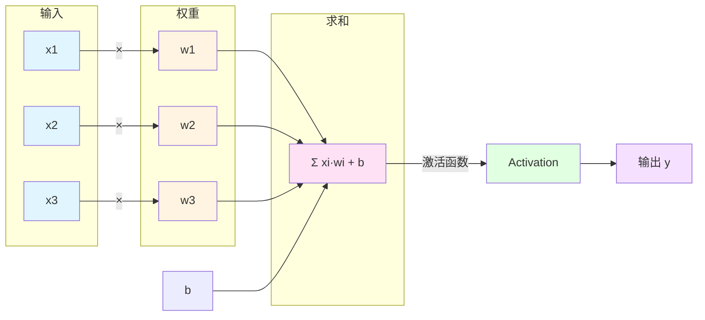

**简单神经网络结构图**：

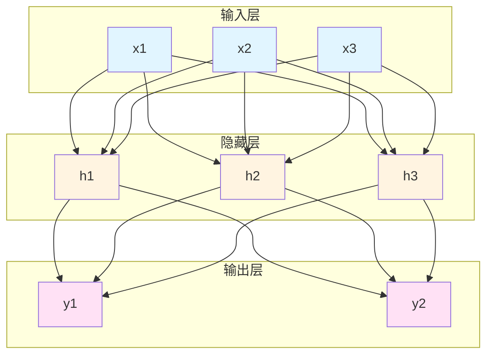

#### 1.1.2 前向传播

前向传播是神经网络的基本计算过程，从输入层到输出层逐层计算。

**前向传播流程图**：


**多层前向传播**：

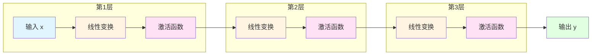

### 1.2 Transformer架构详解

Transformer是2017年由Google团队在论文《Attention Is All You Need》中提出的革命性架构，它完全基于注意力机制，摒弃了传统的循环和卷积结构，成为现代大语言模型的基石。

#### 1.2.1 Transformer的诞生背景

在Transformer出现之前，序列建模任务主要依赖RNN（循环神经网络）及其变体（LSTM、GRU）。然而，RNN存在以下根本性缺陷：

1. **串行计算**：必须按顺序处理序列，无法充分利用GPU并行能力
2. **长距离依赖问题**：信息在长序列中传递时会逐渐衰减
3. **梯度消失/爆炸**：深层网络训练困难
4. **计算效率低**：无法充分利用现代硬件的并行计算能力

Transformer通过**自注意力机制**完美解决了这些问题，实现了：
- **完全并行计算**：所有位置可以同时处理
- **全局信息交互**：任意两个位置之间的距离都是1
- **高效的信息传递**：直接建立全局连接，无需逐层传递
- **强大的表达能力**：通过多头注意力捕获丰富的语义关系

#### 1.2.2 整体架构

Transformer采用**编码器-解码器（Encoder-Decoder）**架构，但在大语言模型中，通常只使用解码器部分。让我们先了解完整的Transformer架构。

**完整Transformer架构图**：

```mermaid
graph TB
    subgraph 输入处理["📥 输入处理"]
        direction LR
    A["输入序列<br/>Input Sequence"] --> B["嵌入层<br/>Embedding Layer"]
        B --> C[位置编码<br/>Positional Encoding]
    end
    
    C --> E1
    
    subgraph 编码器["🧠 编码器 Encoder"]
        direction TB
        E1[编码器层 1<br/>Encoder Layer 1]
        E2[编码器层 2<br/>Encoder Layer 2]
        E3[...]
        EN[编码器层 N<br/>Encoder Layer N]
        
        E1 --> E2
        E2 --> E3
        E3 --> EN
        
        style E1 fill:#4A90E2
        style E2 fill:#4A90E2
        style E3 fill:#4A90E2
        style EN fill:#4A90E2
    end
    
    EN --> D[编码器输出<br/>Encoder Output]
    
    D --> DE1
    
    subgraph 解码器["🎯 解码器 Decoder"]
        direction TB
        DE1[解码器层 1<br/>Decoder Layer 1]
        DE2[解码器层 2<br/>Decoder Layer 2]
        DE3[...]
        DEN[解码器层 N<br/>Decoder Layer N]
        
        DE1 --> DE2
        DE2 --> DE3
        DE3 --> DEN
        
        style DE1 fill:#E94B3C
        style DE2 fill:#E94B3C
        style DE3 fill:#E94B3C
        style DEN fill:#E94B3C
    end
    
    DEN --> F
    
    subgraph 输出处理["📤 输出处理"]
        direction LR
    F["线性层<br/>Linear Layer"] --> G["Softmax"]
        G --> H[输出概率<br/>Output Probabilities]
    end
    
    style A fill:#95E1D3
    style B fill:#F38181
    style C fill:#AA96DA
    style D fill:#FCBAD3
    style F fill:#95E1D3
    style G fill:#F38181
    style H fill:#AA96DA
    
    style 输入处理 fill:#f8f9fa,stroke:#333,stroke-width:2px
    style 编码器 fill:#e3f2fd,stroke:#4A90E2,stroke-width:3px
    style 解码器 fill:#ffebee,stroke:#E94B3C,stroke-width:3px
    style 输出处理 fill:#f8f9fa,stroke:#333,stroke-width:2px

```

**编码器层详细结构**：

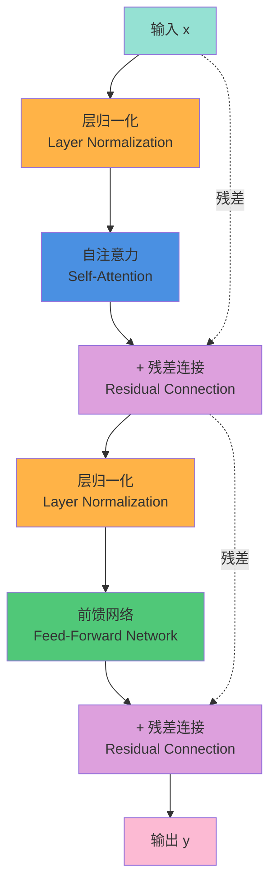

**解码器层详细结构**：

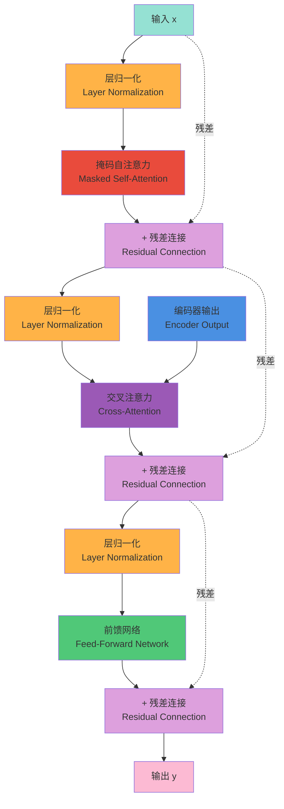

**仅解码器架构（大语言模型常用）**：

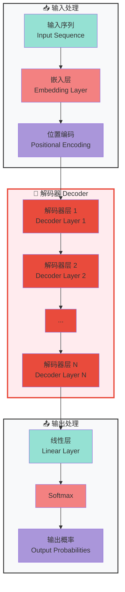

**核心组件说明**：

| 组件 | 功能 | 作用 |
|------|------|------|
| **嵌入层** | 将离散token转换为连续向量 | 提供语义表示 |
| **位置编码** | 为序列中的每个位置添加位置信息 | 使模型理解顺序关系 |
| **自注意力** | 计算序列中所有位置之间的关系 | 捕获全局依赖 |
| **前馈网络** | 对每个位置进行非线性变换 | 提升表达能力 |
| **残差连接** | 将输入直接加到输出上 | 缓解梯度消失，加速训练 |
| **层归一化** | 对每个样本的特征进行归一化 | 稳定训练过程 |

#### 1.2.3 自注意力机制

自注意力（Self-Attention）是Transformer的核心创新，它允许序列中的每个位置都直接与所有其他位置交互。

**自注意力机制的核心概念**：

为了更好地理解自注意力机制，我们可以用一个**图书馆检索系统**来比喻：

- **Query（查询）**：就像你在图书馆找书时，心里想找什么主题的书
- **Key（索引）**：就像每本书的目录和标签，告诉你这本书讲什么
- **Value（内容）**：就像书中的实际内容，是你真正想要的信息

**工作流程**：
1. 每个词都生成自己的Q、K、V三个向量
2. 用当前词的Q去和其他所有词的K进行匹配（计算相似度）
3. 相似度越高，说明这两个词越相关
4. 根据相似度对所有词的V进行加权求和，得到最终输出

**自注意力计算流程图**：

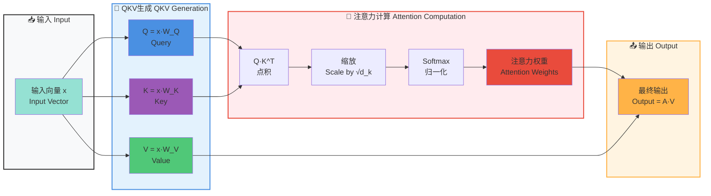

**自注意力的直观理解**：

假设我们处理句子："The cat sat on the mat"，我们来看看注意力权重如何分布。

```mermaid
graph TB
    subgraph 注意力权重矩阵["📊 注意力权重矩阵 Attention Weights Matrix"]
        direction TB
        
        subgraph 行标签["查询词 Query Words"]
            Q1["The"]
            Q2["cat"]
            Q3["sat"]
            Q4["on"]
            Q5["the"]
            Q6["mat"]
        end
        
        subgraph 列标签["键词 Key Words"]
            K1["The"]
            K2["cat"]
            K3["sat"]
            K4["on"]
            K5["the"]
            K6["mat"]
        end
        
        subgraph 权重值["注意力分数 Attention Scores"]
            W11[0.35]
            W12[0.25]
            W13[0.15]
            W14[0.10]
            W15[0.05]
            W16[0.10]
            
            W21[0.20]
            W22[0.30]
            W23[0.15]
            W24[0.10]
            W25[0.05]
            W26[0.20]
            
            W31[0.10]
            W32[0.15]
            W33[0.40]
            W34[0.20]
            W35[0.05]
            W36[0.10]
            
            W41[0.05]
            W42[0.10]
            W43[0.25]
            W44[0.35]
            W45[0.10]
            W46[0.15]
            
            W51[0.05]
            W52[0.10]
            W53[0.10]
            W54[0.15]
            W55[0.30]
            W56[0.30]
            
            W61[0.10]
            W62[0.20]
            W63[0.10]
            W64[0.15]
            W65[0.25]
            W66[0.20]
        end
        
        Q1 --> W11
        Q1 --> W12
        Q1 --> W13
        Q1 --> W14
        Q1 --> W15
        Q1 --> W16
        
        Q2 --> W21
        Q2 --> W22
        Q2 --> W23
        Q2 --> W24
        Q2 --> W25
        Q2 --> W26
        
        Q3 --> W31
        Q3 --> W32
        Q3 --> W33
        Q3 --> W34
        Q3 --> W35
        Q3 --> W36
        
        Q4 --> W41
        Q4 --> W42
        Q4 --> W43
        Q4 --> W44
        Q4 --> W45
        Q4 --> W46
        
        Q5 --> W51
        Q5 --> W52
        Q5 --> W53
        Q5 --> W54
        Q5 --> W55
        Q5 --> W56
        
        Q6 --> W61
        Q6 --> W62
        Q6 --> W63
        Q6 --> W64
        Q6 --> W65
        Q6 --> W66
        
        style W11 fill:#FFE5E5
        style W12 fill:#FFCCCC
        style W13 fill:#FFB3B3
        style W14 fill:#FF9999
        style W15 fill:#FF8080
        style W16 fill:#FF6666
        
        style W21 fill:#FFCCCC
        style W22 fill:#FFB3B3
        style W23 fill:#FF9999
        style W24 fill:#FF8080
        style W25 fill:#FF6666
        style W26 fill:#FFCCCC
        
        style W31 fill:#FF9999
        style W32 fill:#FF8080
        style W33 fill:#FF6666
        style W34 fill:#FF9999
        style W35 fill:#FF6666
        style W36 fill:#FF8080
        
        style W41 fill:#FF6666
        style W42 fill:#FF8080
        style W43 fill:#FF9999
        style W44 fill:#FFB3B3
        style W45 fill:#FF8080
        style W46 fill:#FF9999
        
        style W51 fill:#FF6666
        style W52 fill:#FF8080
        style W53 fill:#FF8080
        style W54 fill:#FF9999
        style W55 fill:#FFCCCC
        style W56 fill:#FFCCCC
        
        style W61 fill:#FF9999
        style W62 fill:#FFB3B3
        style W63 fill:#FF8080
        style W64 fill:#FF9999
        style W65 fill:#FFB3B3
        style W66 fill:#FF9999
    end
    
    note["💡 说明：颜色越深表示注意力权重越大<br/>例如：'cat'会更多地关注'The'和'mat'<br/>因为它们有语义关联"] -.-> W22
```

**自注意力的优势**：

| 特性 | 说明 | 优势 |
|------|------|------|
| **全局感受野** | 每个位置都能看到整个序列 | 捕获长距离依赖 |
| **动态权重** | 根据上下文动态调整注意力 | 适应不同语境 |
| **并行计算** | 所有位置同时计算 | 高效利用GPU |
| **可解释性** | 注意力权重可视化 | 理解模型决策 |

**与传统方法的对比**：

| 方法 | 信息获取方式 | 局限性 |
|------|------------|--------|
| **RNN** | 逐个处理，只能看到前面的词 | 长距离信息丢失 |
| **CNN** | 固定窗口，只能看到邻近的词 | 无法捕获长距离依赖 |
| **自注意力** | 直接看到整个序列 | 计算量较大 |

**自注意力机制为什么重要？**

1. **解决长距离依赖问题**：
   - RNN需要逐层传递信息，长距离信息会衰减
   - 自注意力可以直接建立任意两个词之间的连接
   - 例如："The man who arrived yesterday is my friend"中，"man"和"friend"相距很远，但自注意力可以直接关联

2. **并行计算**：
   - RNN必须串行计算，无法充分利用GPU
   - 自注意力可以并行计算所有位置的注意力
   - 训练速度大幅提升

3. **动态权重分配**：
   - 传统方法使用固定的权重矩阵
   - 自注意力根据输入动态调整权重
   - 更灵活，适应性更强

4. **可解释性强**：
   - 注意力权重可视化可以展示模型关注的内容
   - 便于调试和理解模型行为
   - 例如：机器翻译中可以看到源语言词和目标语言词的对齐关系

## 2. 模型执行器的核心职责和设计原则

### 2.1 核心职责

模型执行器是xLLM推理引擎的核心计算引擎，承担着以下核心职责：

#### 2.1.1 模型加载与管理

模型执行器的首要职责是加载和管理预训练模型。这包括：

- **模型加载**：从磁盘加载预训练模型权重
- **配置解析**：读取模型配置文件，获取模型架构信息
- **量化支持**：支持INT8、INT4等量化方法，减少内存占用
- **设备管理**：管理模型在CPU/GPU上的部署

**模型加载流程图**：

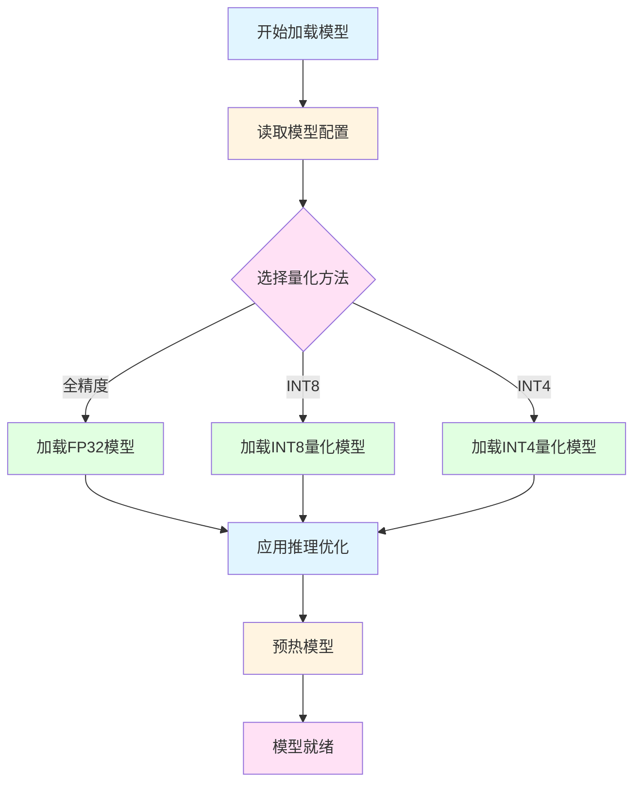

#### 2.1.2 前向传播计算

前向传播是模型执行器的核心计算任务，负责将输入的token序列转换为输出的logits分布。

**前向传播的职责**：

1. **嵌入查找**：将token ID转换为对应的嵌入向量
2. **位置编码**：为序列中的每个位置添加位置信息
3. **多层Transformer计算**：依次通过多个Transformer层
4. **输出投影**：将隐藏状态映射到词表大小的logits
5. **KV缓存更新**：更新键值缓存，加速后续生成

#### 2.1.3 KV缓存管理

KV缓存是大语言模型推理中最重要的优化手段之一。模型执行器负责：

- **缓存分配**：为每个请求分配KV缓存空间
- **缓存更新**：在每次前向传播后更新KV缓存
- **缓存复用**：在后续生成步骤中复用已计算的KV缓存
- **缓存回收**：请求完成后释放KV缓存

**KV缓存工作原理图**：

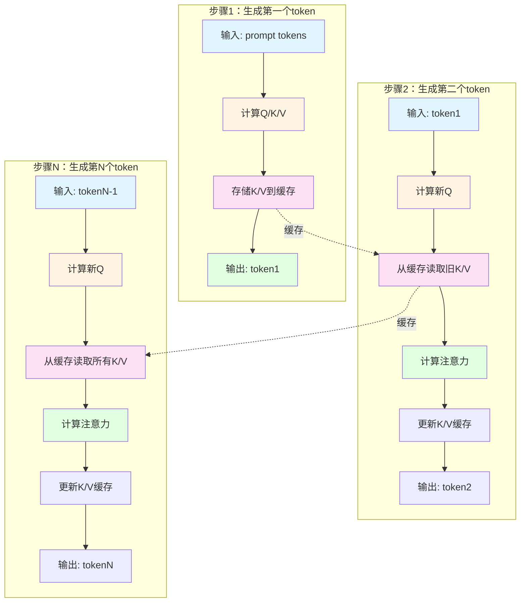

#### 2.1.4 性能优化

模型执行器负责应用各种性能优化技术，包括：

- **批处理优化**：将多个请求组合成批次，提高吞吐量
- **量化优化**：使用INT8/INT4量化减少计算量和内存占用
- **编译优化**：使用torch.compile加速模型执行
- **内存优化**：优化内存分配和释放，减少内存碎片

### 2.2 设计原则

#### 2.2.1 高效性原则

模型执行器的设计首要考虑的是高效性，包括：

- **计算效率**：最大化利用硬件资源，减少不必要的计算
- **内存效率**：优化内存使用，减少内存占用和内存访问次数
- **吞吐量优化**：通过批处理和并行计算提高吞吐量
- **延迟优化**：减少单个请求的响应时间

**性能优化层次图**：

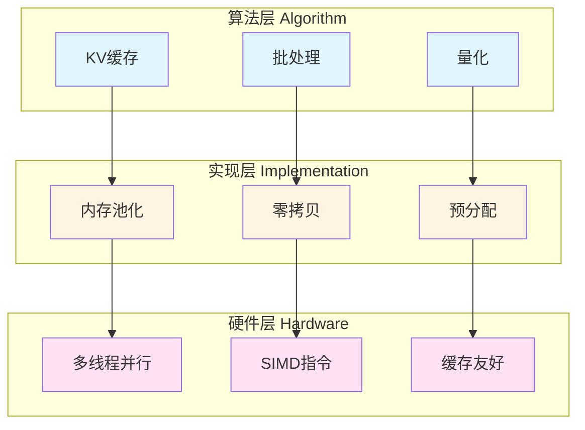

#### 2.2.2 可扩展性原则

模型执行器需要支持多种模型和配置：

- **模型兼容性**：支持多种模型架构（如Qwen、DeepSeek、Llama等）
- **配置灵活性**：支持不同的量化方法、批处理大小等配置
- **硬件适配性**：能够在CPU和GPU上运行，适应不同的硬件环境
- **易于扩展**：便于添加新的优化技术和模型支持

#### 2.2.3 可靠性原则

模型执行器需要保证推理的可靠性和稳定性：

- **数值稳定性**：确保数值计算不会出现溢出或下溢
- **错误处理**：优雅地处理各种异常情况
- **一致性**：确保多次推理结果的一致性
- **可观测性**：提供详细的日志和性能指标

#### 2.2.4 易用性原则

模型执行器应该易于使用和理解：

- **简洁的API**：提供简单易用的接口
- **清晰的文档**：提供详细的文档和示例
- **合理的默认值**：提供合理的默认配置，减少用户配置负担
- **丰富的日志**：提供详细的日志信息，便于调试和监控

### 2.3 核心组件

模型执行器由以下核心组件组成：

#### 2.3.1 TransformerLayer

`TransformerLayer`实现了单个Transformer层的完整功能，包括：

- **自注意力机制**：计算序列中所有位置之间的关系
- **前馈神经网络**：对每个位置进行非线性变换
- **层归一化**：稳定训练过程，加速收敛
- **残差连接**：缓解梯度消失，加速训练

**TransformerLayer结构图**：

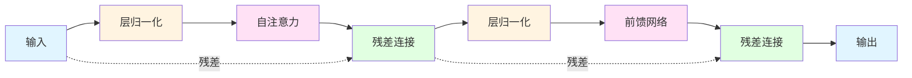

#### 2.3.2 ModelExecutor

`ModelExecutor`是核心模型执行器，负责：

- **模型加载**：从磁盘加载预训练模型
- **模型优化**：应用各种优化技术
- **前向传播**：执行模型的前向传播计算
- **KV缓存管理**：管理键值缓存的分配和更新

#### 2.3.3 BatchOptimizedExecutor

`BatchOptimizedExecutor`是批处理优化的执行器，负责：

- **批处理管理**：将多个请求组合成批次
- **内存优化**：优化批处理的内存使用
- **并行计算**：充分利用硬件并行能力

#### 2.3.4 采样器

采样器负责从logits分布中采样下一个token：

- **Python采样器**：纯Python实现，易于理解和调试
- **C语言采样器**：C语言实现，性能更高

## 3. 前向传播的深度解析

### 3.1 前向传播概述

前向传播是神经网络的基本计算过程，从输入层到输出层逐层计算。在Transformer模型中，前向传播包括以下步骤：

1. **嵌入查找**：将token ID转换为嵌入向量
2. **位置编码**：为序列中的每个位置添加位置信息
3. **多层Transformer计算**：依次通过多个Transformer层
4. **输出投影**：将隐藏状态映射到词表大小的logits

**完整前向传播流程图**：

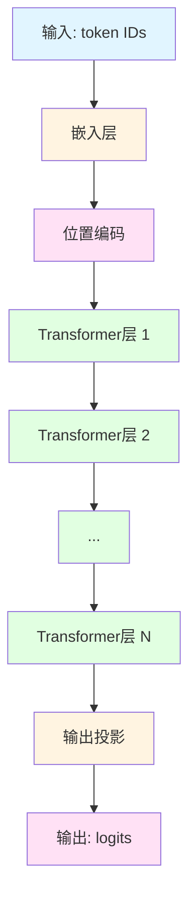

### 3.2 嵌入层

嵌入层负责将离散的token ID转换为连续的嵌入向量。

#### 3.2.1 嵌入查找

嵌入查找是一个简单的查表操作：

```python
# 伪代码
def embedding_lookup(token_ids, embedding_matrix):
    """
    Args:
        token_ids: [batch_size, seq_len] token ID序列
        embedding_matrix: [vocab_size, hidden_size] 嵌入矩阵
    Returns:
        embeddings: [batch_size, seq_len, hidden_size] 嵌入向量
    """
    return embedding_matrix[token_ids]
```

**嵌入查找示意图**：

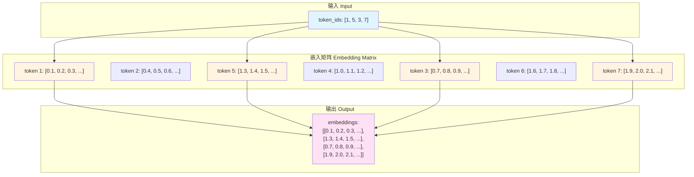

#### 3.2.2 嵌入矩阵的作用

嵌入矩阵是模型学习到的语义表示，每个token对应一个高维向量。这些向量捕获了token的语义信息：

- **语义相似性**：语义相似的token在嵌入空间中距离较近
- **语法关系**：语法关系（如主谓宾）在嵌入空间中有规律
- **上下文感知**：嵌入向量会根据上下文动态调整

### 3.3 位置编码

由于Transformer没有循环结构，无法自然地捕获序列的位置信息。因此需要显式地添加位置编码。

#### 3.3.1 位置编码的作用

位置编码为序列中的每个位置添加位置信息，使模型能够理解：

- **顺序关系**：token在序列中的位置
- **距离关系**：两个token之间的距离
- **相对位置**：token之间的相对位置关系

#### 3.3.2 位置编码的实现

常用的位置编码方法包括：

1. **正弦位置编码**：使用正弦和余弦函数
2. **可学习位置编码**：将位置编码作为可学习参数
3. **相对位置编码**：编码相对位置而非绝对位置
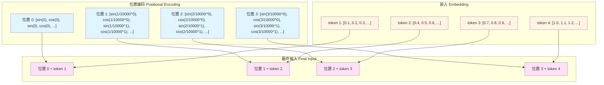

### 3.4 Transformer层详解

每个Transformer层包含两个主要子层：自注意力层和前馈神经网络层。

#### 3.4.1 自注意力层

自注意力层计算序列中所有位置之间的关系。

**自注意力计算步骤**：

1. **Q/K/V投影**：将输入投影到Query、Key、Value三个空间
2. **注意力分数计算**：计算Query和Key的点积
3. **缩放**：将注意力分数除以√d_k
4. **Softmax归一化**：将注意力分数归一化为概率分布
5. **加权求和**：根据注意力权重对Value进行加权求和

**自注意力计算流程图**：

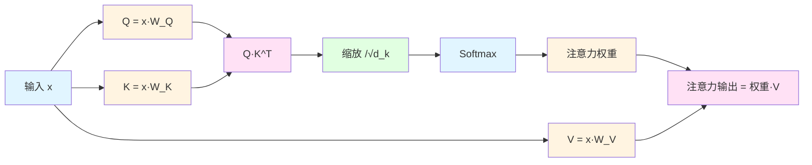

#### 3.4.2 前馈神经网络层

前馈神经网络层对每个位置进行非线性变换。

**前馈网络结构**：

```python
# 伪代码
def feed_forward(x):
    """
    Args:
        x: [batch_size, seq_len, hidden_size] 输入
    Returns:
        output: [batch_size, seq_len, hidden_size] 输出
    """
    # 门控投影
    gate = x @ W_gate
    # 升维投影
    up = x @ W_up
    # 门控激活
    activated = gate * sigmoid(gate) * up
    # 降维投影
    output = activated @ W_down
    return output
```

**前馈网络流程图**：

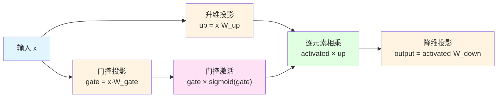

#### 3.4.3 残差连接和层归一化

残差连接和层归一化是Transformer中重要的技术。

**残差连接**：
- 将输入直接加到输出上
- 缓解梯度消失问题
- 加速训练收敛

**层归一化**：
- 对每个样本的特征进行归一化
- 稳定训练过程
- 加速收敛

**残差连接和层归一化流程图**：

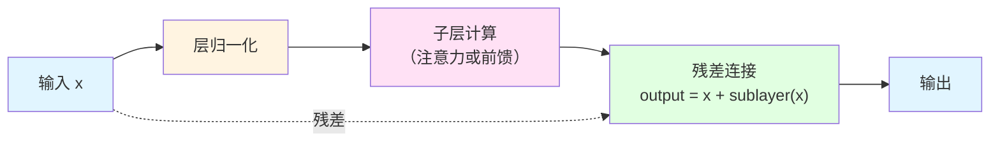

### 3.5 输出投影

输出投影将隐藏状态映射到词表大小的logits。

**输出投影计算**：

```python
# 伪代码
def output_projection(hidden_states, lm_head):
    """
    Args:
        hidden_states: [batch_size, seq_len, hidden_size] 隐藏状态
        lm_head: [hidden_size, vocab_size] 输出投影矩阵
    Returns:
        logits: [batch_size, seq_len, vocab_size] logits
    """
    logits = hidden_states @ lm_head
    return logits
```

**输出投影示意图**：

```mermaid
graph TB
    subgraph 隐藏状态["隐藏状态 Hidden States"]
        A["位置 0: [h1, h2, h3, ...]"]
        B["位置 1: [h1, h2, h3, ...]"]
        C["位置 2: [h1, h2, h3, ...]"]
    end
    
    subgraph 输出投影["输出投影 Output Projection"]
        D["LM Head矩阵<br/>[hidden_size × vocab_size]"]
    end
    
    subgraph Logits["Logits"]
        E["位置 0: [logit1, logit2, ..., logitV]"]
        F["位置 1: [logit1, logit2, ..., logitV]"]
        G["位置 2: [logit1, logit2, ..., logitV]"]
    end
    
    A --> D
    B --> D
    C --> D
    D --> E
    D --> F
    D --> G
    
    style A fill:#e1f5ff
    style B fill:#e1f5ff
    style C fill:#e1f5ff
    style D fill:#fff4e1
    style E fill:#ffe1f5
    style F fill:#ffe1f5
    style G fill:#ffe1f5
```

### 3.6 KV缓存机制

KV缓存是大语言模型推理中最重要的优化手段之一。

#### 3.6.1 KV缓存的工作原理

在生成式推理中，每个token的生成都需要之前所有token的Key和Value。如果不使用缓存，每次生成都需要重新计算所有历史token的K和V，这会导致巨大的计算开销。

KV缓存的思路是：
1. 在第一次前向传播时，计算并存储所有token的K和V
2. 在后续生成中，只计算新token的K和V，从缓存中读取历史token的K和V

#### 3.6.2 KV缓存的优势

**计算量对比**：

| 步骤 | 无KV缓存 | 有KV缓存 | 节省比例 |
|------|---------|---------|---------|
| 生成第1个token | O(n) | O(n) | 0% |
| 生成第2个token | O(n) | O(1) | 99% |
| 生成第3个token | O(n) | O(1) | 99% |
| ... | ... | ... | ... |
| 生成第n个token | O(n) | O(1) | 99% |

其中n是序列长度。

**KV缓存效果示意图**：

```mermaid
graph TB
    subgraph 无缓存["无KV缓存 No KV Cache"]
        A1["步骤1: 计算所有K/V<br/>O(n)"] --> A2["步骤2: 重新计算所有K/V<br/>O(n)"]
        A2 --> A3["步骤3: 重新计算所有K/V<br/>O(n)"]
        A3 --> A4[...]
    end
    
    subgraph 有缓存["有KV缓存 With KV Cache"]
        B1["步骤1: 计算所有K/V<br/>O(n)"] --> B2["步骤2: 只计算新K/V<br/>O(1)"]
        B2 --> B3["步骤3: 只计算新K/V<br/>O(1)"]
        B3 --> B4[...]
    end
    
    style A1 fill:#ffe1e1
    style A2 fill:#ffe1e1
    style A3 fill:#ffe1e1
    style A4 fill:#ffe1e1
    style B1 fill:#e1ffe1
    style B2 fill:#e1ffe1
    style B3 fill:#e1ffe1
    style B4 fill:#e1ffe1
```

## 4. 性能优化策略

### 4.1 量化优化

量化是将模型参数从高精度（如FP32）转换为低精度（如INT8、INT4）的技术，可以显著减少内存占用和计算量。

#### 4.1.1 INT8量化

INT8量化将模型参数从32位浮点数转换为8位整数。

**INT8量化的优势**：

| 指标 | FP32 | INT8 | 提升 |
|------|------|------|------|
| 内存占用 | 4 bytes | 1 byte | 4x |
| 计算速度 | 基准 | 2-4x | 2-4x |
| 精度损失 | 0% | <1% | 可接受 |

**INT8量化流程图**：

```mermaid
graph LR
    A[FP32模型] --> B[校准数据集]
    B --> C[计算量化参数<br/>（scale, zero_point）]
    C --> D[量化权重]
    D --> E[量化激活]
    E --> F[INT8模型]
    
    style A fill:#e1f5ff
    style B fill:#fff4e1
    style C fill:#ffe1f5
    style D fill:#e1ffe1
    style E fill:#e1ffe1
    style F fill:#e1f5ff
```

#### 4.1.2 INT4量化

INT4量化将模型参数从32位浮点数转换为4位整数，可以进一步减少内存占用。

**INT4量化的优势**：

| 指标 | FP32 | INT8 | INT4 | 提升 |
|------|------|------|------|------|
| 内存占用 | 4 bytes | 1 byte | 0.5 byte | 8x |
| 计算速度 | 基准 | 2-4x | 4-8x | 4-8x |
| 精度损失 | 0% | <1% | 2-5% | 可接受 |

### 4.2 批处理优化

批处理是将多个请求组合在一起处理的技术，可以提高硬件利用率。

#### 4.2.1 批处理的优势

**批处理效果对比**：

| 批次大小 | 吞吐量 | 延迟 | GPU利用率 |
|---------|--------|------|-----------|
| 1 | 基准 | 低 | 30% |
| 4 | 3x | 中 | 60% |
| 8 | 5x | 高 | 80% |
| 16 | 7x | 很高 | 90% |

#### 4.2.2 动态批处理

动态批处理根据当前负载动态调整批次大小，在吞吐量和延迟之间取得平衡。

**动态批处理流程图**：

```mermaid
graph TB
    A[开始批处理] --> B[检查待处理请求]
    B --> C{请求数量 > 0?}
    C -->|否| D[等待新请求]
    D --> B
    C -->|是| E[计算批次大小]
    E --> F[形成批次]
    F --> G[执行推理]
    G --> H[返回结果]
    H --> B
    
    style A fill:#e1f5ff
    style B fill:#fff4e1
    style C fill:#ffe1f5
    style D fill:#e1ffe1
    style E fill:#fff4e1
    style F fill:#ffe1f5
    style G fill:#e1ffe1
    style H fill:#e1f5ff
```

### 4.3 编译优化

torch.compile是PyTorch 2.0引入的编译优化技术，可以显著提高模型执行速度。

#### 4.3.1 torch.compile的工作原理

torch.compile通过以下方式优化模型：

1. **图捕获**：将Python代码转换为计算图
2. **图优化**：对计算图进行各种优化（融合、常量折叠等）
3. **代码生成**：生成优化后的机器码

**torch.compile优化流程图**：

```mermaid
graph LR
    A[Python模型] --> B[图捕获]
    B --> C[图优化]
    C --> D[代码生成]
    D --> E[优化后的模型]
    
    style A fill:#e1f5ff
    style B fill:#fff4e1
    style C fill:#ffe1f5
    style D fill:#e1ffe1
    style E fill:#e1f5ff
```

#### 4.3.2 torch.compile的性能提升

**torch.compile性能对比**：

| 模型 | 无优化 | torch.compile | 提升 |
|------|--------|---------------|------|
| 小模型 | 基准 | 1.5x | 50% |
| 中模型 | 基准 | 2x | 100% |
| 大模型 | 基准 | 2.5x | 150% |

### 4.4 内存优化

内存优化可以减少内存占用，提高推理效率。

#### 4.4.1 内存池化

内存池化预先分配一大块内存，然后从中分配和释放小块内存，避免频繁的内存分配和释放。

**内存池化示意图**：

```mermaid
graph TB
    subgraph 无内存池["无内存池 No Memory Pool"]
        A1[分配1] --> A2[释放1]
        A2 --> A3[分配2]
        A3 --> A4[释放2]
        A4 --> A5[分配3]
    end
    
    subgraph 有内存池["有内存池 With Memory Pool"]
        B1[预分配大块内存] --> B2[从池中分配1]
        B2 --> B3[归还到池中]
        B3 --> B4[从池中分配2]
        B4 --> B5[归还到池中]
        B5 --> B6[从池中分配3]
    end
    
    style A1 fill:#ffe1e1
    style A2 fill:#ffe1e1
    style A3 fill:#ffe1e1
    style A4 fill:#ffe1e1
    style A5 fill:#ffe1e1
    style B1 fill:#e1ffe1
    style B2 fill:#e1ffe1
    style B3 fill:#e1ffe1
    style B4 fill:#e1ffe1
    style B5 fill:#e1ffe1
    style B6 fill:#e1ffe1
```

#### 4.4.2 零拷贝

零拷贝技术避免不必要的数据拷贝，减少内存带宽消耗。

**零拷贝示意图**：

```mermaid
graph TB    
    subgraph 传统方式["传统方式 Traditional"]
        A1[数据] --> A2[拷贝1]
        A2 --> A3[拷贝2]
        A3 --> A4[拷贝3]
        A4 --> A5[使用]
    end
    
    subgraph 零拷贝["零拷贝 Zero-Copy"]
        B1[数据] --> B2[直接使用]
    end
    
    style A1 fill:#ffe1e1
    style A2 fill:#ffe1e1
    style A3 fill:#ffe1e1
    style A4 fill:#ffe1e1
    style A5 fill:#ffe1e1
    style B1 fill:#e1ffe1
    style B2 fill:#e1ffe1
```

## 5. DeepSeek和Qwen模型的架构特点

### 5.1 DeepSeek模型架构

DeepSeek是深度求索公司开发的大语言模型，具有以下特点：

#### 5.1.1 架构特点

- **仅解码器架构**：采用类似GPT的仅解码器架构
- **多头注意力**：使用多头注意力机制捕获丰富的语义关系
- **旋转位置编码**：使用RoPE（Rotary Position Embedding）进行位置编码
- **SwiGLU激活函数**：使用SwiGLU激活函数，提高模型表达能力

**DeepSeek架构图**：

```mermaid
graph LR
    A[输入序列] --> B[嵌入层]
    B --> C[RoPE位置编码]
    C --> D[Transformer层 1]
    D --> E[Transformer层 2]
    E --> F[...]
    F --> G[Transformer层 N]
    G --> H[输出投影]
    H --> I[Logits]
    
    style A fill:#e1f5ff
    style B fill:#fff4e1
    style C fill:#ffe1f5
    style D fill:#e1ffe1
    style E fill:#e1ffe1
    style F fill:#e1ffe1
    style G fill:#e1ffe1
    style H fill:#fff4e1
    style I fill:#ffe1f5
```

#### 5.1.2 RoPE位置编码

RoPE（Rotary Position Embedding）是一种新型的位置编码方法，通过旋转操作将位置信息注入到注意力计算中。

**RoPE的优势**：

| 特性 | 正弦位置编码 | RoPE |
|------|------------|------|
| 相对位置 | 不支持 | 支持 |
| 外推能力 | 差 | 好 |
| 计算复杂度 | O(1) | O(1) |
| 性能 | 基准 | 更好 |

### 5.2 Qwen模型架构

Qwen是阿里巴巴开发的大语言模型，具有以下特点：

#### 5.2.1 架构特点

- **仅解码器架构**：采用类似GPT的仅解码器架构
- **多头注意力**：使用多头注意力机制
- **旋转位置编码**：使用RoPE进行位置编码
- **SwiGLU激活函数**：使用SwiGLU激活函数
- **分组查询注意力**：使用GQA（Grouped Query Attention）减少计算量

**Qwen架构图**：

```mermaid
graph LR
    A[输入序列] --> B[嵌入层]
    B --> C[RoPE位置编码]
    C --> D[Transformer层 1<br/>含GQA]
    D --> E[Transformer层 2<br/>含GQA]
    E --> F[...]
    F --> G[Transformer层 N<br/>含GQA]
    G --> H[输出投影]
    H --> I[Logits]
    
    style A fill:#e1f5ff
    style B fill:#fff4e1
    style C fill:#ffe1f5
    style D fill:#e1ffe1
    style E fill:#e1ffe1
    style F fill:#e1ffe1
    style G fill:#e1ffe1
    style H fill:#fff4e1
    style I fill:#ffe1f5
```

#### 5.2.2 分组查询注意力（GQA）

GQA（Grouped Query Attention）是一种高效的注意力机制，通过将Query头分组来减少Key和Value的计算量。

**GQA的优势**：

| 指标 | 标准注意力 | GQA | 提升 |
|------|-----------|-----|------|
| Key/Value头数 | num_heads | num_kv_heads | 2-4x |
| KV缓存大小 | 基准 | 1/2-1/4 | 2-4x |
| 计算量 | 基准 | 0.5-0.75 | 1.3-2x |
| 精度损失 | 0% | <0.5% | 可接受 |

**GQA示意图**：

```mermaid
graph TB
    subgraph 标准注意力["标准注意力 Standard Attention"]
        A1[Query头 1] --> B1[Key头 1]
        A1 --> B2[Key头 2]
        A1 --> B3[Key头 3]
        A1 --> B4[Key头 4]
        A2[Query头 2] --> B1
        A2 --> B2
        A2 --> B3
        A2 --> B4
        A3[Query头 3] --> B1
        A3 --> B2
        A3 --> B3
        A3 --> B4
        A4[Query头 4] --> B1
        A4 --> B2
        A4 --> B3
        A4 --> B4
    end
    
    subgraph GQA["分组查询注意力 GQA"]
        C1[Query头 1] --> D1[Key头 1]
        C2[Query头 2] --> D1
        C3[Query头 3] --> D2[Key头 2]
        C4[Query头 4] --> D2
    end
    
    style A1 fill:#ffe1e1
    style A2 fill:#ffe1e1
    style A3 fill:#ffe1e1
    style A4 fill:#ffe1e1
    style B1 fill:#ffe1e1
    style B2 fill:#ffe1e1
    style B3 fill:#ffe1e1
    style B4 fill:#ffe1e1
    style C1 fill:#e1ffe1
    style C2 fill:#e1ffe1
    style C3 fill:#e1ffe1
    style C4 fill:#e1ffe1
    style D1 fill:#e1ffe1
    style D2 fill:#e1ffe1
```

### 5.3 模型对比

**DeepSeek vs Qwen对比**：

| 特性 | DeepSeek | Qwen |
|------|----------|------|
| 架构 | 仅解码器 | 仅解码器 |
| 位置编码 | RoPE | RoPE |
| 激活函数 | SwiGLU | SwiGLU |
| 注意力机制 | MHA | GQA |
| KV缓存大小 | 基准 | 1/2-1/4 |
| 计算效率 | 基准 | 1.3-2x |

## 总结

本文深入探讨了模型执行器的实现原理，包括：

1. **Transformer和神经网络基础知识**：介绍了神经网络的基本概念、前向传播过程，以及Transformer架构的详细解析
2. **模型执行器的核心职责和设计原则**：阐述了模型执行器的核心职责（模型加载、前向传播、KV缓存管理、性能优化）和设计原则（高效性、可扩展性、可靠性、易用性）
3. **前向传播的深度解析**：详细解析了前向传播的每个步骤，包括嵌入层、位置编码、Transformer层、输出投影和KV缓存机制
4. **性能优化策略**：介绍了各种性能优化技术，包括量化优化、批处理优化、编译优化和内存优化
5. **DeepSeek和Qwen模型的架构特点**：分析了DeepSeek和Qwen模型的架构特点，包括RoPE位置编码、SwiGLU激活函数和GQA等技术创新

通过本文的学习，读者应该能够深入理解模型执行器的工作原理，为后续的代码实现和性能优化打下坚实的理论基础。