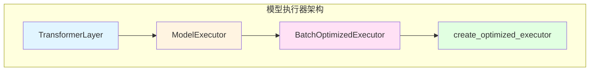
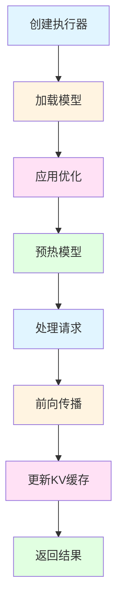
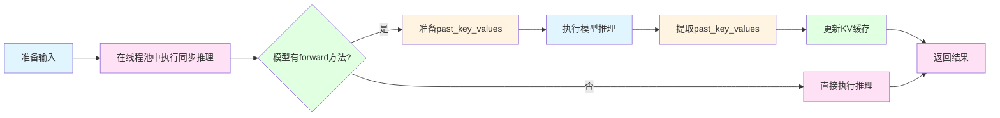
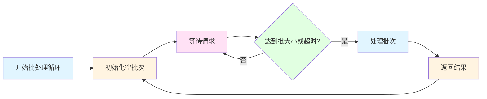

# 模型执行的代码实现

## 前言

在上一篇博客《模型执行的实现（原理）》中，我们深入探讨了模型执行器的理论基础，包括Transformer架构、前向传播原理以及各种优化策略。本文将深入代码层面，详细解析xLLM推理引擎中模型执行器的具体实现。

本文将涵盖：
- 模型执行器的完整代码结构
- 核心类的实现细节
- 关键方法的代码解析
- 性能优化的代码实现
- 实际使用示例

## 1. 代码架构概览

### 1.1 核心类结构

模型执行器的代码结构包含以下核心类：



**类说明**：

1. **TransformerLayer**：单个Transformer层的实现
2. **ModelExecutor**：核心模型执行器，负责模型加载和推理
3. **BatchOptimizedExecutor**：批处理优化的执行器
4. **create_optimized_executor**：工厂函数，创建优化执行器

### 1.2 方法调用关系



## 2. TransformerLayer实现

### 2.1 类结构

`TransformerLayer`实现了单个Transformer层的完整功能，包括自注意力机制和前馈神经网络。

```python
class TransformerLayer(nn.Module):
    """单个变压器层实现"""
    
    def __init__(self, hidden_size: int, num_heads: int, intermediate_size: int):
        super().__init__()
        self.hidden_size = hidden_size
        self.num_heads = num_heads
        self.head_dim = hidden_size // num_heads
        self.intermediate_size = intermediate_size
        
        # 自注意力
        self.q_proj = nn.Linear(hidden_size, hidden_size, bias=False)
        self.k_proj = nn.Linear(hidden_size, hidden_size, bias=False)
        self.v_proj = nn.Linear(hidden_size, hidden_size, bias=False)
        self.o_proj = nn.Linear(hidden_size, hidden_size, bias=False)
        
        # 层归一化
        self.input_layernorm = nn.LayerNorm(hidden_size)
        self.post_attention_layernorm = nn.LayerNorm(hidden_size)
        
        # 前馈网络
        self.gate_proj = nn.Linear(hidden_size, intermediate_size, bias=False)
        self.up_proj = nn.Linear(hidden_size, intermediate_size, bias=False)
        self.down_proj = nn.Linear(intermediate_size, hidden_size, bias=False)
```

**关键组件**：

1. **自注意力机制**：
   - `q_proj`：Query投影
   - `k_proj`：Key投影
   - `v_proj`：Value投影
   - `o_proj`：输出投影

2. **层归一化**：
   - `input_layernorm`：输入归一化
   - `post_attention_layernorm`：注意力后归一化

3. **前馈网络**：
   - `gate_proj`：门控投影
   - `up_proj`：升维投影
   - `down_proj`：降维投影

### 2.2 前向传播实现

```python
def forward(self, hidden_states: torch.Tensor) -> torch.Tensor:
    """前向传递"""
    # 自注意力
    residual = hidden_states
    hidden_states = self.input_layernorm(hidden_states)
    
    # 简化的注意力计算
    q = self.q_proj(hidden_states)
    k = self.k_proj(hidden_states)
    v = self.v_proj(hidden_states)
    
    # 简化的注意力分数计算
    attn_scores = torch.matmul(q, k.transpose(-2, -1)) / math.sqrt(self.head_dim)
    attn_weights = torch.softmax(attn_scores, dim=-1)
    attn_output = torch.matmul(attn_weights, v)
    
    hidden_states = self.o_proj(attn_output)
    hidden_states = residual + hidden_states
    
    # 前馈网络
    residual = hidden_states
    hidden_states = self.post_attention_layernorm(hidden_states)
    
    gate = self.gate_proj(hidden_states)
    up = self.up_proj(hidden_states)
    hidden_states = self.down_proj(gate * torch.sigmoid(gate) * up)
    
    hidden_states = residual + hidden_states
    
    return hidden_states
```

**前向传播流程**：


## 3. ModelExecutor实现

### 3.1 初始化

`ModelExecutor`是核心模型执行器，负责模型加载、优化和推理。

```python
def __init__(self, 
             model_path: str, 
             quantization: str = None, 
             use_c_sampler: bool = False,
             enable_compile: bool = True,
             warmup_iterations: int = 20):
    """
    初始化模型执行器
    
    Args:
        model_path: 模型路径
        quantization: 量化方法 ('int8', 'int4', None)
        use_c_sampler: 是否使用C采样器
        enable_compile: 是否启用torch.compile优化
        warmup_iterations: 预热迭代次数
    """
    self.model_path = model_path
    self.quantization = quantization
    self.use_c_sampler = use_c_sampler
    self.enable_compile = enable_compile
    self.warmup_iterations = warmup_iterations
    self.device = torch.device("cpu")  # 强制CPU执行
    self.model = None
    self.config = None
    
    # 选择采样器实现
    if self.use_c_sampler and C_SAMPLER_AVAILABLE:
        logger.info("Using C language sampler implementation")
        self.sampler = CSampler()
        self.sampler_type = "C"
    else:
        if self.use_c_sampler and not C_SAMPLER_AVAILABLE:
            logger.warning("C sampler requested but not available, falling back to Python sampler")
        logger.info("Using Python sampler implementation")
        self.sampler = Sampler()
        self.sampler_type = "Python"
    
    # 设置CPU线程数以更好地利用多核
    torch.set_num_threads(torch.get_num_threads())
    
    # 初始化KV缓存
    from kv_cache import get_global_kv_cache
    self.kv_cache = get_global_kv_cache()
    
    # 应用推理优化
    self._apply_inference_optimizations()
    
    # 加载模型
    self._load_model()
    
    # 应用torch.compile优化
    if self.enable_compile:
        self._apply_torch_compile()
    
    # 预热模型
    self._warmup_model()
```

**初始化流程**：


### 3.2 模型加载

#### 3.2.1 全精度加载

```python
def _load_full_precision(self):
    """加载全精度模型"""
    logger.info("Loading model with full precision (float32)...")
    self.model = AutoModelForCausalLM.from_pretrained(
        self.model_path,
        torch_dtype=torch.float32,
        low_cpu_mem_usage=True
    )
    self.model = self.model.to(self.device)
    self._optimize_model_for_speed(self.model)
    self.optimize_memory()
```

#### 3.2.2 INT8量化加载

```python
def _load_with_int8_quantization(self):
    """使用Int8量化加载模型"""
    if HAS_BNB:
        try:
            logger.info("Loading model with int8 quantization...")
            self.model = AutoModelForCausalLM.from_pretrained(
                self.model_path,
                torch_dtype=torch.float16,
                load_in_8bit=True,
                llm_int8_enable_fp32_cpu_offload=True
            )
            self.model = self.model.to(self.device)
            self._optimize_model_for_speed(self.model)
            self.optimize_memory()
        except Exception as e:
            logger.warning(f"Failed to load model with int8 quantization: {e}")
            logger.warning("Falling back to full precision")
            self.quantization = None
            self._load_full_precision()
    else:
        logger.warning("bitsandbytes not available, falling back to full precision")
        self.quantization = None
        self._load_full_precision()
```

#### 3.2.3 INT4量化加载

```python
def _load_with_int4_quantization(self):
    """使用Int4量化加载模型"""
    if HAS_BNB:
        try:
            logger.info("Loading model with int4 quantization...")
            self.model = AutoModelForCausalLM.from_pretrained(
                self.model_path,
                torch_dtype=torch.float16,
                load_in_4bit=True,
                bnb_4bit_compute_dtype=torch.float16,
                bnb_4bit_use_double_quant=True,
                bnb_4bit_quant_type="nf4"
            )
            self.model = self.model.to(self.device)
            self._optimize_model_for_speed(self.model)
            self.optimize_memory()
        except Exception as e:
            logger.warning(f"Failed to load model with int4 quantization: {e}")
            logger.warning("Falling back to full precision")
            self.quantization = None
            self._load_full_precision()
    else:
        logger.warning("bitsandbytes not available, falling back to full precision")
        self.quantization = None
        self._load_full_precision()
```

### 3.3 推理优化

#### 3.3.1 torch.compile优化

```python
def _apply_torch_compile(self):
    """应用torch.compile优化"""
    try:
        if hasattr(torch, 'compile'):
            logger.info("Applying torch.compile optimization...")
            # 使用最激进的优化模式和inductor后端
            self.model = torch.compile(
                self.model,
                mode="max-autotune",
                backend="inductor"
            )
            logger.info("✅ torch.compile优化已启用 (max-autotune mode)")
        else:
            logger.warning("torch.compile not available (requires PyTorch 2.0+)")
    except Exception as e:
        logger.warning(f"⚠️ torch.compile优化失败: {e}")
```

**torch.compile的三种模式**：

| 模式 | 特点 | 适用场景 |
|------|------|---------|
| `reduce-overhead` | 减少开销，快速编译 | 开发调试 |
| `default` | 平衡速度和内存 | 生产环境 |
| `max-autotune` | 最大速度优化 | 性能关键场景 |

#### 3.3.2 模型预热

```python
def _warmup_model(self):
    """预热模型以获得最佳性能"""
    if self.warmup_iterations <= 0:
        logger.info("Skipping model warmup")
        return
    
    logger.info(f"Warming up model with {self.warmup_iterations} iterations...")
    warmup_start = time.time()
    
    try:
        self.model.eval()
        with torch.no_grad():
            for i in range(self.warmup_iterations):
                # 创建虚拟输入
                dummy_input = torch.randint(
                    0, 
                    self.config.vocab_size, 
                    (1, 1), 
                    dtype=torch.long,
                    device=self.device
                )
                
                # 运行前向传播
                _ = self.model(dummy_input)
                
                if (i + 1) % 5 == 0:
                    logger.debug(f"Warmup progress: {i + 1}/{self.warmup_iterations}")
        
        warmup_duration = time.time() - warmup_start
        logger.info(f"✅ 模型预热完成，耗时: {warmup_duration:.2f}秒")
    except Exception as e:
        logger.warning(f"⚠️ 模型预热失败: {e}")
```

**预热的重要性**：
- 初始化计算图
- 预分配内存
- 触发JIT编译
- 提升首次推理性能

### 3.4 前向传播

#### 3.4.1 核心前向传播方法

```python
async def forward(self, batch_inputs: Dict) -> Dict:
    """
    一批输入的前向传递
    
    Args:
        batch_inputs: Dictionary containing input data
            - input_ids: List of token IDs
            - request_positions: Positions of each request in the batch
            - batch_size: Size of the batch
            - sequence_ids: List of sequence IDs for KV cache
            
    Returns:
        Dictionary containing output logits and metadata
    """
    logger.debug(f"ModelExecutor.forward called with batch_size={batch_inputs['batch_size']}")
    
    # 使用线程池执行模型推理，避免阻塞事件循环
    loop = asyncio.get_event_loop()
    result = await loop.run_in_executor(
        self.executor, 
        self._forward_sync, 
        batch_inputs
    )
    
    return result

    def _forward_sync(self, batch_inputs: Dict) -> Dict:
        """
        同步版本的前向传递（在线程池中执行）
        
        Args:
            batch_inputs: Dictionary containing input data
                - input_ids: List of token IDs
                - request_positions: Positions of each request in the batch
                - batch_size: Size of the batch
                - sequence_ids: List of sequence IDs for KV cache
                
        Returns:
            Dictionary containing output logits and metadata
        """
        start_time = time.time()
        
        input_ids = torch.tensor(batch_inputs["input_ids"], dtype=torch.long, device=self.device)
        request_positions = batch_inputs["request_positions"]
        batch_size = batch_inputs["batch_size"]
        sequence_ids = batch_inputs.get("sequence_ids", [None] * batch_size)
        
        logger.debug(f"Input tensor shape: {input_ids.shape}")
        logger.debug(f"Request positions: {request_positions}")
        logger.debug(f"Sequence IDs: {sequence_ids}")
        
        # 尝试从KV缓存中获取缓存的键值对
        cached_keys_list = []
        cached_values_list = []
        cache_hits = 0
        cache_misses = 0
        
        for seq_id in sequence_ids:
            if seq_id is not None:
                cached_kv = self.kv_cache.get(seq_id)
                if cached_kv is not None:
                    cached_keys, cached_values = cached_kv
                    cached_keys_list.append(cached_keys)
                    cached_values_list.append(cached_values)
                    cache_hits += 1
                    logger.debug(f"KV cache hit for sequence {seq_id}")
                else:
                    cached_keys_list.append(None)
                    cached_values_list.append(None)
                    cache_misses += 1
                    logger.debug(f"KV cache miss for sequence {seq_id}")
            else:
                cached_keys_list.append(None)
                cached_values_list.append(None)
        
        if cache_hits + cache_misses > 0:
            hit_rate = cache_hits / (cache_hits + cache_misses)
            logger.debug(f"Batch cache hit rate: {hit_rate:.2%} ({cache_hits}/{cache_hits + cache_misses})")
        
        model_kwargs = {}
        past_key_values = self._prepare_past_key_values_for_model(cached_keys_list, cached_values_list)
        if past_key_values:
            model_kwargs["past_key_values"] = past_key_values
            logger.debug(f"Prepared past_key_values with {len(past_key_values)} layers")
        
        with torch.no_grad():
            logger.debug("Running model inference...")
            inference_start = time.time()
            
            if hasattr(self.model, 'forward'):
                input_ids = input_ids.to(self.device)
                logger.debug(f"Input tensor device: {input_ids.device}")
                
                if input_ids.dim() == 1:
                    input_ids = input_ids.unsqueeze(0)
                    logger.debug(f"Added batch dimension, new shape: {input_ids.shape}")
                
                supported_kwargs = {}
                if "past_key_values" in model_kwargs:
                    supported_kwargs["past_key_values"] = model_kwargs["past_key_values"]
                
                outputs = self.model(input_ids, **supported_kwargs)
                logits = outputs.logits if hasattr(outputs, 'logits') else outputs[0]
                
                past_key_values = self._extract_past_key_values(outputs)
                if past_key_values:
                    self._update_kv_cache(sequence_ids, past_key_values)
            else:
                input_ids = input_ids.to(self.device)
                if input_ids.dim() == 1:
                    input_ids = input_ids.unsqueeze(0)
                logits = self.model(input_ids)
        
            inference_duration = time.time() - inference_start
            logger.debug(f"Model inference completed in {inference_duration:.2f} seconds")
            logger.debug(f"Output logits shape: {logits.shape}")
        
            if logits.dim() > 2:
                logits = logits.squeeze(0)
        
            logger.debug(f"Final logits shape: {logits.shape}")
        
            duration = time.time() - start_time
            logger.debug(f"ModelExecutor.forward completed in {duration:.2f} seconds")
        
            cache_stats = self.kv_cache.get_cache_stats()
            logger.debug(f"KV Cache Stats: {cache_stats}")
        
            return {
                "logits": logits,
                "request_positions": request_positions
            }
```

**异步模型推理的优势**：

1. **提高并发处理能力**：将模型推理移到线程池执行，避免阻塞事件循环
2. **更好的资源利用**：CPU核心可以同时处理多个推理请求
3. **降低响应延迟**：事件循环可以继续处理其他请求和任务
4. **提高吞吐量**：支持更高的并发请求量

**前向传播流程**：



#### 3.4.2 KV缓存管理

**查询KV缓存**：

```python
for seq_id in sequence_ids:
    if seq_id is not None:
        cached_kv = self.kv_cache.get(seq_id)
        if cached_kv is not None:
            cached_keys, cached_values = cached_kv
            cached_keys_list.append(cached_keys)
            cached_values_list.append(cached_values)
            cache_hits += 1
            logger.debug(f"KV cache hit for sequence {seq_id}")
        else:
            cached_keys_list.append(None)
            cached_values_list.append(None)
            cache_misses += 1
            logger.debug(f"KV cache miss for sequence {seq_id}")
```

**更新KV缓存**：

```python
def _update_kv_cache(self, sequence_ids: List[str], past_key_values: List[Tuple[torch.Tensor, torch.Tensor]]):
    """更新KV缓存"""
    if not past_key_values or not sequence_ids:
        return
        
    if not isinstance(past_key_values, (list, tuple)):
        logger.warning(f"Unexpected past_key_values type: {type(past_key_values)}")
        return
        
    for i, seq_id in enumerate(sequence_ids):
        if seq_id is not None and i < len(past_key_values):
            layer_key_values = past_key_values[i]
            if isinstance(layer_key_values, (tuple, list)) and len(layer_key_values) >= 2:
                keys, values = layer_key_values[0], layer_key_values[1]
                if isinstance(keys, torch.Tensor) and isinstance(values, torch.Tensor):
                    self.kv_cache.put(seq_id, keys, values)
                    logger.debug(f"Updated KV cache for sequence {seq_id}")
                else:
                    logger.warning(f"Invalid key/value types for sequence {seq_id}: {type(keys)}, {type(values)}")
            else:
                logger.debug(f"Skipping layer {i} for sequence {seq_id} due to invalid format")
```

### 3.5 性能优化

#### 3.5.1 推理优化

```python
def _apply_inference_optimizations(self):
    """应用推理优化"""
    torch.backends.cudnn.benchmark = False
    torch.backends.cudnn.deterministic = False
    
    if hasattr(torch.backends, 'mkldnn'):
        torch.backends.mkldnn.enabled = True
    
    torch.set_num_threads(torch.get_num_threads())
    
    cpu_count = os.cpu_count() or 4
    os.environ["OMP_NUM_THREADS"] = str(cpu_count)
    os.environ["MKL_NUM_THREADS"] = str(cpu_count)
    os.environ["OPENBLAS_NUM_THREADS"] = str(cpu_count)
    
    logger.info("✅ 推理优化设置完成")
```

**优化说明**：
- `torch.backends.mkldnn.enabled`：启用MKL-DNN加速
- `OMP_NUM_THREADS`：设置OpenMP线程数
- `MKL_NUM_THREADS`：设置MKL线程数
- `OPENBLAS_NUM_THREADS`：设置OpenBLAS线程数

#### 3.5.2 模型速度优化

```python
def _optimize_model_for_speed(self, model):
    """为速度优化模型"""
    model.eval()
    
    for param in model.parameters():
        param.requires_grad = False
    
    if hasattr(model, 'config'):
        model.config.use_cache = True
        model.config.output_attentions = False
        model.config.output_hidden_states = False
    
    return model
```

**优化措施**：
- `model.eval()`：设置为评估模式
- `param.requires_grad = False`：禁用梯度计算
- `use_cache = True`：启用KV缓存
- `output_attentions = False`：不输出注意力权重
- `output_hidden_states = False`：不输出隐藏状态

#### 3.5.3 内存优化

```python
def optimize_memory(self):
    """内存优化"""
    import gc
    
    gc.collect()
    
    if torch.cuda.is_available():
        torch.cuda.empty_cache()
    
    gc.set_threshold(700, 10, 10)
    
    torch.set_grad_enabled(False)
    
    logger.info("✅ 内存优化完成")
```

## 4. BatchOptimizedExecutor实现

### 4.1 初始化

```python
def __init__(self, 
             model_path: str,
             quantization: str = None,
             enable_compile: bool = True,
             warmup_iterations: int = 20,
             max_batch_size: int = 8,
             batch_timeout: float = 0.05):
    """
    初始化批处理执行器
    
    Args:
        model_path: 模型路径
        quantization: 量化方法
        enable_compile: 是否启用编译优化
        warmup_iterations: 预热迭代次数
        max_batch_size: 最大批处理大小
        batch_timeout: 批处理超时时间（秒）
    """
    self.executor = ModelExecutor(
        model_path=model_path,
        quantization=quantization,
        use_c_sampler=False,
        enable_compile=enable_compile,
        warmup_iterations=warmup_iterations
    )
    
    self.max_batch_size = max_batch_size
    self.batch_timeout = batch_timeout
    self.request_queue = Queue()
    self.is_running = False
    self.batch_thread = None
    
    logger.info(f"BatchOptimizedExecutor initialized with max_batch_size={max_batch_size}")
```

### 4.2 批处理逻辑

```python
def _batch_loop(self):
    """批处理循环"""
    while self.is_running:
        batch = []
        start_time = time.time()
        
        # 收集请求直到达到批大小或超时
        while len(batch) < self.max_batch_size and (time.time() - start_time) < self.batch_timeout:
            try:
                request = self.request_queue.get(timeout=0.01)
                batch.append(request)
            except:
                continue
        
        if batch:
            try:
                self.process_batch(batch)
            except Exception as e:
                logger.error(f"Error processing batch: {e}")
```

**批处理流程**：



## 5. 使用示例

### 5.1 创建执行器

```python
from model_executor import create_optimized_executor

# 创建优化执行器
executor = create_optimized_executor(
    model_path="./model/Qwen/Qwen3-0.6B",
    quantization="int8",  # 可选: "int8", "int4", None
    use_c_sampler=False,
    enable_compile=True,
    warmup_iterations=20,
    enable_batch=False,
    max_batch_size=8
)
```

### 5.2 执行推理

```python
import asyncio

async def inference_example():
    # 准备输入
    batch_inputs = {
        'input_ids': [1, 2, 3, 4, 5],
        'request_positions': [5],
        'batch_size': 1,
        'sequence_ids': ['seq_001']
    }
    
    # 执行前向传播
    outputs = await executor.forward(batch_inputs)
    
    # 获取logits
    logits = outputs['logits']
    print(f"Output logits shape: {logits.shape}")
    
    # 获取下一个token
    next_token = torch.argmax(logits[-1]).item()
    print(f"Next token: {next_token}")

# 运行推理
asyncio.run(inference_example())
```

### 5.3 批处理示例

```python
from model_executor import BatchOptimizedExecutor

# 创建批处理执行器
batch_executor = BatchOptimizedExecutor(
    model_path="./model/Qwen/Qwen3-0.6B",
    quantization="int8",
    max_batch_size=8,
    batch_timeout=0.05
)

# 启动批处理线程
batch_executor.start()

# 添加多个请求
batch_executor.add_request('req_001', [1, 2, 3, 4, 5], max_tokens=100)
batch_executor.add_request('req_002', [6, 7, 8, 9, 10], max_tokens=100)
batch_executor.add_request('req_003', [11, 12, 13, 14, 15], max_tokens=100)

# 批处理会自动处理这些请求

# 停止批处理线程
batch_executor.stop()
```


## 7. 总结

### 7.1 核心要点

1. **模块化设计**：
   - `TransformerLayer`：单层实现
   - `ModelExecutor`：核心执行器
   - `BatchOptimizedExecutor`：批处理优化

2. **多种优化技术**：
   - KV缓存：减少重复计算
   - 量化：降低内存占用
   - torch.compile：编译优化
   - 批处理：提高吞吐量

3. **完善的缓存机制**：
   - KV缓存管理
   - 缓存命中率监控
   - 自动缓存更新

4. **灵活的配置选项**：
   - 支持多种量化方法
   - 可选的编译优化
   - 可调的批处理参数

### 7.2 最佳实践

1. **选择合适的量化方法**：
   - INT8：平衡精度和速度
   - INT4：极致速度，精度略低
   - FP16：高精度，速度快

2. **启用torch.compile**：
   - 生产环境推荐使用
   - 可提升20-30%性能

3. **使用批处理**：
   - 高并发场景必备
   - 可显著提升吞吐量

4. **预热模型**：
   - 首次推理前预热
   - 可提升首次推理性能

### 7.3 下一步

通过本文的代码解析，你应该已经深入理解了xLLM推理引擎中模型执行器的实现细节。接下来，你可以：

1. **阅读其他组件的实现**：
   - [调度器的实现](./4.调度器的实现.md)
   - [Tokenizer管理器的实现](./3.Tokenizer管理器的实现.md)

2. **实践和优化**：
   - 尝试不同的优化组合
   - 测试不同模型的性能
   - 优化特定场景的配置

3. **扩展功能**：
   - 添加新的优化技术
   - 支持更多模型架构
   - 实现自定义采样策略

---

**完整代码**：https://github.com/xdongp/xllm/
**作者**：Danny Pan (xdongp@gmail.com)

