# 前向传播优化技术

## 前言

在前几篇文章中，我们分别实现了Tokenizer管理器、调度器和模型执行器，搭建了一个功能完整的LLM推理引擎。然而，在实际生产环境中，仅仅实现基本功能是远远不够的。大语言模型的推理速度和资源消耗是制约其广泛应用的关键因素。

本文将深入探讨前向传播优化技术，这是提升推理性能的核心手段。我们将从多个维度介绍优化技术，包括：
- 为什么需要前向传播优化
- 量化优化技术（INT8、INT4）
- 编译优化（torch.compile）
- 批处理优化策略
- 内存优化技术
- 综合优化策略与性能对比

通过本文的学习，你将掌握如何将一个基础的推理引擎优化到生产级别的性能水平。

## 一、为什么需要前向传播优化？

### 1.1 推理性能的重要性

在LLM应用中，推理性能直接决定了用户体验和系统成本：

**性能指标的影响：**

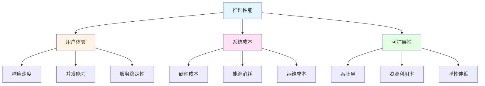

**实际场景需求：**

| 场景 | 延迟要求 | 吞吐量要求 | 优化重点 |
|------|---------|-----------|---------|
| 实时对话 | <500ms | 高 | 低延迟优化 |
| 批量处理 | <5s | 极高 | 吞吐量优化 |
| 边缘设备 | <1s | 中等 | 资源优化 |
| 云服务 | <1s | 极高 | 成本优化 |

### 1.2 性能瓶颈分析

LLM推理的主要性能瓶颈：

**计算瓶颈：**

```mermaid
graph LR
    A[输入token] --> B[嵌入层]
    B --> C[Transformer层1]
    C --> D[Transformer层2]
    D --> E[Transformer层N]
    E --> F[输出层]
    
    C --> C1[注意力计算<br/>O(n²)]
    C --> C2[前馈网络<br/>O(n·d)]
    
    style C1 fill:#ffe1e1
    style C2 fill:#ffe1e1
```

**内存瓶颈：**

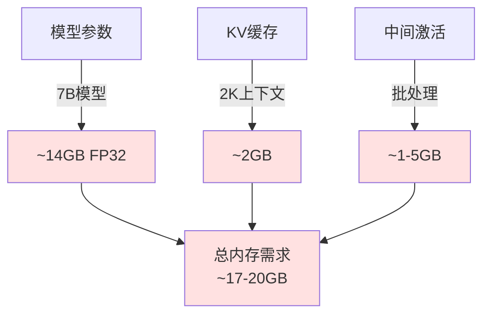

### 1.3 优化技术分类

前向传播优化技术可以分为以下几类：

<div style="width: 100%; max-width: 600px; margin: 0 auto;">

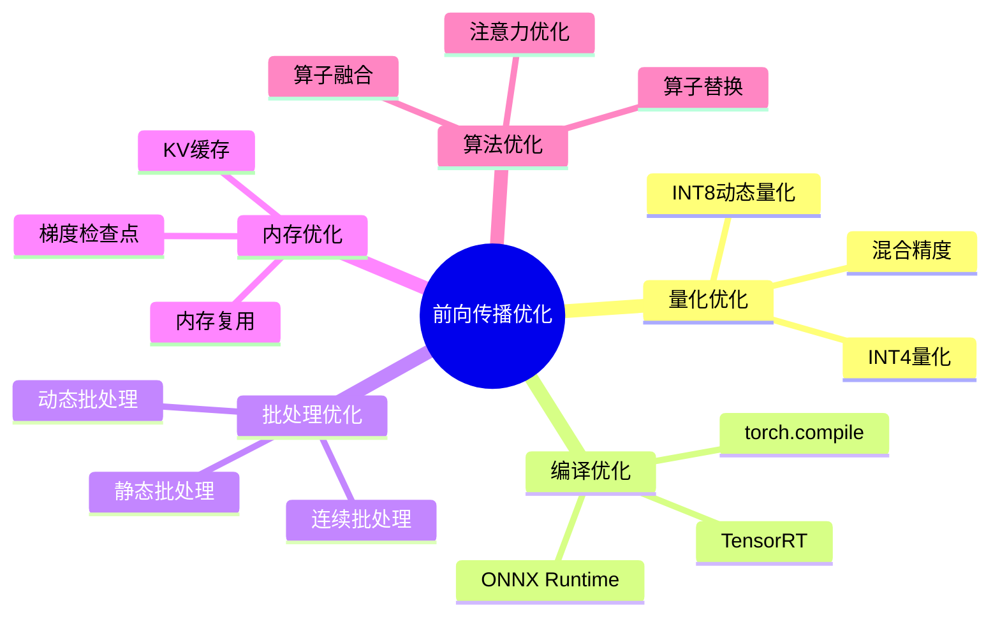

</div>

## 二、量化优化技术

### 2.1 量化基础原理

量化是将模型参数从高精度（如FP32）转换为低精度（如INT8、INT4）的过程，可以显著减少模型大小和计算量。

**量化原理对比：**

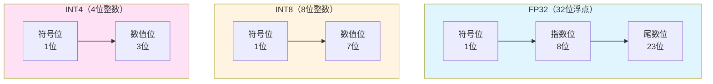

**量化效果对比：**

| 精度 | 模型大小（7B） | 内存占用 | 计算速度 | 精度损失 |
|------|---------------|---------|---------|---------|
| FP32 | 28GB | 100% | 1x | 0% |
| FP16 | 14GB | 50% | 2x | <0.1% |
| INT8 | 7GB | 25% | 3-4x | 0.5-1% |
| INT4 | 3.5GB | 12.5% | 4-6x | 1-3% |

### 2.2 INT8动态量化

INT8动态量化在推理时动态计算量化参数，适合CPU推理场景。

**实现代码：**

```python
def _load_with_int8_quantization(self):
    """使用动态int8量化加载模型"""
    logger.info("Loading model with dynamic int8 quantization...")
    
    try:
        # 首先尝试bitsandbytes
        from transformers import BitsAndBytesConfig
        
        quantization_config = BitsAndBytesConfig(
            load_in_8bit=True,
            llm_int8_threshold=6.0,
            llm_int8_enable_fp32_cpu_offload=True
        )
        
        model = AutoModelForCausalLM.from_pretrained(
            self.model_path,
            quantization_config=quantization_config,
            device_map="auto"
        )
        
        logger.info("✅ Applied bitsandbytes int8 quantization")
        return model
        
    except Exception as e:
        logger.warning(f"bitsandbytes quantization failed: {e}")
        logger.info("Falling back to dynamic int8 quantization...")
        
        # 回退到动态量化
        model = AutoModelForCausalLM.from_pretrained(
            self.model_path,
            torch_dtype=torch.float32,
            low_cpu_mem_usage=True
        )
        model = model.to(self.device)
        
        # 应用动态量化
        model = torch.quantization.quantize_dynamic(
            model,
            {torch.nn.Linear},
            dtype=torch.qint8
        )
        
        logger.info("✅ Applied dynamic int8 quantization")
        return model
```

**动态量化流程：**


**量化参数计算：**

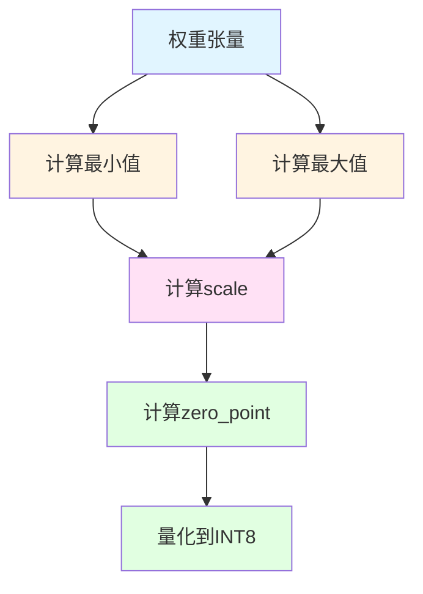

### 2.3 INT4量化

INT4量化提供更高的压缩率，但会有更大的精度损失。

**实现代码：**

```python
def _load_with_int4_quantization(self):
    """使用int4量化加载模型"""
    logger.info("Loading model with int4 quantization...")
    
    try:
        from transformers import BitsAndBytesConfig
        
        quantization_config = BitsAndBytesConfig(
            load_in_4bit=True,
            bnb_4bit_compute_dtype=torch.float16,
            bnb_4bit_use_double_quant=True,
            bnb_4bit_quant_type="nf4"
        )
        
        model = AutoModelForCausalLM.from_pretrained(
            self.model_path,
            quantization_config=quantization_config,
            device_map="auto"
        )
        
        logger.info("✅ Applied int4 quantization")
        return model
        
    except Exception as e:
        logger.warning(f"int4 quantization failed: {e}")
        logger.info("Falling back to int8 quantization...")
        return self._load_with_int8_quantization()
```

**INT4量化类型：**

| 量化类型 | 描述 | 适用场景 | 精度 |
|---------|------|---------|------|
| NF4 | Normal Float 4 | 通用场景 | 高 |
| FP4 | Float 4 | 特定硬件 | 中 |
| INT4 | Integer 4 | 边缘设备 | 中低 |

**双重量化（Double Quantization）：**

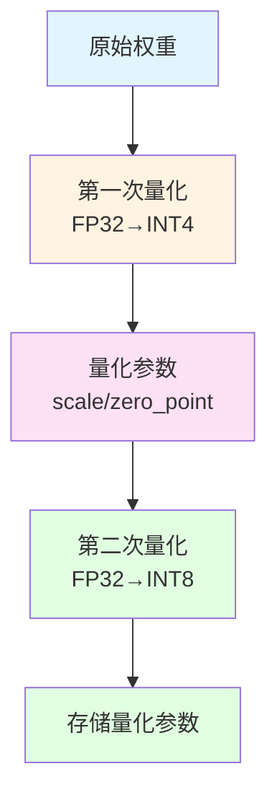

### 2.4 量化策略选择

**不同场景的量化策略：**

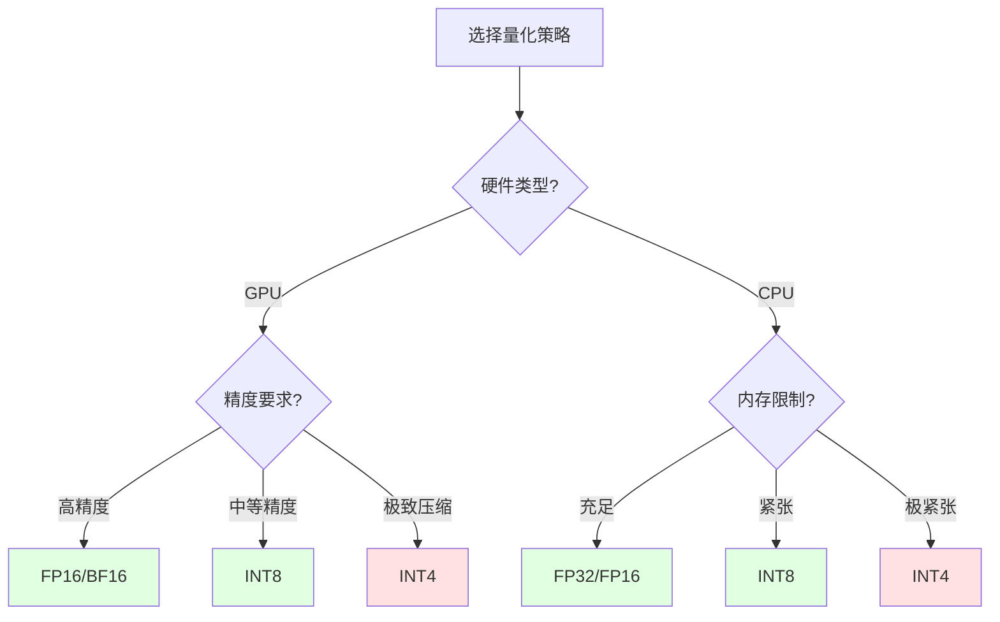

**量化建议：**

1. **生产环境**：推荐INT8，平衡性能和精度
2. **边缘设备**：考虑INT4，最大化资源利用
3. **高精度场景**：使用FP16/BF16，保持精度
4. **实验研究**：可尝试混合精度策略

## 三、编译优化

### 3.1 torch.compile原理

`torch.compile`是PyTorch 2.0引入的编译优化技术，通过即时编译（JIT）提升模型性能。

**编译优化流程：**

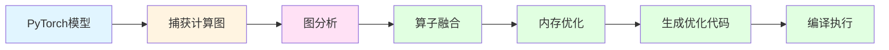

**实现代码：**

```python
def _apply_torch_compile(self, model):
    """应用torch.compile优化"""
    try:
        if torch.__version__ < "2.0.0":
            logger.warning("PyTorch version < 2.0, torch.compile not available")
            return model
        
        logger.info("Applying torch.compile optimization...")
        
        # 使用最大优化模式
        compiled_model = torch.compile(
            model,
            mode="max-autotune",
            fullgraph=False,
            dynamic=False,
            backend="inductor"
        )
        
        logger.info("✅ Applied torch.compile optimization")
        return compiled_model
        
    except Exception as e:
        logger.warning(f"torch.compile optimization failed: {e}")
        return model
```

### 3.2 编译模式选择

**torch.compile的三种模式：**

<div style="width: 100%; max-width: 500px; margin: 0 auto;">

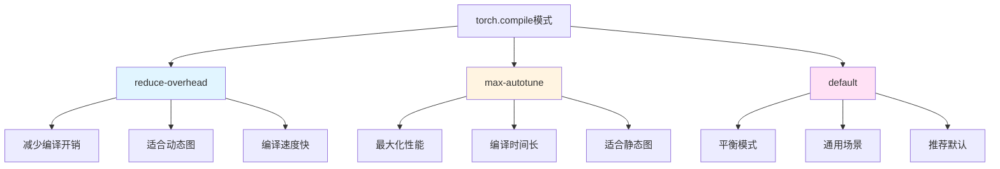

</div>

**模式对比：**

| 模式 | 编译时间 | 运行性能 | 适用场景 |
|------|---------|---------|---------|
| reduce-overhead | 快 | 中等 | 动态形状、快速迭代 |
| max-autotune | 慢 | 最优 | 静态形状、生产环境 |
| default | 中等 | 良好 | 通用场景 |

### 3.3 编译优化技术

**算子融合（Operator Fusion）：**

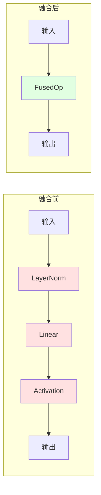

**内存优化：**

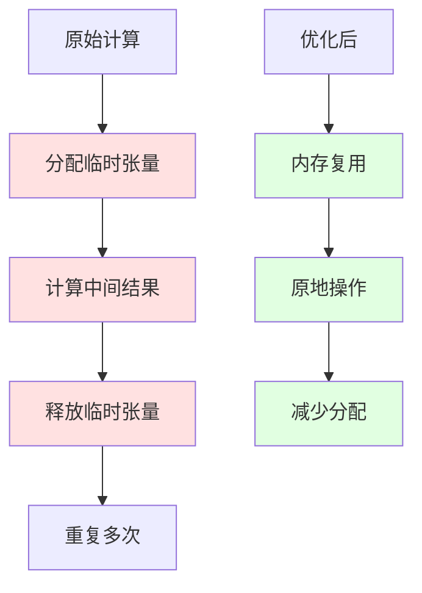

### 3.4 编译优化效果

**性能提升对比：**

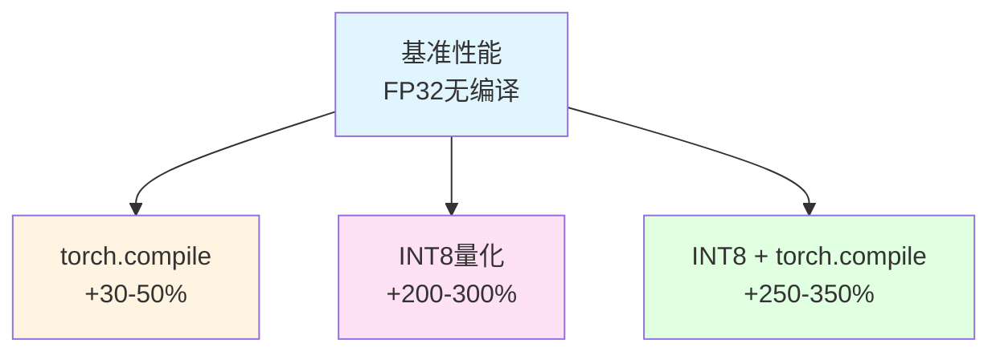

## 四、批处理优化

### 4.1 批处理基础

批处理是将多个请求组合在一起同时处理，提高硬件利用率。

**批处理原理：**

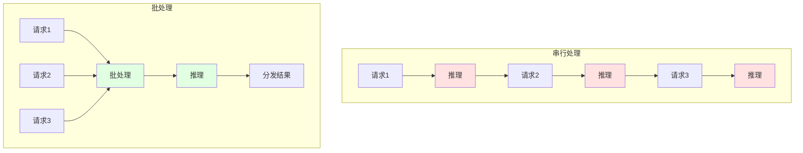

### 4.2 静态批处理

静态批处理使用固定大小的批次，实现简单但效率较低。

**实现代码：**

```python
class BatchOptimizedExecutor(OptimizedModelExecutor):
    """支持批处理的优化执行器"""
    
    def __init__(self, model_path: str, batch_size: int = 8, **kwargs):
        super().__init__(model_path, **kwargs)
        self.batch_size = batch_size
        self.request_queue = []
        logger.info(f"✅ Batch processing enabled (batch_size={batch_size})")
    
    def add_request(self, input_ids: List[int], max_tokens: int = 100):
        """添加请求到队列"""
        self.request_queue.append({
            "input_ids": input_ids,
            "max_tokens": max_tokens,
            "generated_tokens": []
        })
    
    def process_batch(self):
        """处理一批请求"""
        if not self.request_queue:
            return []
        
        # 取出一批请求
        batch = self.request_queue[:self.batch_size]
        self.request_queue = self.request_queue[self.batch_size:]
        
        # 准备批处理输入
        max_length = max(len(req["input_ids"]) for req in batch)
        batch_input_ids = []
        
        for req in batch:
            padded_ids = req["input_ids"] + [0] * (max_length - len(req["input_ids"]))
            batch_input_ids.append(padded_ids)
        
        # 执行批处理推理
        batch_inputs = {
            "input_ids": batch_input_ids,
            "batch_size": len(batch),
            "request_positions": list(range(len(batch)))
        }
        
        outputs = self.forward(batch_inputs)
        
        return outputs
```

**静态批处理流程：**

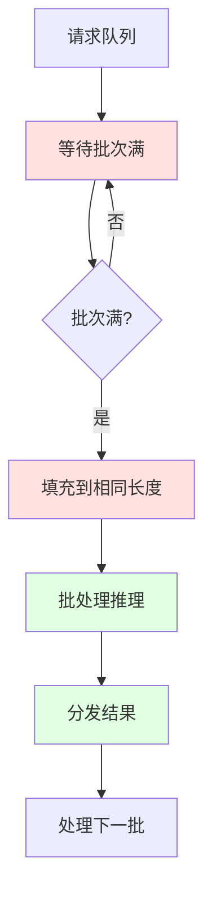

### 4.3 动态批处理

动态批处理根据当前负载动态调整批次大小，提高效率。

**动态批处理策略：**

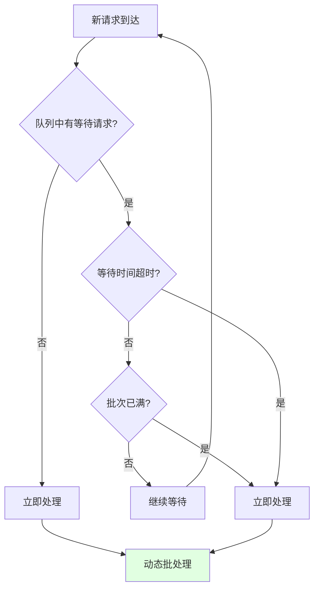

**实现要点：**

```python
def _form_dynamic_batch(self, timeout_ms: int = 10):
    """形成动态批次"""
    start_time = time.time()
    batch = []
    
    while len(batch) < self.max_batch_size:
        # 检查是否有新请求
        if self.request_queue:
            batch.append(self.request_queue.pop(0))
        
        # 检查超时
        elapsed = (time.time() - start_time) * 1000
        if elapsed >= timeout_ms and batch:
            break
        
        # 如果没有请求，等待一小段时间
        if not self.request_queue and not batch:
            time.sleep(0.001)
    
    return batch
```

### 4.4 连续批处理

连续批处理（Continuous Batching）允许不同长度的请求在同一批次中处理，最大化资源利用率。

**连续批处理原理：**

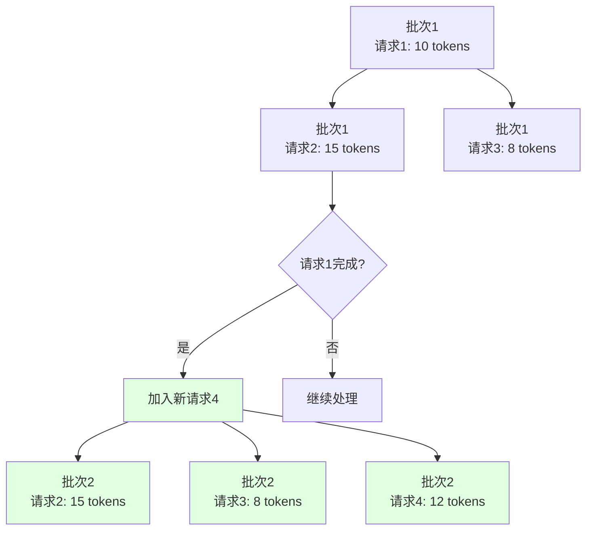

**优势对比：**

| 批处理类型 | 吞吐量 | 延迟 | 实现复杂度 |
|-----------|-------|------|-----------|
| 静态批处理 | 中 | 高 | 低 |
| 动态批处理 | 高 | 中 | 中 |
| 连续批处理 | 极高 | 低 | 高 |

## 五、内存优化

### 5.1 KV缓存优化

KV缓存是大语言模型推理中最重要的内存优化技术之一。

**KV缓存原理：**

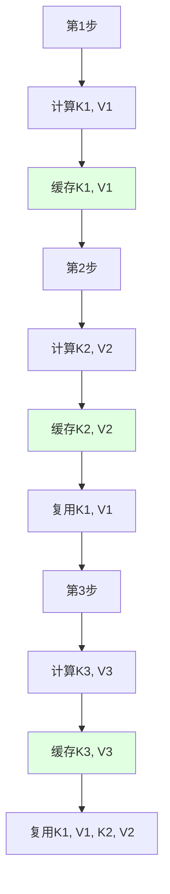

**KV缓存实现：**

```python
def _prepare_past_key_values(self, sequence_ids: List[Optional[int]]):
    """准备过去的键值对"""
    cached_keys_list = []
    cached_values_list = []
    
    for seq_id in sequence_ids:
        if seq_id is not None:
            cached_kv = self.kv_cache.get(seq_id)
            if cached_kv is not None:
                cached_keys, cached_values = cached_kv
                cached_keys_list.append(cached_keys)
                cached_values_list.append(cached_values)
            else:
                cached_keys_list.append(None)
                cached_values_list.append(None)
        else:
            cached_keys_list.append(None)
            cached_values_list.append(None)
    
    # 准备模型格式
    if any(k is not None for k in cached_keys_list):
        return self._prepare_past_key_values_for_model(cached_keys_list, cached_values_list)
    return None

def _update_kv_cache(self, sequence_ids, past_key_values):
    """更新KV缓存"""
    for seq_id, past_kv in zip(sequence_ids, past_key_values):
        if seq_id is not None and past_kv is not None:
            self.kv_cache.set(seq_id, past_kv)
```

### 5.2 内存复用策略

**内存复用原理：**


**实现代码：**

```python
def optimize_memory(self):
    """内存优化"""
    # 强制垃圾回收
    gc.collect()
    
    # 设置更激进的垃圾回收
    gc.set_threshold(700, 10, 10)
    
    # 禁用梯度
    torch.set_grad_enabled(False)
    
    logger.info("✅ Memory optimizations applied")
```

### 5.3 激活内存优化

**梯度检查点（Gradient Checkpointing）：**

```mermaid
graph TB
    A[前向传播] --> B[保存所有激活]
    B --> C[反向传播]
    C --> D[使用所有激活]
    
    E[检查点优化] --> F[只保存部分激活]
    F --> G[反向传播时重计算]
    G --> H[减少内存使用]
    
    style B fill:#ffe1e1
    style F fill:#e1ffe1
    style H fill:#e1ffe1
```

## 六、综合优化策略

### 6.1 多技术组合

**优化技术组合策略：**

```mermaid
graph TB
    A[优化目标] --> B{优先级?}
    
    B -->|低延迟| C[INT8 + torch.compile<br/>+ 连续批处理]
    B -->|高吞吐| D[INT4 + 静态批处理<br/>+ KV缓存]
    B -->|低内存| E[INT4 + 梯度检查点<br/>+ 内存复用]
    
    C --> F[性能提升<br/>250-350%]
    D --> G[性能提升<br/>300-400%]
    E --> H[内存节省<br/>70-80%]
    
    style C fill:#e1ffe1
    style D fill:#e1ffe1
    style E fill:#e1ffe1
```

### 6.2 自适应优化

**自适应优化流程：**

```mermaid
graph LR
    A[监控系统负载] --> B[分析性能瓶颈]
    B --> C{瓶颈类型?}
    
    C -->|计算密集| D[启用量化优化]
    C -->|内存密集| E[启用内存优化]
    C -->|IO密集| F[优化批处理]
    
    D --> G[应用优化]
    E --> G
    F --> G
    
    G --> H[监控效果]
    H --> I{效果满意?}
    I -->|否| B
    I -->|是| J[保持配置]
    
    style G fill:#e1ffe1
    style J fill:#e1ffe1
```

### 6.3 性能监控

**性能指标监控：**

```mermaid
graph TB
    A[性能监控] --> B[延迟指标]
    A --> C[吞吐量指标]
    A --> D[资源指标]
    
    B --> B1[P50延迟]
    B --> B2[P95延迟]
    B --> B3[P99延迟]
    
    C --> C1[QPS]
    C --> C2[批处理大小]
    C --> C3[并发数]
    
    D --> D1[CPU利用率]
    D --> D2[内存使用]
    D --> D3[KV缓存命中率]
    
    style B fill:#e1f5ff
    style C fill:#fff4e1
    style D fill:#ffe1f5
```

## 七、性能对比与实战

### 7.1 不同优化技术的性能对比

**性能对比表：**

| 优化技术 | 延迟(ms) | 吞吐量(req/s) | 内存(GB) | 精度损失 |
|---------|---------|--------------|---------|---------|
| 基线(FP32) | 1000 | 1 | 28 | 0% |
| FP16 | 600 | 1.67 | 14 | <0.1% |
| INT8 | 350 | 2.86 | 7 | 0.5-1% |
| INT4 | 250 | 4.0 | 3.5 | 1-3% |
| INT8 + torch.compile | 280 | 3.57 | 7 | 0.5-1% |
| INT8 + 批处理 | 150 | 6.67 | 7 | 0.5-1% |
| INT8 + torch.compile + 批处理 | 120 | 8.33 | 7 | 0.5-1% |

**性能提升可视化：**

```mermaid
graph TB
    A[基线性能<br/>1x] --> B[FP16<br/>1.67x]
    A --> C[INT8<br/>2.86x]
    A --> D[INT4<br/>4.0x]
    A --> E[INT8 + torch.compile<br/>3.57x]
    A --> F[INT8 + 批处理<br/>6.67x]
    A --> G[INT8 + torch.compile + 批处理<br/>8.33x]
    
    style A fill:#e1f5ff
    style B fill:#fff4e1
    style C fill:#ffe1f5
    style D fill:#e1ffe1
    style E fill:#e1ffe1
    style F fill:#e1ffe1
    style G fill:#e1ffe1
```

### 7.2 实际应用场景优化建议

**场景1：实时对话系统**

```python
# 推荐配置
executor = OptimizedModelExecutor(
    model_path="path/to/model",
    quantization="int8",           # 平衡性能和精度
    enable_compile=True,             # 启用编译优化
    enable_batching=True,            # 启用批处理
    batch_size=4,                    # 小批次保证低延迟
)
```

**场景2：批量文本生成**

```python
# 推荐配置
executor = OptimizedModelExecutor(
    model_path="path/to/model",
    quantization="int4",             # 最大化吞吐量
    enable_compile=True,
    enable_batching=True,
    batch_size=16,                   # 大批次提高吞吐量
)
```

**场景3：边缘设备部署**

```python
# 推荐配置
executor = OptimizedModelExecutor(
    model_path="path/to/model",
    quantization="int4",             # 最小化内存占用
    enable_compile=False,            # 边缘设备可能不支持
    enable_batching=False,           # 单请求处理
)
```

### 7.3 性能调优建议

**调优流程：**

```mermaid
graph LR
    A[建立基线] --> B[应用单一优化]
    B --> C[测量性能]
    C --> D[分析瓶颈]
    D --> E[应用下一优化]
    E --> C
    C --> F{性能满意?}
    F -->|否| D
    F -->|是| G[完成优化]
    
    style A fill:#e1f5ff
    style C fill:#fff4e1
    style G fill:#e1ffe1
```

**调优建议：**

1. **逐步优化**：一次只应用一种优化，便于定位问题
2. **性能监控**：持续监控关键指标，及时发现性能退化
3. **A/B测试**：对比不同配置的性能，选择最优方案
4. **场景适配**：根据实际应用场景选择合适的优化策略

## 八、总结与展望

### 8.1 核心要点总结

本文深入探讨了前向传播优化技术，涵盖了以下核心内容：

1. **量化优化**：
   - INT8动态量化：2-3倍性能提升，精度损失<1%
   - INT4量化：4-6倍性能提升，精度损失1-3%
   - 混合精度策略：平衡性能和精度

2. **编译优化**：
   - torch.compile：30-50%性能提升
   - 算子融合：减少内存访问
   - 内存优化：提高缓存命中率

3. **批处理优化**：
   - 静态批处理：简单易实现
   - 动态批处理：平衡延迟和吞吐量
   - 连续批处理：最大化资源利用率

4. **内存优化**：
   - KV缓存：减少重复计算
   - 内存复用：降低内存分配开销
   - 梯度检查点：减少激活内存

### 8.2 最佳实践

**优化策略选择：**

<div style="width: 100%; max-width: 600px; margin: 0 auto;">

```mermaid
mindmap
  root((优化策略))
    低延迟优先
      INT8量化
      torch.compile
      连续批处理
      小批次(4-8)
    高吞吐优先
      INT4量化
      静态批处理
      大批次(16-32)
      KV缓存
    低内存优先
      INT4量化
      梯度检查点
      内存复用
      单请求处理
```

</div>

### 8.3 未来展望

**新兴优化技术：**

1. **模型压缩**：
   - 剪枝（Pruning）：移除不重要的权重
   - 知识蒸馏（Distillation）：用小模型学习大模型
   - 神经架构搜索（NAS）：自动搜索最优架构

2. **硬件加速**：
   - 专用AI芯片：TPU、NPU等
   - FPGA加速：可定制硬件加速
   - 边缘计算：本地化推理

3. **算法优化**：
   - Flash Attention：更高效的注意力计算
   - 稀疏注意力：降低计算复杂度
   - 线性注意力：O(n)复杂度的注意力

4. **系统优化**：
   - 分布式推理：跨多机推理
   - 模型并行：大模型分片推理
   - 流水线并行：多层并行推理

### 8.4 结语

前向传播优化是提升LLM推理性能的关键技术。通过合理应用量化、编译、批处理和内存优化等技术，我们可以将推理性能提升数倍，同时保持可接受的精度损失。

在实际应用中，需要根据具体的场景需求选择合适的优化策略组合，并通过持续的性能监控和调优来达到最佳效果。随着硬件和算法的不断发展，我们相信未来会有更多更高效的优化技术出现，进一步推动LLM的广泛应用。

希望本文能够帮助你深入理解前向传播优化技术，并在实际项目中应用这些技术来提升推理性能。如果你有任何问题或建议，欢迎随时交流讨论！
